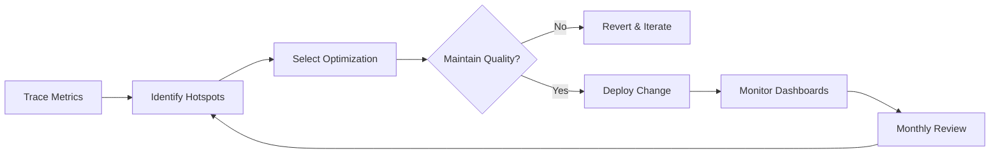

TL;DR
- Profile each agent step to understand model latency, API charges, and network bottlenecks.
- Apply caching, batching, and tiered model selection to keep experiences responsive while cutting cost per conversation.
- Continuously monitor cost-to-value metrics and tune orchestration rules when drift occurs.

## Baseline Measurement
Instrument every agent interaction with timestamps, model identifiers, token counts, and cost. Use distributed tracing (OpenTelemetry) to capture spans across tool calls, vector searches, and human gates. Aggregate metrics by workflow and persona to spot hotspots.

### Establish Budgets
Set latency budgets per user-facing workflow (e.g., 2.5 seconds p95) and cost ceilings per session. Tie budgets to business KPIs like conversion rate or support satisfaction to justify trade-offs. Document budgets in your automation governance portal.

## Optimization Techniques
Use hierarchical model selection: default to fast, cheaper models (gpt-4o-mini) and escalate to larger models only when confidence drops. Cache deterministic responses such as policy references or product specs. Batch similar tool calls—like search queries—when multiple agents request overlapping information.

### Rate Control and Scheduling
Implement concurrency limits and queue prioritization so high-priority tasks skip ahead. Use the n8n pagination and rate limit playbook for external APIs. For compute-intensive steps, pre-fetch data or schedule off-peak processing.

## Monitoring and Feedback
Create dashboards showing latency percentiles, cost per task, and cache hit rates. Set alerts when metrics exceed budgets. Feed cost anomalies into the offer testing framework so monetization teams adjust pricing or targeting. Conduct monthly cost reviews that evaluate vendor pricing changes and usage patterns.

### Experimentation
Run A/B tests where agents use alternative prompt templates or tool orders to measure impact on speed and cost. Use evaluation loops to ensure quality remains acceptable when lowering model sizes or increasing caching.

## Comparison Table
| Optimization | Primary Benefit | Latency Impact | Cost Impact | Considerations |
| --- | --- | --- | --- | --- |
| Tiered Models | Reduce spend | Medium | High savings | Requires confidence routing |
| Response Caching | Faster repeat answers | High | Medium | Ensure cache invalidation |
| Batch Tool Calls | Fewer network trips | High | Medium | Requires grouping logic |
| Prompt Compression | Lower tokens | Medium | Medium | Watch quality drop |

## Diagram

## Checklist
- [ ] Instrument agents with latency, cost, and token metrics.
- [ ] Define latency and cost budgets per workflow aligned to business KPIs.
- [ ] Implement tiered model selection, caching, and batching strategies.
- [ ] Monitor dashboards with alerts for budget breaches and cache health.
- [ ] Run experiments and evaluation loops to validate quality after optimizations.

> **Benchmarks**
> - Time to implement: 2 weeks to deploy tracing, caching, and tiered model routing. [Estimate]
> - Expected outcome: 35% cost reduction with sub-2.5s p95 latency sustained. [Estimate]

## Internal Links
- [Use the tool selection framework to codify tiered model routing.](../multi-agent-orchestration/multi-agent-tool-selection-framework.mdx)
- [Feed optimization results into the evaluation loop design.](../multi-agent-orchestration/designing-evaluation-loops.mdx)
- [Coordinate cost oversight with the automation ROI calculator.](../ai-automation-foundations/automation-roi-calculator-simple-model.mdx)
- [Share caching strategies with the Vercel performance tuning playbook.](../devops-for-creators/cwv-tuning-for-mdx-sites.mdx)

## Sources
- [Google performance and latency guidelines](https://cloud.google.com/architecture/performance-latency)
- [OpenAI pricing guide](https://openai.com/pricing)
