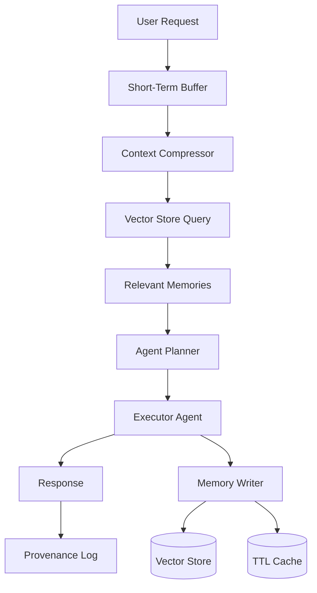

TL;DR
- Separate ephemeral conversational memory from durable knowledge bases so agents respond quickly without bloating prompts.
- Use vector databases with TTL and metadata filters to store long-term recall while respecting privacy requirements.
- Implement provenance tracking and human override controls so you can prune or replay memory safely.

## Understand Memory Horizons
Short-term memory lives inside the model's context window. It captures the current conversation or task instructions. Long-term memory persists beyond a single session, storing customer preferences, historical actions, or knowledge snippets. Define what information belongs in each horizon. For example, an automation assistant may keep the last five user turns in short-term memory while archiving order history in a vector database.

### Context Window Management
Large prompts increase latency and cost. Use summarization nodes or rolling windows to keep context under token limits. For tasks requiring multi-step plans, compress earlier steps into bullet summaries. Consider specialized models with larger context windows for planning agents, and smaller, cheaper models for execution agents.

## Vector Stores and Retrieval
Vector databases such as Pinecone, Weaviate, or open-source options like pgvector store embeddings for semantic search. When writing memories, attach metadata tags (tenant ID, data class, expiry). During retrieval, filter by tenant and TTL to avoid cross-customer leakage. Cache frequently accessed memories to reduce vector queries during hot paths.

### TTL State and Privacy
Not all memories should live forever. Implement TTL policies for ephemeral memories: automatically purge records after a set duration or when a user requests deletion. Combine TTL with event-based triggers (e.g., when an order is fulfilled). Maintain audit logs showing when memories were created, accessed, or deleted. Use encryption at rest and in transit for long-term stores.

## Provenance and Governance
Track provenance by storing source URLs, version numbers, or human annotator IDs alongside each memory. When an agent generates an answer, return provenance metadata in the response so operators can verify authenticity. Provide operators with tools to edit or delete problematic memories and retrain retrieval indexes.

## Blueprint Examples
A practical architecture might include: (1) short-term JSON memory in Redis keyed by session ID, (2) long-term semantic memory in Pinecone with strict namespaces, and (3) a knowledge graph or document store for structured data. Agents first pull recent context, then query the vector store with the user's latest intent, merge results, and log the combined context for auditing.

## Comparison Table
| Memory Layer | Storage Option | Retention | Typical Content | Governance Control |
| --- | --- | --- | --- | --- |
| Short-Term Session | In-memory store, Redis | Minutes-hours | Current conversation turns | Auto-expire via TTL |
| Working Notes | Document DB, Postgres | Days-weeks | Task plans, intermediate outputs | Manual pruning workflows |
| Long-Term Semantic | Vector DB (Pinecone, Weaviate) | Weeks-months | Customer history, knowledge snippets | Metadata filters, RBAC |
| Permanent Records | Data warehouse | Years | Compliance logs, transactions | Legal retention policies |
| Human Override | Admin UI + audit log | On demand | Memory edits, deletions | Approval workflow |

## Diagram

## Checklist
- [ ] Define memory categories and assign storage backends with retention windows.
- [ ] Implement context window management with summarization or sliding buffers.
- [ ] Configure vector store namespaces, metadata filters, and encryption.
- [ ] Enforce TTL policies and deletion workflows for privacy requests.
- [ ] Expose provenance metadata in agent responses and audit logs.

> **Benchmarks**
> - Time to implement: 2 weeks to deploy a multi-layer memory system with retrieval and TTL automation. [Estimate]
> - Expected outcome: Improve answer relevance by 30% while keeping prompt token counts under 6k tokens per request. [Estimate]

## Internal Links
- [Coordinate memory routing with the agent orchestration patterns guide.](../multi-agent-orchestration/agent-routing-patterns.mdx)
- [Ensure webhook-triggered data is stored safely by following the n8n webhook foundations.](../n8n-workflows-integrations/n8n-triggers-webhooks-foundation.mdx)

## Sources
- [OpenAI guidance on managing context](https://platform.openai.com/docs/guides/prompt-engineering/context)
- [Pinecone architecture overview for vector retrieval](https://docs.pinecone.io/docs/architecture-overview)
