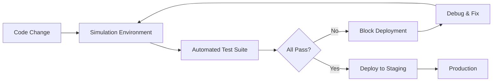

TL;DR
- Mirror production workflows in a sandbox with mock tools, deterministic prompts, and seeded data.
- Automate regression suites that evaluate correctness, safety, and guardrail adherence using evaluation loops.
- Feed simulation results into deployment gates so only resilient agent bundles ship.

## Build the Simulation Environment
Clone your orchestration runtime into a staging environment. Replace live tools with mocks that simulate responses, including latency, errors, and partial data. Seed datasets representing typical and adversarial scenarios. Use feature flags to toggle simulation-specific logic like stubbed credentials.

### Deterministic Prompts and Seeds
To make tests reproducible, freeze randomness by providing deterministic seeds and prompts. Use templated instructions where variables such as user persona or product type can be swapped to create variant scenarios. Log prompts and outputs for debugging.

## Automated Test Suites
Create test cases focusing on functional correctness (did the agent complete the task), safety (guardrails triggered), and performance (latency under budget). Implement tests using your orchestrator's API or command-line interface. For LLM evaluations, use the designing evaluation loops approach to compare outputs against human-written gold standards.

### Chaos and Adversarial Testing
Introduce chaos events—tool timeouts, malformed responses, or conflicting instructions. Simulate adversarial prompts with injection attempts. Verify that agents escalate to human gates or fallback behaviors per the production guardrails.

## Deployment Integration
Integrate simulation suites into CI pipelines. Block deployments when tests fail and provide diffed logs for rapid debugging. Track pass rates over time to detect regressions. Publish reports to stakeholders before rollout decisions.

### Continuous Improvement
Review failed simulations in blameless postmortems. Update prompts, memory architectures, or tool selection rules accordingly. Add new test cases to cover previously unseen failure modes.

## Comparison Table
| Test Type | Focus | Tooling | Failure Action | Notes |
| --- | --- | --- | --- | --- |
| Functional | Task completion accuracy | Orchestrator API, Jest | Block release | Use gold outputs |
| Safety | Guardrail adherence | Evaluation loops, policy checkers | Escalate to governance council | Include red-team prompts |
| Performance | Latency budgets | Tracing dashboards | Optimize routing | Align with cost playbook |
| Chaos | Resilience under failure | Fault injection scripts | Create remediation backlog | Run weekly |

## Diagram

## Checklist
- [ ] Clone orchestration runtime with mocked tools and seeded datasets.
- [ ] Define deterministic prompts and seeds for reproducible tests.
- [ ] Automate functional, safety, performance, and chaos test suites.
- [ ] Integrate simulations into CI gates with clear failure actions.
- [ ] Review failures and expand coverage based on postmortems.

> **Benchmarks**
> - Time to implement: 3 weeks to build mocks, test suites, and CI integration. [Estimate]
> - Expected outcome: 60% reduction in production incidents tied to agent regressions. [Estimate]

## Internal Links
- [Use the human approval gates article to verify escalation behavior in simulations.](../multi-agent-orchestration/human-approval-gates-for-agents.mdx)
- [Align guardrail checks with the production guardrails for AI playbook.](../ai-automation-foundations/production-guardrails-for-ai.mdx)
- [Feed simulation metrics into the agent cost and latency optimization guide.](../multi-agent-orchestration/agent-cost-latency-optimization.mdx)
- [Coordinate dataset management with the automation data readiness audit.](../ai-automation-foundations/automation-data-readiness-audit.mdx)

## Sources
- [Martin Fowler on microservice testing strategies](https://martinfowler.com/articles/microservice-testing/)
- [Research on automated evaluation of LLM agents](https://arxiv.org/abs/2307.00383)
