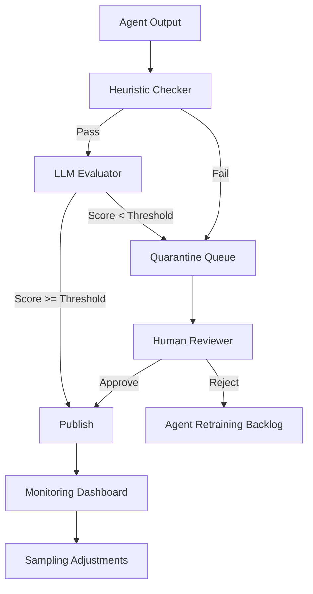

TL;DR
- Use layered heuristics, LLM judges, and human review to inspect outputs proportional to their risk.
- Maintain sampling plans and quarantine queues so suspect artifacts never reach production customers.
- Track costs and latency of evaluation loops to prove quality gains outweigh overhead.

## Map Evaluation Types to Risks
Start with a risk assessment. Classify outputs based on potential harm: factual errors, policy violations, and tone mismatches. For low-risk outputs, lightweight heuristics (regex, schema checks) may suffice. For higher-stakes content, introduce LLM-based evaluators that compare responses against rubrics. Reserve human review for high-value assets or when automated evaluators disagree. Document the thresholds that move an item from one evaluation tier to another.

### Sampling Strategy
You rarely need to review every output. Build a sampling matrix that combines volume, impact, and historical defect rates. For example, evaluate 100% of financial disclosures, 20% of general blog posts, and 5% of internal summaries. Increase sampling temporarily after model updates or notable incidents. Store sampling configurations in version control so you can trace changes over time.

## Thresholds and Scoring
Define pass/fail criteria before launching. Heuristics might flag missing metadata, while LLM judges can assign rubric scores for accuracy, clarity, and policy adherence. Set thresholds (e.g., accuracy ≥ 0.8) and require evaluators to add reasons. Aggregated scores should feed dashboards so product owners see quality trends. When scores dip below threshold, auto-route items to quarantine.

### Quarantine and Remediation
Quarantine is a holding queue where outputs await remediation. Provide operators with context: original prompt, model version, evaluator notes. Offer remediation paths, such as requesting agent revision or escalating to a subject matter expert. Track time-in-quarantine to highlight bottlenecks.

## Cost and Latency Management
Evaluation loops add compute and human labor cost. Estimate per-item evaluator spend and set budgets. Use asynchronous processing to avoid blocking user experiences; for high-risk outputs, degrade gracefully by delaying publication until review clears. Monitor latency per evaluator and optimize by caching frequent rubric checks or batching requests.

## Comparison Table
| Evaluation Tier | Tooling | Sample Rate | Primary Goal | Escalation Trigger |
| --- | --- | --- | --- | --- |
| Heuristic Checks | Regex, schema validators | 100% | Catch structural errors | Missing fields, unsafe tokens |
| LLM Judge | Rubric-scoring agent | 10–50% | Assess accuracy & tone | Score below threshold |
| Human Review | SMEs, editors | Risk-based | Validate nuanced judgement | LLM disagreement, high-impact asset |
| Adversarial Testing | Red-team prompts | Release-based | Detect policy leaks | New model or major update |
| Post-Launch Monitoring | Analytics dashboards | Continuous | Track drift | Spike in complaints |

## Diagram

## Checklist
- [ ] Categorize outputs by risk and assign evaluator tiers.
- [ ] Implement heuristic validators for structural issues.
- [ ] Configure LLM-based evaluation with rubric scoring and logging.
- [ ] Stand up quarantine workflows with remediation playbooks.
- [ ] Monitor cost, latency, and defect trends to tune sampling rates.

> **Benchmarks**
> - Time to implement: 1–2 weeks to build end-to-end evaluation loops for a mid-size content pipeline. [Estimate]
> - Expected outcome: Reduce defective publishes by 70% while adding under 15% latency to release cycles. [Estimate]

## Internal Links
- [Align evaluator routing with the agent orchestration patterns described earlier.](../multi-agent-orchestration/agent-routing-patterns.mdx)
- [Feed evaluation insights back into the content brief generator workflow for better prompts.](../content-factory-distribution/content-brief-generator.mdx)

## Sources
- [OpenAI Evals announcement and methodology](https://openai.com/blog/evals)
- [Monitoring distributed systems for anomaly detection](https://landing.google.com/sre/sre-book/chapters/monitoring-distributed-systems/)
