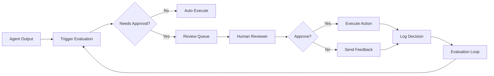

TL;DR
- Trigger human review based on risk tiers, anomaly scores, or missing confidence metrics to protect users.
- Provide reviewers with structured UI, context, and decision logging to keep throughput high without losing accountability.
- Feed reviewer outcomes back into routing logic and evaluation loops so agents learn when to self-escalate.

## Define Review Triggers
Start with the automation risk matrix to identify scenarios requiring human approval: high monetary impact, regulatory exposure, or brand-sensitive outputs. Layer in dynamic signals such as low confidence scores, high hallucination risk, or out-of-distribution inputs. Document triggers in policy so teams understand why escalations occur.

### Configure Agent Signals
Ensure agents output confidence scores, rationale snippets, and suggested actions when they request approval. For tool-based actions, include structured JSON summarizing changes, affected records, and rollback instructions. The orchestrator should bundle these signals before handing off to reviewers.

## Reviewer Experience Design
Build a lightweight review console displaying the agent's proposal, supporting evidence, historical context, and risk tier. Provide approve/decline buttons, edit suggestions, and quick links to runbook documentation. Track decision time, comments, and overrides. Align UI with accessibility standards so reviewers stay efficient.

### SLA and Staffing
Define review SLAs by risk tier. High-risk approvals may need 15-minute turnaround with an on-call specialist; medium-risk items might allow 4 hours with asynchronous queues. Staff accordingly and provide scheduling tools to prevent burnout.

## Logging and Auditability
Capture every decision with timestamp, reviewer identity, decision outcome, and rationale. Store logs in immutable storage with retention policies aligned to compliance requirements. Provide auditors with search and export functionality to demonstrate oversight.

### Continuous Improvement
Analyze approval data to identify agents that escalate too often or rarely. If declines are frequent, revisit prompts, data quality, or tool access. Use evaluation loops to simulate decisions and preempt false positives.

## Comparison Table
| Trigger Type | Example Signal | Reviewer SLA | Tooling | Notes |
| --- | --- | --- | --- | --- |
| Risk Tier | High financial impact | 15 min | On-call specialist console | Requires redundancy |
| Confidence Drop | Model confidence < 0.6 | 4 hrs | Queue dashboard | Tune thresholds via evals |
| Policy Keyword | Contains legal/regulatory phrases | 1 hr | Keyword detector | Pair with governance charter |
| Anomaly Score | Drift > 3σ | 2 hrs | Monitoring alerts | Use data readiness audit insights |

## Diagram

## Checklist
- [ ] Document risk- and signal-based triggers that require human approval.
- [ ] Ensure agents provide structured context (confidence, rationale, diff) with every escalation.
- [ ] Build reviewer UI with decision logging, runbook access, and SLA tracking.
- [ ] Implement immutable audit logs and compliance-aligned retention.
- [ ] Analyze approval data to refine triggers and agent training.

> **Benchmarks**
> - Time to implement: 2 weeks to build review console, logging, and trigger policies. [Estimate]
> - Expected outcome: 50% reduction in escalated incident severity while maintaining reviewer throughput. [Estimate]

## Internal Links
- [Integrate with the evaluation loop guide to route feedback into agent improvement.](../multi-agent-orchestration/designing-evaluation-loops.mdx)
- [Coordinate triggers with the automation governance operating model.](../ai-automation-foundations/automation-governance-operating-models.mdx)
- [Leverage memory architectures to persist reviewer outcomes for future context.](../multi-agent-orchestration/agent-memory-architectures.mdx)
- [Align staffing with the video repurposing pipeline's QA practices for consistency.](../content-factory-distribution/video-to-carousels-and-shorts.mdx)

## Sources
- [Human-in-the-loop literature review](https://arxiv.org/abs/2209.00626)
- [ISO/IEC TR 24028:2020 AI Trustworthiness](https://www.iso.org/standard/81265.html)
