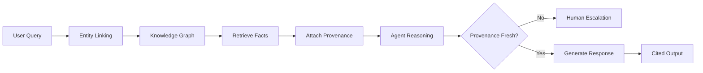

TL;DR
- Build or integrate a knowledge graph capturing entities, relationships, and provenance to ground agent reasoning.
- Use entity linking to map user queries to graph nodes, then retrieve validated facts before generating responses.
- Track provenance and freshness of facts so agents know when to escalate to humans or re-fetch data.

## Construct the Knowledge Graph
Identify core entities—products, customers, policies, content assets—and model relationships like ownership, dependencies, or eligibility. Populate the graph from structured databases and vetted documents. Store provenance metadata such as source URL, publication date, and confidence. Tools like Neo4j, AWS Neptune, or open-source graph databases can power the graph.

### Data Refresh Strategy
Set update cadences per entity type. Financial data might refresh daily, while product specs update weekly. Use automation pipelines to ingest changes and log deltas. Align with the automation data readiness audit to ensure inputs remain trustworthy.

## Entity Linking and Retrieval
When an agent receives a query, run named entity recognition and linking to map terms to graph nodes. Use vector similarity for ambiguous matches. Retrieve connected facts along with provenance. Provide agents with structured context objects (JSON) containing entity IDs, relationships, and citations.

### Response Generation with Provenance
Require agents to cite sources in their outputs. Enforce policies where high-risk responses include multiple corroborating facts. If provenance is missing or stale, agents should escalate to human approval gates.

## Monitoring and Maintenance
Track graph usage metrics—query latency, hit rate, top missing entities. Monitor for stale data by comparing timestamp metadata to freshness thresholds. Alert data stewards when nodes need review. Run periodic audits to ensure relationships remain accurate.

### Expansion and Cross-Team Collaboration
Work with content teams to integrate briefs and distribution plans, connecting marketing assets to product knowledge. Collaborate with monetization teams to link offers and attribution data, enabling agents to recommend the right campaigns.

## Comparison Table
| Component | Purpose | Owner | Refresh Cadence | Tooling |
| --- | --- | --- | --- | --- |
| Entity Schema | Defines nodes/edges | Data architect | Quarterly | dbt, schema docs |
| Graph Store | Persists knowledge | Data engineering | Daily backups | Neo4j, Neptune |
| Entity Linking Service | Maps text to graph | ML team | Weekly model eval | spaCy, Transformers |
| Provenance Monitor | Tracks freshness | Governance | Daily | Custom dashboards |

## Diagram

## Checklist
- [ ] Model core entities and relationships with provenance metadata.
- [ ] Implement automated pipelines to refresh graph data on defined cadences.
- [ ] Deploy entity linking services that map user queries to graph nodes.
- [ ] Require agents to cite sources and escalate when provenance is stale.
- [ ] Monitor graph usage, freshness, and coverage metrics with alerts.

> **Benchmarks**
> - Time to implement: 4 weeks to launch an initial knowledge graph with entity linking for key domains. [Estimate]
> - Expected outcome: 40% reduction in hallucination-related support escalations. [Estimate]

## Internal Links
- [Share capability signals with the tool selection framework to inform routing.](../multi-agent-orchestration/multi-agent-tool-selection-framework.mdx)
- [Sync provenance policies with the human approval gates playbook.](../multi-agent-orchestration/human-approval-gates-for-agents.mdx)
- [Align data ingestion with the programmatic topic hubs guide for content-rich nodes.](../content-factory-distribution/programmatic-topic-hubs.mdx)
- [Loop insights into the attribution playbook to tie knowledge to revenue.](../monetization-analytics/attribution-for-creators.mdx)

## Sources
- [Neo4j graph data science resources](https://neo4j.com/developer/graph-data-science/)
- [Research on grounding LLMs with knowledge graphs](https://arxiv.org/abs/2308.03293)
