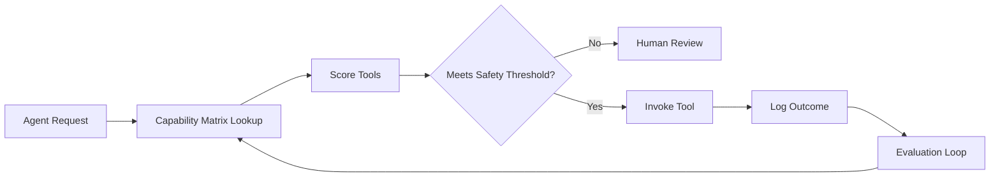

TL;DR
- Map agent capabilities and tool affordances in a capability matrix to avoid redundant or unsafe tool calls.
- Score candidate tool invocations against latency, cost, confidence, and governance constraints before execution.
- Continuously refine routing rules with post-execution feedback from evaluation loops and human reviewers.

## Build the Capability Matrix
List every agent in your system and the tools they can access—APIs, search, calculators, vector stores, or proprietary systems. For each combination, score capability (1–5), latency impact, and risk. Highlight exclusive tools that only certain agents may use due to credentials or compliance. Store this matrix in a shared repository so orchestrators can query it programmatically.

### Contextual Inputs
Capture additional context: required inputs, output schemas, and preconditions such as data freshness. Tools needing structured JSON outputs require agents to follow stricter format instructions. Document fallback options when primary tools fail.

## Routing Strategy
When an agent needs to complete a task, consult the capability matrix to produce a ranked list of tools. Apply filters for maximum allowable latency or cost. Use the automation risk matrix to escalate tasks requiring human oversight or guardrails. Implement gating logic in your orchestrator—if the agent's confidence is below threshold, route to a human gate or alternative tool.

### Scoring Function
Design a scoring formula combining capability score, expected latency penalty, cost per use, and safety multiplier. Example: `score = capability * confidence - latency_weight - cost_weight + safety_bonus`. Tune weights using historical outcomes from evaluation loops.

## Feedback and Learning
After each tool invocation, log success metrics—task completion, human overrides, errors. Feed this data into your designing evaluation loops framework to update scores. Promote tools with consistent success and demote those causing errors. When new tools are added, run sandbox simulations before exposing them to production agents.

### Governance Alignment
Ensure tool access aligns with automation governance policies. Document who approved each tool, required authentication, and audit trails. Align with the automation data readiness audit to verify input quality.

## Comparison Table
| Attribute | Why it Matters | Data Source | Update Cadence | Example |
| --- | --- | --- | --- | --- |
| Capability Score | Measures fit for task | Human annotation, eval results | Monthly | Summarization agent with search tool |
| Latency Impact | Keeps response time targets | Observability metrics | Weekly | External API call adds 800ms |
| Cost per Call | Controls spend | Billing reports | Monthly | Proprietary API $0.01/call |
| Safety Tier | Prevents misuse | Risk matrix | Quarterly | Tool requires human gate |

## Diagram

## Checklist
- [ ] Catalog agents, tools, capability scores, latency, and risk tiers.
- [ ] Implement a scoring function that balances capability, cost, latency, and safety.
- [ ] Integrate evaluation feedback to update scores and routing rules.
- [ ] Align tool approvals with governance policies and audit requirements.
- [ ] Document fallback options when primary tools fail or exceed thresholds.

> **Benchmarks**
> - Time to implement: 1 week to build the matrix and integrate scoring into orchestrator logic. [Estimate]
> - Expected outcome: 20% reduction in unnecessary tool calls and improved task success rates. [Estimate]

## Internal Links
- [Pair with the agent routing patterns guide to orchestrate multi-step flows.](../multi-agent-orchestration/agent-routing-patterns.mdx)
- [Feed outcome data into the evaluation loop design framework.](../multi-agent-orchestration/designing-evaluation-loops.mdx)
- [Align tool governance with the automation risk matrix for small teams.](../ai-automation-foundations/automation-risk-matrix-small-teams.mdx)
- [Share capability metadata with the knowledge graph context playbook.](../multi-agent-orchestration/knowledge-graph-context-for-agents.mdx)

## Sources
- [OpenAI function calling update](https://openai.com/blog/function-calling-and-other-api-updates)
- [Google research on tool use in agents](https://research.google/pubs/pub47630/)
