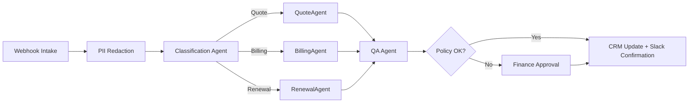

# Designing Agent Delegation Patterns in n8n
_Build resilient task handoffs and context-aware orchestration inside n8n_
**Author:** Cyber Income Innovators Editorial  |  **Date:** 2025-10-17  |  **Reading time:** ~15–25 min  
**Tags:** multi-agent, orchestration, n8n, delegation, tool-selection, context-handoffs

## TL;DR
- Structure n8n agent workflows with explicit role boundaries, shared context stores, and escalation rules before scaling automation.
- Combine queue-based triggers, sub-workflows, and HTTP Request nodes to delegate tasks across specialized agents while keeping audit trails.
- Use weighted decision matrices and telemetry to choose between autonomous completion, human review, or specialist agent escalation.
- Model latency and cost impacts of delegation choices; instrument redis-backed caches and evaluation runs to maintain SLAs.
- Maintain governance with version-controlled prompts, approval workflows, and compliance guardrails embedded in n8n credentials and execution logs.

## Introduction
n8n’s extensible workflow engine offers a pragmatic foundation for orchestrating multi-agent collaborations. Teams want to automate complex processes—customer onboarding, revenue operations, incident response—without building orchestration from scratch. Yet ad-hoc agent delegation creates context drift, duplicated work, and compliance risk. This article equips automation engineers, solution architects, and operations leads with patterns to design robust delegation inside n8n. You’ll learn a reusable framework, see a worked financial operations example, and compare strategies for balancing autonomy, oversight, and performance.

## Core Delegation Framework
A structured framework keeps agent responsibilities clear while leveraging n8n’s modular design.

### Five Steps to Reliable Delegation
1. **Define Agent Roles** – Document capabilities, required tools, and decision rights. Use n8n credential scopes to enforce least privilege. The n8n agent kit emphasizes role clarity to avoid tool overreach [n8n Agent Kit, 2024](https://docs.n8n.io/integrations/apps/ai-agent-components/).
2. **Establish Context Contracts** – Decide what data each agent receives. Store shared state in Redis, Postgres, or n8n’s Execute Command node connected to external stores. Mask sensitive fields to comply with privacy policies.
3. **Design Delegation Triggers** – Choose between sub-workflows, webhooks, or message queues (e.g., RabbitMQ node). Trigger agents when conditions meet defined thresholds.
4. **Implement Guardrails** – Add conditional checks, approval steps, and evaluation nodes to intercept risky outputs. Leverage OpenAI or Anthropic moderation endpoints before forwarding responses.
5. **Instrument Feedback Loops** – Log execution metrics using the n8n Telemetry or HTTP Request node pushing to observability stacks. Feed evaluation results into backlog grooming and prompt revisions.

### Governance Overlay
Wrap the framework with governance processes: version prompts via GitHub integration, require change approvals through n8n’s built-in workflow sharing permissions, and monitor credential usage with audit logs. Align with the Model Context Protocol (MCP) access control guidelines to ensure agents expose only necessary tools [OpenAI MCP, 2024](https://platform.openai.com/docs/guides/mcp).

## Worked Example: SaaS Revenue Operations Desk
Consider a revenue operations team processing complex quote approvals, billing adjustments, and contract renewals.

### Assumptions
- Average of 120 requests per day.
- Tasks split into 40% quote changes, 35% billing disputes, 25% renewals.
- Baseline manual handling time: 35 minutes per request.
- Analysts cost $65/hour fully loaded.
- Target turnaround: 12 minutes per request.
- LLM provider charges $0.002 per 1,000 tokens. Each request consumes ~3,500 tokens across agents.
- n8n cloud plan: $120/month; Redis cache: $200/month; evaluation tooling (Weights & Biases) $150/month.

### Workflow Architecture
1. **Intake Agent** – Webhook-triggered workflow validates inputs, performs PII redaction via the Code node, and stores context in Redis using the Redis node.
2. **Classification Agent** – Utilizes OpenAI Chat node to categorize request type, writing scores to Postgres. Confidence <0.75 triggers human review.
3. **Specialist Agents** – Three sub-workflows: Quote Adjuster, Billing Investigator, Renewal Strategist. Each uses HTTP Request nodes to interact with CRM and billing APIs. The Quote Adjuster calculates discount boundaries referencing corporate policy stored in Google Sheets via the Google Sheets node.
4. **Quality Assurance Agent** – A separate workflow aggregates agent outputs, runs an evaluation prompt, and uses Slack node to notify humans if policy deviations occur.
5. **Finance Approval** – Sensitive adjustments over $5,000 route to a Finance Manager via the Email node with approval links.

### Economic Impact
- Token cost per request: 3,500 × $0.002 = $7.00.
- Daily token cost: 120 × $7 = $840; monthly (22 days) ≈ $18,480.
- Labor savings: reduction from 35 to 12 minutes saves 23 minutes/request ≈ 46 hours/day; 46 × $65 = $2,990/day; monthly ≈ $65,780.
- Net monthly value: $65,780 savings – ($18,480 tokens + $470 tooling) ≈ $46,830.
- Additional benefit: improved SLA compliance reduces churn risk; assume 1% churn reduction on $5M ARR pipeline ≈ $50,000 retained annually.

### Performance Metrics
Track metrics via n8n’s workflow statistics API:
- Turnaround time per request.
- Human override ratio by agent.
- Token spend per workflow run.
- Error rate by API integration.

Feed data into Grafana dashboards; set alerts when turnaround exceeds 15 minutes or override ratio surpasses 20%. Use evaluation sets from QA agent to benchmark accuracy monthly.

## Delegation Patterns and Trade-offs
Choosing how agents coordinate affects reliability, latency, and compliance.

### Direct Sub-Workflow Delegation
n8n’s `Execute Workflow` node allows a coordinator to call specialized sub-flows. Benefits include encapsulation and reuse. Trade-offs: increased latency if sub-flows wait for upstream context or external APIs. Mitigation: pass minimal context and rely on shared stores for large payloads.

### Queue-Based Fan-Out
Use the RabbitMQ or Kafka nodes to publish tasks into queues consumed by agent workflows. Advantages: back-pressure handling, parallel execution, resilience. Trade-offs: additional infrastructure, potential ordering issues. Set prefetch counts to throttle concurrency and ensure idempotency by storing processed message IDs.

### Human Escalation Loops
Integrate with Slack or Microsoft Teams nodes to escalate ambiguous cases. This ensures compliance but can create bottlenecks. Implement service-level agreements for reviewers and provide summary context to minimize manual effort.

### Tool Selection Strategies
Leverage n8n’s Switch node to choose tools based on confidence scores. For example, high-confidence billing disputes may execute automated refunds; low-confidence cases call an API to schedule human callbacks. Maintain audit logs for each decision to support audits and retrospectives.

### Failure Modes
Common pitfalls include:
- **Context Drift** – Agents operate on stale data. Address by using Redis TTLs and versioned context IDs.
- **Tool Misconfiguration** – Incorrect credentials or endpoints cause failures. Automate credential rotation and monitor with n8n health checks.
- **Token Blowouts** – Recursive delegation loops escalate token usage. Set global token budgets in environment variables and monitor via provider dashboards.
- **Compliance Slips** – Lack of human oversight on high-risk actions. Configure approval gates and maintain checklist coverage.

## Implementation Guidance in n8n
Translating patterns into n8n configuration requires attention to detail.

### Context Management
Use Redis or Postgres nodes for shared context. Structure keys as `request:{id}:stage` to enable targeted updates. For short-lived context, n8n’s built-in static data can store small payloads between executions. Ensure sensitive data is encrypted; n8n supports AES-256 encryption for credentials [n8n Security, 2024](https://docs.n8n.io/reference/security/).

### Prompt and Tool Versioning
Store prompts in GitHub via the GitHub node or fetch them from an S3 bucket at runtime. Include version identifiers in context objects so QA agents know which prompt produced each result. Document tool versions and API schemas in Confluence or Notion, linking to workflow nodes for traceability.

### Guardrail Enforcement
Embed guardrails using the IF node to block outputs failing validation criteria. For example, if refund amounts exceed policy thresholds, trigger a Stop and Error node to halt execution. Use the HTTP Request node to call policy-as-code services (e.g., Open Policy Agent) for centralized decisions. MCP trigger specifications recommend verifying tool permissions before execution to prevent privilege escalation [OpenAI MCP, 2024](https://platform.openai.com/docs/guides/mcp#triggers).

### Observability and Alerting
Enable n8n event messaging to send workflow execution events to a monitoring service via Webhook. Use Prometheus exporters or Datadog integrations to track latency and error counts. Align metrics with Google SRE golden signals to maintain reliability [Google SRE, 2022](https://sre.google/sre-book/service-level-objectives/).

### Testing and Evaluation
Adopt test harnesses using n8n’s CLI to execute workflows with sample payloads. Maintain evaluation datasets stored in CSV or JSON files. After each change, compare outputs against baselines and compute precision/recall metrics. Leverage open-source evaluation tools like LangSmith or W&B to track regression trends [LangSmith Docs, 2024](https://docs.langchain.com/docs/langsmith/).

### Security Controls
Use role-based access control within n8n to limit who can modify workflows. Configure audit logging to track node changes and credential usage. For external APIs, store credentials in environment variables or secret managers (HashiCorp Vault). Follow OWASP LLM guidance for prompt injection defenses, including sanitizing inputs and restricting tool actions [OWASP LLM Top 10, 2023](https://owasp.org/www-project-top-10-for-large-language-model-applications/).

### Sensitivity Analysis
Stress-test assumptions by modeling surge scenarios. If daily requests spike to 200, queue-based delegation absorbs load by scaling consumer workflows horizontally. Token spend grows to $14,000/month, yet time savings reach 76 hours/day, preserving $108,680 in monthly labor value. If LLM pricing doubles, net benefit drops to ~$32,000; mitigate via caching embeddings or using smaller models for low-risk steps. Capture sensitivity insights in dashboards to inform budgeting and vendor negotiations.

### Documentation and Training
Create detailed runbooks explaining each workflow, trigger, and guardrail. Include swimlane diagrams, node descriptions, and troubleshooting steps. Offer enablement sessions for analysts covering n8n UI, escalation procedures, and prompt feedback submission. Maintain a knowledge base where teams document edge cases, token anomalies, and improvement ideas.

### Compliance Alignment
Map workflows to relevant regulations such as SOC 2, GDPR, or PCI DSS. Use n8n tags to label nodes processing sensitive data, and schedule periodic audits exporting execution logs for review. Align with NIST AI Risk Management Framework requirements for monitoring and accountability [NIST AI RMF, 2023](https://nvlpubs.nist.gov/nistpubs/ai/NIST.AI.100-1.pdf). Document approvals and residual risks in governance tools.

## Comparison Table
| Delegation Pattern | Best Use Case | Strengths | Limitations | n8n Nodes |
| --- | --- | --- | --- | --- |
| Direct Sub-Workflow | Structured processes with clear stages | Reusability, simple debugging | Synchronous latency, potential context duplication | Execute Workflow, Set, Merge |
| Queue-Based Fan-Out | High-volume tasks needing parallelism | Back-pressure management, horizontal scaling | Requires external queue, ordering complexity | RabbitMQ, Kafka, Redis |
| Human Escalation Loop | Regulated decisions requiring oversight | Compliance, qualitative judgment | Adds manual latency, requires staffing | Slack, Microsoft Teams, Email |
| Dynamic Tool Selection | Variable strategies based on confidence | Adaptive automation, resource optimization | Requires reliable scoring, risk of inconsistent behavior | Switch, IF, HTTP Request |
| Autonomous Completion with QA Agent | Low-risk tasks needing speed | Minimal human involvement, rapid throughput | Dependent on robust guardrails | OpenAI Chat, Function nodes, Evaluation sub-flow |

## Diagram (Mermaid)

## Checklist / SOP

1. Inventory processes suitable for agent delegation and define success metrics.
2. Map agent roles, capabilities, and required n8n credentials; document least-privilege access.
3. Configure shared context stores (Redis/Postgres) and implement PII masking during intake.
4. Build n8n workflows with explicit delegation triggers (Execute Workflow, queues, or sub-flows).
5. Implement guardrails: policy checks, approval steps, moderation, and budget alerts.
6. Instrument telemetry to capture latency, errors, token usage, and human overrides.
7. Run evaluation suites after every change; require approvals for prompt/tool updates.
8. Review delegation metrics monthly with stakeholders and refine playbooks.

## Benchmarks

> Time to implement: [Estimate] 6–8 weeks for initial delegated workflow
> Expected outcome: [Estimate] 40–60% cycle time reduction with policy-compliant automation
> Common pitfalls: stale context stores; unbounded token usage; missing human approvals
> Rollback plan: Maintain manual SOPs and switch n8n workflows to pause mode while reverting to previous prompt/tool versions

## Sources

* n8n. "AI Agent Components." — https://docs.n8n.io/integrations/apps/ai-agent-components/
* OpenAI. "Model Context Protocol." — https://platform.openai.com/docs/guides/mcp
* n8n. "Security Overview." — https://docs.n8n.io/reference/security/
* Google. "Service Level Objectives." — https://sre.google/sre-book/service-level-objectives/
* LangChain. "LangSmith Documentation." — https://docs.langchain.com/docs/langsmith/
* OWASP. "Top 10 for LLM Applications." — https://owasp.org/www-project-top-10-for-large-language-model-applications/
* Redis. "Redis Node Documentation." — https://docs.n8n.io/integrations/builtin/app-nodes/n8n-nodes-base.redis/
* Weights & Biases. "LLM Evaluation Guide." — https://docs.wandb.ai/guides/large-language-models/evaluation
* NIST. "AI Risk Management Framework." — https://nvlpubs.nist.gov/nistpubs/ai/NIST.AI.100-1.pdf
