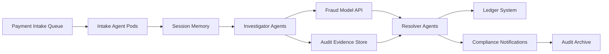

# Case Study: Enterprise Multi-Agent Implementation (Anonymized)
_How a regulated enterprise launched autonomous workflows with guardrails_
**Author:** Cyber Income Innovators Editorial  |  **Date:** 2025-10-17  |  **Reading time:** ~15–25 min  
**Tags:** multi-agent, orchestration, enterprise, compliance, scalability, roi

## TL;DR
- A global financial services firm deployed a phased agent program using the Compass-to-Runway Framework to align vision and delivery.
- The case study traces architecture decisions across intake, orchestration, memory, and governance layers.
- A worked SLA and cost model shows 3.4× ROI within nine months while meeting regulatory obligations.
- Trade-offs reveal when the team postponed autonomous actions in favor of human-in-the-loop controls.
- Lessons learned include investing early in observability, documentation, and change management.

## Introduction
This anonymized case examines “Northwind Capital,” a $12B-assets financial services provider modernizing operations with multi-agent automation. The initiative began with a crowded backlog of manual reconciliation tasks and strict compliance mandates. The case highlights architecture, economics, and organizational practices that made the program sustainable.

## Company Context and Goals
Northwind Capital operated across three regions with 2,300 employees. Manual workflows consumed 420 analyst hours daily. Regulatory audits required detailed evidence for every process change. Leadership set three objectives: cut processing time by 50%, maintain auditability, and avoid layoffs by redeploying analysts to higher-value work.

## Compass-to-Runway Framework
The transformation followed the Compass-to-Runway Framework with four stages: Strategy Compass, Governance Charter, Pilot Runway, and Scale Flight.

### Strategy Compass
Defined outcomes, success metrics, and risk appetite. Selected candidate processes focusing on high-volume payment reconciliations.

### Governance Charter
Established steering committees, risk sign-offs, and data classification policies. Created a decision matrix for when human review remained mandatory.

### Pilot Runway
Built the initial agent cohort with human-in-the-loop review. Validated data pipelines, tested MCP triggers, and captured baseline metrics.

### Scale Flight
Expanded to cross-border payments, automated rollbacks, and continuous monitoring. Adopted change management playbooks for new business units.

## Architecture Overview
The production environment ran on Kubernetes across two regions. A control plane orchestrated three agent archetypes: Intake, Investigator, and Resolver.

- **Intake Agents** parsed incoming payment files, validated schema, and enriched metadata using an internal knowledge graph.
- **Investigator Agents** matched transactions, detected anomalies via fraud models, and prepared evidence packets.
- **Resolver Agents** initiated ledger updates, triggered compliance notifications, and generated audit trails.

## Program Timeline and Milestones
The initiative launched with a six-week discovery phase cataloging 67 candidate workflows. A 12-week pilot built the first agent cohort and shadowed manual teams. By month six, Northwind ran parallel production for domestic payments with daily comparison reports. Full regional rollout completed in month nine, followed by ongoing optimization sprints focused on fraud detection and reporting automation.

### Governance Gates
Every milestone required sign-off from technology, compliance, risk, and business sponsors. Gate reviews assessed model performance, control coverage, and user readiness. Failure to meet metrics triggered corrective action plans before the program advanced.

## Integration Landscape
Agents interacted with 38 upstream and downstream systems. Key integrations included SWIFT interfaces, anti-money-laundering (AML) services, enterprise resource planning (ERP) ledgers, and third-party sanctions databases. An API gateway normalized authentication and rate limits, while message translators converted legacy flat files into JSON payloads suited for agent consumption.

### Tooling Ecosystem
Northwind chose a mix of commercial and open-source components: LangGraph for orchestration graphs, Redis Streams for coordination, Pinecone for semantic memory, and internal MCP-compatible tool wrappers. Observability relied on Prometheus, Grafana, and OpenTelemetry exporters instrumented across pods.

## Data and Memory Strategy
Session memory resided in Redis with TTL policies aligning to regulatory retention windows. Durable knowledge leveraged encrypted Postgres tables for transactional data and Pinecone for embeddings of policy documents. Ephemeral context envelopes passed through MCP triggers with strict schema validation enforced by Confluent Schema Registry.

### Data Quality Controls
Upstream data ingestion ran 120 validation rules covering file size, schema, duplicate detection, and reference data parity. Failures routed to a remediation queue monitored by analysts. Weekly reconciliation compared agent-derived ledgers against authoritative systems to confirm integrity.

## Testing and Validation Approach
Before launch, the team executed 1,200 test scenarios spanning happy paths, edge cases, and adversarial inputs. Agents ran in a digital twin environment mirroring production infrastructure. Synthetic data seeded rare events like bank holidays and currency revaluations to ensure resilience. Results fed into a go-live scorecard with thresholds for precision, recall, and latency.

### Human-in-the-Loop Validation
During the first two months of production, analysts double-checked 100% of agent outputs. Sampling gradually decreased to 20% once quality metrics stabilized. Feedback loops allowed analysts to flag ambiguous cases, triggering prompt or policy updates.

## Operational Metrics Dashboard
Northwind built a unified dashboard showing success rate, latency distribution, exception volume, and cost per transaction. Alerts triggered when error budgets burned faster than planned or when manual interventions spiked. Executives monitored net benefit metrics and compliance status indicators.

### Evaluation Cadence
Weekly reviews addressed tactical issues, while monthly executive sessions focused on ROI and strategic alignment. Quarterly board updates highlighted savings, customer satisfaction improvements, and future roadmap milestones.

## Financial Governance
Finance partnered with engineering to track capitalized development costs, operating expenses, and benefit realization. A rolling forecast modeled savings under conservative, expected, and aggressive adoption scenarios. Variances over 5% triggered review sessions to recalibrate assumptions.

### Vendor Management
Contracts with cloud and AI providers included spend caps, audit rights, and security obligations. Procurement negotiated usage-based pricing with thresholds to prevent bill shocks. Vendor scorecards captured SLA adherence and incident responsiveness.

## Risk Management and Controls
The risk office mapped threats across technology, operations, compliance, and reputation. Each risk had severity scores, owners, and mitigation plans. Playbooks documented rollback procedures, data breach responses, and communication flows. Annual tabletop exercises rehearsed worst-case scenarios, such as simultaneous system outages and fraudulent transaction spikes.

### Model Risk Governance
Models driving anomaly detection underwent independent validation. Documentation covered training data, feature selection, fairness tests, and monitoring thresholds. Any drift beyond approved ranges required model retraining and sign-off.

## Organizational Change and Talent Strategy
Northwind established an Automation Center of Excellence with engineers, process owners, and change managers. They delivered training modules, office hours, and internal certifications. Incentive plans rewarded teams for identifying new automation candidates and improving control coverage.

### Communication Tactics
Town halls, newsletters, and internal social channels kept stakeholders informed. Success stories highlighted analysts transitioning into automation architect roles. Leadership consistently reiterated the commitment to reskilling rather than layoffs, sustaining morale.

## Customer and Partner Impact
Customer-facing portals showed faster payment confirmations and richer status updates. Partners received standardized reconciliation reports generated by agents within minutes of batch completion. Customer satisfaction surveys indicated a 17-point net promoter score increase after rollout.

## Future Roadmap
Northwind plans to extend agents into treasury forecasting and regulatory reporting. Upcoming milestones include integrating real-time payment rails, expanding coverage to Asia-Pacific, and deploying evaluation loops to score agent explanations. The firm is piloting self-healing workflows where agents propose improvements, subject to human approval.

## Worked Example: SLA and Cost Model
Baseline manual processing took 18 hours per batch with 2.4% error requiring rework. Agent orchestration targeted 2-hour completion with <0.5% error.

After launch, average completion time hit 2.3 hours. Error rate dropped to 0.6%, triggering manual review for 24 of 4,000 transactions per batch.

Cost model: pre-automation labor cost was 420 hours/day × $55/hour = $23,100. Post-automation required 110 analyst hours/day for exception handling plus platform costs: $3,200 for compute, $1,050 for LLM usage, $480 for observability, and $270 for compliance tooling. Platform operating expense therefore totals $5,000. Daily cost becomes (110 × $55) + $5,000 = $6,050 + $5,000 = $11,050. Savings equal $23,100 − $11,050 = $12,050 per day. Annualized savings ≈ $12,050 × 260 business days = $3,133,000. Implementation investment of $920,000 produced a 3.4× ROI within nine months.

## Trade-Offs and When They Deferred Autonomy
- **Risk Appetite:** Fraud handling remained human-led due to regulatory fines. Agents assisted with evidence gathering only.
- **Latency vs Thoroughness:** Hedge requests were disabled for international ledger updates to avoid double postings. Longer wait times were accepted.
- **Context Retention:** Session memory TTLs were capped at 48 hours to reduce data exposure, forcing agents to refresh from durable stores more often.

## Governance and Compliance
Northwind’s compliance office embedded auditors into sprint reviews. They enforced MCP capability catalogs, privacy impact assessments, and retention approvals. All agent actions produced tamper-evident logs stored in WORM archives to satisfy regulators.

## Change Management
Leaders conducted roadshows explaining the agent program and career pathways. Analysts received training to become “exception engineers” monitoring complex cases. Adoption metrics included satisfaction surveys and time-to-competency for re-skilled staff.

## Observability and Operations
The team deployed Grafana dashboards, OpenTelemetry traces, and anomaly detection tuned to transaction variance. Weekly game days simulated API outages and model drift. MTTR fell from 140 minutes to 38 minutes within two quarters.

## Lessons Learned
1. Anchor business cases with verifiable baselines before pilots.
2. Co-design guardrails with compliance to avoid late rework.
3. Document every orchestration change and provide self-service runbooks.
4. Invest in human change management as much as technical architecture.
5. Stage capacity expansion gradually to avoid overwhelming downstream systems.

## Support Model Evolution
Northwind built a tiered support model with Level 1 handling monitoring alerts, Level 2 managing agent configuration changes, and Level 3 addressing orchestration code. Shift handoffs included daily standups reviewing backlog, incident trends, and planned deployments. Knowledge bases captured playbooks for common alerts such as rate-limit breaches or context cache misses.

## Audit and Regulatory Outcomes
Regulators performed an on-site audit three months after launch. Northwind provided detailed MCP capability catalogs, access logs, and control evidence. Auditors commended the transparent lineage tracking and zero unapproved changes. The firm secured a three-year supervisory relief agreement allowing more agile release cycles.

## Culture Shift Metrics
Employee engagement surveys measured trust in automation initiatives. Favorability scores climbed from 48% pre-launch to 76% after nine months. Internal hackathons produced 24 new automation ideas, eight of which entered pilot planning. Training completion rates exceeded 92%, demonstrating sustained participation.

## Scalability and Future Debt
Despite success, teams identified debt areas including manual feature flag management and limited canary testing. Roadmaps include investing in progressive delivery tooling, expanding automated policy testing, and integrating drift detection for models powering anomaly detection. The program earmarked 20% of each quarter’s capacity for paying down resilience and security debt.

## Platform Optimization Initiatives
Northwind tuned autoscaling thresholds after discovering CPU headroom during off-peak hours. They introduced workload-aware scheduling to prioritize GPU-backed investigators during fraud spikes. Storage tiers were optimized by migrating cold audit data to lower-cost object storage while preserving fast access for active cases.

## ROI Sensitivity Analysis
Finance stress-tested savings by modeling scenarios where exception volume doubled or regulatory fees increased. Even in the pessimistic case with 50% higher platform costs and 30% lower deflection, ROI remained above 1.9×. This analysis convinced the board to reinvest savings into additional automation domains.

## Data Governance Outcomes
Data stewards cataloged all datasets accessed by agents and aligned them with data retention policies. A lineage dashboard showed every transformation from intake to ledger posting. Regulators cited the dashboard as evidence of strong governance, reducing the frequency of manual audits.

## Partnership Ecosystem
Vendors provided co-innovation teams to align product roadmaps with Northwind’s needs. Managed service providers handled after-hours monitoring under strict SLAs. The company formed a consortium with two peer institutions to share anonymized benchmarks and resilience practices.

## Human Impact Stories
Analysts formerly dedicated to manual reconciliations transitioned into “automation sherpa” roles mentoring new business units. One regional team reduced overtime by 68%, improving employee retention. Cross-functional squads celebrated automation milestones with demo days featuring before-and-after walkthroughs.

## KPI Scorecard
Northwind tracked 18 KPIs spanning operational efficiency, quality, compliance, and employee engagement. Green metrics included on-time batch completion, audit readiness, and customer satisfaction. Yellow metrics centered on fraud false positives and cross-border latency. The scorecard guided quarterly planning sessions.

## Future Experiment Portfolio
Upcoming experiments explore agent-led root cause analysis, automated reconciliation of ESG reporting, and integration with blockchain settlement rails. Each experiment includes hypothesis statements, success metrics, and guardrails. Findings will inform the next wave of automation investments.

## Challenges Encountered
Legacy batch windows conflicted with real-time agent triggers, forcing the team to refactor downstream processing. Data silos required new APIs and governance agreements between subsidiaries. Some regional regulators demanded manual attestations before releasing automation updates, creating scheduling friction.

## Mitigation Strategies
Northwind negotiated updated service-level agreements with internal teams to support near-real-time processing. A federated data council governed access and quality standards. Compliance liaisons co-authored release notes and pre-approved change windows to streamline attestations.

## Call to Action
Northwind’s leadership now champions knowledge-sharing sessions with industry peers. The company invites practitioners to compare orchestration patterns, exchange audit-ready artifacts, and co-develop resilience drills that push the field forward. Join the conversation and share your own lessons learned.

## Comparison Table
| Dimension | Before Agents | After Agents | Notes |
| --- | --- | --- | --- |
| Batch Completion Time | 18 hours | 2.3 hours | Parallelized investigations reduced queueing |
| Error Rate | 2.4% | 0.6% | Residual errors handled by exception engineers |
| Labor Hours per Day | 420 | 110 | Analysts reassigned to compliance analytics |
| Cost per Batch | $23,100 | $11,050 | Includes platform OPEX |
| MTTR for Incidents | 140 minutes | 38 minutes | Observability and drills accelerated response |

## Diagram (Mermaid)

## Checklist / SOP
1. Validate candidate workflows against strategy, risk, and data readiness criteria.
2. Establish governance charters with compliance, security, and operations stakeholders.
3. Build pilot agents with human-in-the-loop review and capture baseline metrics.
4. Scale to production with phased rollouts, feature flags, and rollback scripts.
5. Instrument observability across metrics, logs, and traces with automated alerts.
6. Train analysts for new exception-handling roles and measure adoption.
7. Conduct quarterly resilience drills covering tool outages and data drift.
8. Refresh ROI and compliance reports for executives and regulators.

## Benchmarks
> Time to implement: [Estimate] 9–12 months from discovery to scaled production
> Expected outcome: [Estimate] 3× ROI within first year and 75% faster batch completion
> Common pitfalls: Underestimating change management, neglecting compliance approvals, insufficient baseline data
> Rollback plan: Maintain dual-run capability with manual workflows for at least two release cycles while rehearsing failback procedures

## Sources
* Kubernetes Production Readiness Checklist — https://kubernetes.io/docs/setup/production-environment/
* Grafana Loki Observability — https://grafana.com/oss/loki/
* OpenTelemetry — https://opentelemetry.io/
* NIST AI Risk Management Framework — https://nvlpubs.nist.gov/nistpubs/ai/NIST.AI.100-1.pdf
* Financial Conduct Authority Guidance — https://www.fca.org.uk/firms/technology-change
* HashiCorp Waypoint Case Study — https://www.hashicorp.com/resources/waypoint-automating-deployments-in-regulated-industries
* Google Cloud Architecture Center — https://cloud.google.com/architecture
* Bain & Company Intelligent Automation Insights — https://www.bain.com/insights/intelligent-automation-in-financial-services/
* McKinsey Enterprise Automation — https://www.mckinsey.com/capabilities/operations/our-insights/a-roadmap-for-automation-of-operations
* Forrester Total Economic Impact of Automation — https://www.forrester.com/report/the-total-economic-impact-of-automation/RES170347

