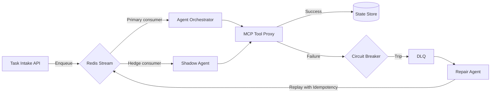

# Fault-Tolerant Multi-Agent Architectures: Best Practices
_Engineering resilience into autonomous teams of agents without killing velocity_
**Author:** Cyber Income Innovators Editorial  |  **Date:** 2025-10-17  |  **Reading time:** ~15–25 min  
**Tags:** multi-agent, orchestration, reliability, resilience, observability, zero-trust

## TL;DR
- Engineer layered failure containment with retries, hedged requests, and circuit breakers tuned to agent SLAs.
- Adopt the R4 Resilience Framework to align redundancy, rollback, repair, and review loops across orchestration layers.
- Quantify failure budgets with a worked incident cost model to justify investment in chaos drills and DLQs.
- Apply saga patterns, outbox relays, and idempotency keys to navigate exactly-once myths across agent workflows.
- Instrument observability and game days to validate failover readiness before customer workloads hit production.

## Introduction
Multi-agent automation is only as strong as its weakest broker, queue, or plugin. Senior engineers and platform leads need operating models that keep self-directed agents available despite flaky APIs, noisy contexts, or malformed tool outputs. This article equips you with patterns, math, and guardrails to deliver fault tolerance without drowning in complexity. You will leave with a reusable framework, concrete incident economics, and a proven checklist to stage chaos exercises that prevent catastrophic rollbacks.

## The R4 Resilience Framework
The R4 framework covers Redundancy, Rollback, Repair, and Review. Use it to reason about resilience investments before writing infrastructure code.

### Redundancy
Design for active-active orchestration controllers, geo-replicated Redis queues, and dual tool adapters. Favor quorum-based consensus for critical state transitions. Evaluate cost impacts versus availability targets.

### Rollback
Ensure automated rollback paths exist for every orchestration graph change. Maintain versioned workflow specs and guard them with feature flags, per-agent kill switches, and MCP trigger toggles.

### Repair
Automate remediation runbooks. Leverage agentic fixer routines that detect anomalies, clear poisoned messages, and rehydrate context stores without human paging every time.

### Review
Institutionalize blameless post-incident reviews. Connect telemetry from Jaeger traces, OpenTelemetry metrics, and MCP audit logs to root-cause analyses.

## Worked Example: Hedged Requests and Incident Budgets
Consider an orchestration cluster handling 2,000 tasks per minute with a $0.08 gross margin per task. Baseline failure rate is 1.2%, costing 24 failed tasks per minute. Each failure loses margin plus a $3.50 manual remediation charge. Daily cost of failure equals ((24 tasks/min × 60 min × 24 h) × ($0.08 + $3.50)) ≈ $12,441.

Adding hedged requests with timeouts at the 95th percentile cut failures to 0.35% but increase compute spend by $180/day. Incident remediation savings become ((0.012 − 0.0035) × 2,000 × 60 × 24 × ($0.08 + $3.50)) ≈ $9,030/day. Net gain is $9,030 − $180 = $8,850 daily, easily funding resilience investments and ongoing chaos testing.

## Exactly-Once Semantics Are a Myth
Distributed agents rarely deliver true exactly-once execution. Embrace effectively-once strategies.

### Saga Coordination
Use orchestrated sagas to manage long-running state changes. Break workflows into compensatable steps. Implement local transaction logs so failed agent actions can trigger compensating calls.

### Outbox and Inbox Relays
Publish tool calls via outbox tables monitored by relay workers. Consumers write to idempotent inboxes keyed by task ID and step number. This decouples persistence from messaging and prevents duplicate side effects.

### Idempotency Keys Everywhere
Propagate idempotency headers across MCP triggers, HTTP calls, and queue payloads. Store recent keys in Redis with TTL equal to the maximum retry horizon. Reject duplicates before they hit fragile downstream services.

## Trade-Offs and When Not to Over-Engineer
Fault tolerance has costs. Active-active clusters double infrastructure spend. Hedged requests increase downstream pressure and can exhaust rate limits. Circuit breakers with overly conservative thresholds might block healthy dependencies. Avoid layering advanced patterns when the workflow SLA tolerates brief delays or manual intervention is cheaper than automation.

## Chaos Engineering for Agents
Chaos drills reveal blind spots. Inject message corruption, simulate MCP registry outages, and throttle vector-store lookups. Measure failover timings, DLQ growth, and human escalation paths. Document guardrail breaches and update feature flags accordingly.

## Observability and SLO Guardrails
Define SLOs for success rate, latency bands, and recovery time. Tie alerting to error budgets. Use distributed tracing to stitch agent spans, queue operations, and tool calls. Combine Prometheus metrics with structured logs emitted from each orchestration node.

## Operationalizing the R4 Framework
Translate the R4 framework into quarterly objectives. For Redundancy, target dual-region deployments for workflows exceeding $50,000 daily revenue. For Rollback, maintain infrastructure-as-code templates that support instant rollback by pinning prior versions. Repair initiatives include automated DLQ replayers and self-healing scripts. Review milestones require documented post-incident action items tracked in issue management systems.

### R4 Maturity Ladder
Level one organizations rely on manual failover and ad hoc reviews. Level two deploys automated retries and standardized postmortems. Level three implements predictive failover, automated rollbacks, and continuous resilience scoring. Use maturity assessments to prioritize investments.

## Agent-Level Resilience Patterns
Individual agents need localized defenses even within robust orchestrators. Prioritize adaptive retry budgets per tool integration. Build fallback behaviors such as switching from direct database writes to append-only log staging when primary dependencies degrade. Use capability gating so agents gracefully refuse commands requiring unavailable tools rather than attempting risky workarounds.

### Degraded Mode Playbooks
Document the limited feature sets supported during partial outages. Configure orchestrators to broadcast capability downgrades via pub/sub so downstream agents can adjust expectations. Ensure customer-facing workflows message the degraded state clearly to prevent surprise behavior.

### Safe Stop Mechanisms
Implement explicit stop tokens or kill-switch events that freeze agents mid-run without corrupting shared state. Couple safe stop with checkpointing of in-flight context to enable resumption once dependencies recover. Test stop signals under load to avoid agents ignoring them due to tight loops or unbounded retries.

## Failure Mode Catalog
Maintain a living catalog of failure modes grouped by infrastructure, data, and logic. Infrastructure failures include node crashes, disk exhaustion, and network partitions. Data failures cover schema drift, malformed payloads, and poisoned training sets. Logic failures capture incorrect routing, prompt regressions, or tool misuse. Each failure entry should document detection signals, containment steps, remediation runbooks, and owner contacts.

### Quantifying Blast Radius
Score each failure mode by blast radius (number of agents affected) and time-to-detect. Prioritize mitigations for high-blast, high-latency scenarios. Use dependency graphs to highlight hidden couplings where a single tool outage could ripple across multiple workflows.

## Resilience Testing Roadmap
Set a quarterly roadmap mixing automated chaos, manual game days, and tabletop simulations. Month one focuses on infrastructure chaos such as pod eviction or queue throttling. Month two targets data anomalies including corrupted embeddings or stale knowledge bases. Month three runs human process drills to validate escalation paths. Track coverage metrics to confirm every critical workflow experiences at least two simulated failures per quarter.

## Tooling Stack for Resilience Telemetry
Augment observability with resilience-specific dashboards. Monitor retry rates, hedged request counts, circuit breaker states, and DLQ age distributions. Correlate telemetry with business KPIs such as order completion or support resolution time. Invest in anomaly detection tuned to identify creeping failure patterns like gradually increasing latency or escalating manual overrides.

## Vendor and Dependency Risk Management
Map external APIs, SaaS tools, and model providers powering agent actions. Establish secondary providers or cached fallbacks for the highest-risk dependencies. Negotiate SLAs that include notification requirements and recovery commitments. Incorporate third-party status feeds into orchestration guardrails so agents pause at the first hint of upstream trouble.

## Scenario Playbook: Payment Dispute Workflow
Consider a payment dispute workflow with intake, investigation, and resolution agents. Intake ingests dispute tickets, investigation pulls statements, and resolution issues refunds. A bank API outage spikes investigation failures. Circuit breakers trip, hedged requests invoke cached statements, and disputes reroute to manual analysts. DLQ captures affected cases, while repair agents replay them once the API recovers. The playbook identifies communication templates, SLA adjustments, and reporting obligations for regulators.

## KPIs and Reporting for Resilience
Track mean time to detect, mean time to remediate, percentage of automated recoveries, and error budget consumption. Publish monthly resilience scorecards summarizing incidents, root causes, and remediation status. Tie incentives or OKRs to resilience improvements to ensure sustained attention.

## Budgeting for Resilience
Estimate resilience budgets by allocating a percentage of automation savings to ongoing hardening. Use the incident cost model to show ROI on replication, chaos platforms, and training. Align budgets with fiscal planning cycles so resilience upgrades ship alongside feature enhancements.

## Implementation Roadmap Checklist
Phase initiatives to avoid overload. Phase one establishes telemetry, baseline SLOs, and basic retries. Phase two introduces circuit breakers, DLQs, and chaos experiments. Phase three deploys active-active topologies, hedged requests, and predictive anomaly detection. Each phase ends with executive readouts summarizing risk reduction and next investments.

## Measuring Success Over Time
Create quarterly resilience scorecards comparing target and actual metrics. Highlight improvements in automated recovery rates, reduced incident frequency, and shorter MTTR. Pair quantitative stats with qualitative insights from postmortems to capture cultural shifts.

## Regulatory and Compliance Alignment
Industries like finance or healthcare impose availability and audit requirements. Map resilience controls to frameworks such as FFIEC, PCI DSS, or HIPAA. Maintain evidence packages showing failover tests, DLQ retention settings, and incident response exercises. Collaborate with compliance teams to align resilience thresholds with regulatory expectations.

## Roles and Accountability
Assign clear ownership for resilience components. Platform engineers manage orchestration infrastructure, SRE teams own SLO compliance, and application teams maintain agent-level fallbacks. Establish an executive sponsor to unblock budget and cross-team coordination. Publish a RACI matrix so stakeholders know who leads, approves, contributes, and is informed during incidents.

## Continuous Education
Run quarterly workshops covering new resilience patterns, lessons from postmortems, and updates to tooling. Encourage engineers to earn certifications in SRE, cloud resilience, or chaos engineering. Share curated reading lists and community resources so the organization keeps pace with industry best practices.

## Comparison Table
| Pattern | Best Use Case | Key Benefits | Trade-Offs |
| --- | --- | --- | --- |
| Hedged Requests | Latency-sensitive tool calls with tail spikes | Reduces long-tail latency, boosts success rate | Higher compute cost, possible duplicate side effects |
| Circuit Breakers | Fragile external APIs | Prevents cascading failures, fast detection of outages | Requires accurate threshold tuning |
| DLQ with Replay Policies | Complex multi-step workflows | Preserves failed payloads, supports manual or automated replay | Needs governance to avoid reprocessing toxic messages |
| Saga Pattern | Cross-service state changes | Ensures compensating actions, avoids partial commits | Additional complexity, requires careful step design |
| Chaos Game Days | Validating resilience posture | Surfaces latent coupling, exercises runbooks | Investment in tooling, potential disruption if poorly staged |

## Diagram (Mermaid)

## Checklist / SOP
1. Define SLOs for task success, p95 latency, and recovery time budgets.
2. Instrument orchestrator traces with OpenTelemetry spans per agent hop.
3. Implement idempotency key propagation across all triggers and tool calls.
4. Deploy circuit breakers with adaptive thresholds and alerting hooks.
5. Configure DLQs with retention policies and automated repair agent workflows.
6. Schedule monthly chaos drills targeting at least three failure modes.
7. Review outcomes in blameless postmortems and update the R4 roadmap.
8. Refresh documentation and rollback playbooks after every major workflow change.

## Benchmarks
> Time to implement: [Estimate] 8–12 weeks for enterprise-scale orchestration layers
> Expected outcome: [Estimate] 60–75% reduction in manual remediation spend and 40% faster recovery from tool failures
> Common pitfalls: Overly aggressive hedging, missing idempotency keys, stale rollback scripts
> Rollback plan: Maintain versioned orchestration specs and feature flags to revert traffic to prior stable topologies within minutes

## Sources
* Netflix Technology Blog — https://netflixtechblog.com/introducing-hystrix-for-service-latency-and-fault-tolerance-3b3c2372c4a7
* Google SRE Workbook — https://sre.google/workbook/handling-overload/
* Microsoft Azure Architecture Center — https://learn.microsoft.com/azure/architecture/patterns/circuit-breaker
* AWS Builders Library — https://aws.amazon.com/builders-library/retries-and-timeouts-handling-transient-failures/
* Stripe Engineering — https://stripe.com/blog/idempotency
* Gremlin Chaos Engineering — https://www.gremlin.com/community/tutorials/chaos-engineering-for-distributed-systems/
* OpenTelemetry — https://opentelemetry.io/docs/concepts/what-is-opentelemetry/
* Redis Streams Documentation — https://redis.io/docs/latest/develop/data-types/streams/
* CNCF TAG App Delivery — https://tag-app-delivery.cncf.io/whitepapers/fault-tolerance-distributed-systems/

