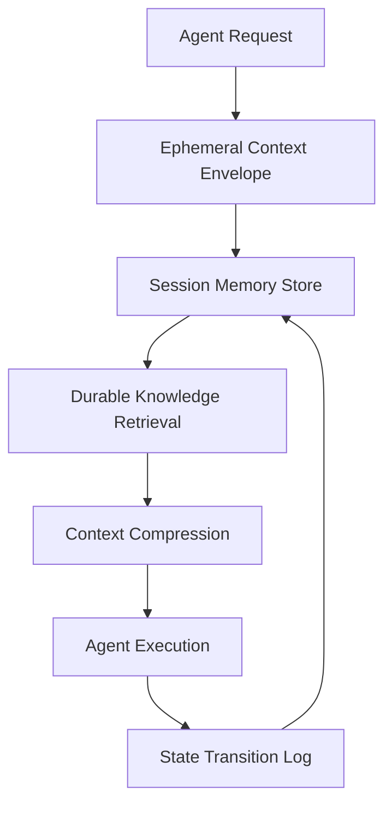

# Handling State & Context in Multi-Agent Systems
_Designing memory layers that keep autonomous teams coordinated and compliant_
**Author:** Cyber Income Innovators Editorial  |  **Date:** 2025-10-17  |  **Reading time:** ~15–25 min  
**Tags:** multi-agent, orchestration, state, context, memory, persistence

## TL;DR
- Apply the Tri-Layer Memory Framework to balance ephemeral context, session memory, and durable knowledge bases.
- Use versioned context packets with idempotency keys to survive retries and parallel agent execution.
- Quantify storage and latency trade-offs with a worked cost model comparing vector, key-value, and relational layers.
- Guard against context bloat using compression, summarization, and access controls tuned to privacy requirements.
- Instrument state transitions for auditability and GDPR/CCPA compliance.

## Introduction
State and context are the lifeblood of coordinated agents. Without disciplined memory patterns, you get hallucinated tool calls, duplicate actions, and compliance headaches. This article gives engineering leaders concrete frameworks and numbers to design memory layers that scale.

## Tri-Layer Memory Framework
The Tri-Layer Memory Framework distinguishes three layers: Ephemeral Context, Session Memory, and Durable Knowledge.

### Ephemeral Context
Resides in orchestration envelopes and MCP trigger payloads. Should be lean, immutable, and expire within minutes. Use structured JSON with schema validation.

### Session Memory
Tracks conversation history, task assignments, and intermediate results. Store in Redis, DynamoDB, or other low-latency stores with TTLs aligned to SLAs. Encrypt at rest and restrict access via per-agent policies.

### Durable Knowledge
Holds long-term artifacts such as documents, policies, and customer profiles. Use vector databases for semantic retrieval, relational stores for transactional integrity, and object storage for large binaries. Govern updates with change logs and access reviews.

## Worked Example: Storage Cost Trade-Offs
Suppose a workflow handles 50,000 tasks daily. Each task requires 15 KB of session memory, 4 KB of ephemeral context, and optionally 80 KB of durable knowledge references.

Ephemeral context stored in Redis with 2-hour retention costs about $0.10 per GB-month. Daily volume is 50,000 × 4 KB = 200 MB ≈ 0.2 GB. Monthly cost ≈ 0.2 × $0.10 = $0.02.

Session memory stored in DynamoDB on-demand costs $1.25 per million write units and $0.25 per million read units. Assume 3 writes and 4 reads per task. Daily writes = 150,000; reads = 200,000. Monthly cost ≈ ((150,000 × 30 / 1,000,000) × $1.25) + ((200,000 × 30 / 1,000,000) × $0.25) ≈ $5.63 + $1.50 = $7.13.

Durable knowledge stored in a vector database at $0.25 per GB-month with 10% of tasks requiring storage. Daily volume = 5,000 × 80 KB = 400 MB ≈ 0.4 GB. Monthly cost ≈ 0.4 × $0.25 = $0.10. Total monthly storage spend ≈ $7.25 while enabling strict retention policies.

## Context Compression and Summarization
Use rolling summaries to keep prompts under model token limits. Apply approximate nearest neighbor re-ranking to prioritize context retrieval. Track compression ratios and quality metrics to avoid truncating crucial facts.

## Idempotent State Transitions
Attach idempotency keys to every context update. Maintain a state transition log per agent with version numbers. Reject writes with stale versions to prevent race conditions during parallel agent execution.

## Access Control and Compliance
Implement attribute-based access control (ABAC) on memory stores. Mask PII using format-preserving encryption or tokenization. Log every read/write along with purpose, honoring data minimization mandates in regulations like GDPR.

## Data Lineage and Versioning
Track lineage across context transformations. Record which agent created a summary, which model version was used, and the source documents involved. Store lineage metadata alongside context payloads for auditability and debuggability. Use change data capture streams to propagate updates to downstream caches.

### Schema Evolution Management
Adopt versioned schemas for context packets. Include backwards-compatible adapters that translate older formats into new structures. Run automated integration tests to confirm agents still interpret evolved schemas correctly.

## Performance Tuning for Memory Systems
Profile latency across memory layers. Use Redis pipelines or multiplexed connections to cut round-trip time. Cache frequently accessed durable knowledge snippets in edge locations. Monitor cache hit ratios and update policies when hit rate drops below 85%.

### Token Budget Optimization
Quantify token consumption per agent step. Apply retrieval-augmented generation with relevance filtering to keep prompts compact. Experiment with hybrid embeddings (dense + sparse) to reduce recall noise while respecting token budgets.

## Cross-Agent Coordination Patterns
Leverage shared whiteboard primitives for agents collaborating on tasks. Represent shared plans as structured documents with locking semantics to avoid conflicting writes. Use event sourcing to broadcast updates so idle agents can resume with the latest context.

### Conflict Resolution
Define priority rules when multiple agents propose conflicting state changes. Favor the agent with the freshest data or higher trust level. Log conflicts for postmortem review and adjust orchestration policies accordingly.

## Drift and Staleness Management
Context drift occurs when session memory outlives relevant facts. Schedule automated sweeps that archive or delete aged context. Apply drift detection models that compare current context summaries against source-of-truth systems. Trigger refresh workflows when drift exceeds defined thresholds.

## Future-Proofing Memory Architectures
Plan for growth by adopting modular connectors and vendor-agnostic abstractions. Evaluate portability across clouds or on-prem deployments. Document data sovereignty requirements and replicate memory stores to regional clusters as regulations demand.

## Worked Example: Context Failure Remediation
An e-commerce support workflow experienced context corruption on 2% of cases due to incomplete session writes. Each incident required 18 minutes of analyst intervention at $45 per hour, costing 0.18 × $45 = $8.10 per case. With 1,200 affected cases monthly, losses reached $9,720. Implementing versioned context packets and retryable writes cut corruption to 0.3%, saving roughly $7,776 monthly even after investing $1,200 in additional infrastructure and monitoring.

## Testing Strategy for Memory Layers
Create unit tests validating schema adherence and serialization logic. Run load tests simulating concurrent agent access to session stores. Execute chaos drills that randomly delay or drop storage responses to confirm retry and fallback behavior. Track mean recovery time for each memory layer under duress.

## Documentation and Runbooks
Maintain living documents describing memory schemas, retention policies, and emergency procedures. Include diagrams of data flow, dependency lists, and contact information for service owners. Store runbooks in accessible collaboration platforms and rehearse their steps during game days.

## Collaboration with Compliance and Legal
Meet monthly with compliance partners to review retention schedules, access logs, and upcoming regulations. Share audit-ready reports covering who accessed sensitive context and why. Adjust policies when legal requirements change, such as new cross-border data transfer rules.

## Emerging Trends
Track developments in encrypted computation like homomorphic encryption or secure enclaves for sensitive context processing. Evaluate decentralized identifiers (DIDs) for customer identity management. Monitor vendor roadmaps for vector databases supporting row-level security or built-in governance features.

## Data Residency and Sovereignty Planning
Segment memory stores by geography to satisfy data residency laws. Use policy engines to enforce which agents may access regional data. Replicate durable knowledge across regions with encryption-in-transit and at rest, ensuring change propagation respects jurisdictional boundaries.

## Training and Enablement
Offer engineers playbooks covering context patterns, failure scenarios, and remediation tactics. Pair new team members with experienced memory stewards during onboarding. Review incidents quarterly to reinforce best practices and evolve training materials.

## Comparison Table
| Memory Layer | Typical Tech | TTL | Key Risks | Mitigations |
| --- | --- | --- | --- | --- |
| Ephemeral Context | MCP payloads, in-memory caches | Minutes | Corruption, schema drift | JSON schema validation, checksum headers |
| Session Memory | Redis, DynamoDB, Cloud Spanner | Hours to days | Data leaks, stale state | TTL cleanup, ABAC, idempotent updates |
| Durable Knowledge | Vector DB, Postgres, S3 | Weeks to years | Unauthorized retention, outdated knowledge | Change logs, access reviews, scheduled re-indexing |

## Diagram (Mermaid)

## Checklist / SOP
1. Classify workflow data into ephemeral, session, and durable categories.
2. Define schemas and retention policies per category with security approvals.
3. Implement storage connectors with versioning and idempotency key enforcement.
4. Deploy compression and summarization strategies with quality monitoring.
5. Configure ABAC policies and redact or tokenize sensitive fields.
6. Emit state transition logs to an immutable audit store.
7. Review retention schedules quarterly with legal and compliance teams.
8. Test failover and restoration procedures for each memory layer.

## Benchmarks
> Time to implement: [Estimate] 4–6 weeks for a production-ready tri-layer memory setup
> Expected outcome: [Estimate] 30% lower context errors and 50% faster recovery from state corruption incidents
> Common pitfalls: Over-retention of PII, inconsistent schemas, missing idempotency enforcement
> Rollback plan: Revert to previous storage connectors using versioned infrastructure definitions and restore snapshots from the immutable audit log

## Sources
* Redis Data Management — https://redis.io/docs/latest/develop/
* AWS DynamoDB On-Demand Pricing — https://aws.amazon.com/dynamodb/pricing/on-demand/
* Pinecone Vector Database — https://docs.pinecone.io/docs/overview
* Google Cloud ABAC — https://cloud.google.com/iam/docs/abac
* NIST Privacy Framework — https://www.nist.gov/privacy-framework
* OpenAI Context Management Best Practices — https://platform.openai.com/docs/guides/production-best-practices
* AWS Encryption SDK — https://docs.aws.amazon.com/encryption-sdk/latest/developer-guide/introduction.html
* Cloud Security Alliance GDPR Guidance — https://cloudsecurityalliance.org/artifacts/gdpr-challenges-in-the-cloud/

