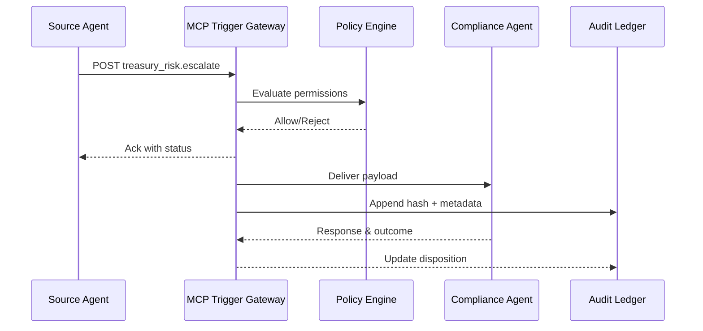

# Implementing MCP Triggers for Agent Communication
_Engineer secure, observable Model Context Protocol triggers for reliable agent-to-agent messaging_
**Author:** Cyber Income Innovators Editorial  |  **Date:** 2025-10-17  |  **Reading time:** ~15–25 min  
**Tags:** multi-agent, orchestration, mcp, triggers, security, observability

## TL;DR
- MCP triggers coordinate agent communication through structured events, context, and permissions—treat them as first-class APIs.
- Design trigger schemas with explicit contracts, idempotency keys, and policy hooks to prevent drift and unauthorized tool calls.
- Implement security with scoped credentials, signature verification, and network segmentation; log every trigger invocation for audits.
- Test throughput, latency, and failure scenarios using synthetic loads and chaos experiments to maintain SLAs.
- Govern MCP triggers via version control, change approvals, and evaluation loops tied to business metrics.

## Introduction
The Model Context Protocol (MCP) provides a standardized way for agents, tools, and applications to exchange structured messages. Without disciplined trigger design, multi-agent systems suffer from inconsistent context, security gaps, and brittle workflows. This guide targets platform engineers, AI architects, and DevSecOps leaders building MCP-based orchestration. We present a reusable framework, a finance-grade worked example, implementation details, and governance tactics to keep triggers resilient, observable, and compliant.

## MCP Trigger Design Framework
A five-component framework anchors consistent trigger development.

### 1. Purpose & Outcomes
Start with the user story: what outcome should the trigger deliver? Document success criteria, SLAs, and failure handling. MCP documentation emphasizes aligning triggers with concrete tasks to avoid overbroad responsibilities [OpenAI MCP Guide, 2024](https://platform.openai.com/docs/guides/mcp).

### 2. Schema & Validation
Define JSON schemas for trigger payloads, including required fields, optional metadata, and enums. Incorporate idempotency keys to prevent duplicate processing. Validate incoming payloads using JSON Schema validators or libraries like Ajv. Include version fields (e.g., `schema_version`) for backwards compatibility.

### 3. Permissions & Guardrails
Map which agents can invoke the trigger. Implement allow-lists using MCP capability descriptors. Tie triggers to policy engines (Open Policy Agent) evaluating context, user roles, and sensitivity levels. OWASP recommends strict validation and least privilege when exposing agent APIs [OWASP LLM Top 10, 2023](https://owasp.org/www-project-top-10-for-large-language-model-applications/).

### 4. Observability & Telemetry
Instrument trigger invocations with structured logs capturing correlation IDs, latency, and decision outcomes. Emit metrics (success count, error rate, rejection count) to Prometheus or Datadog. Store payload hashes to detect tampering. Align instrumentation with OpenTelemetry spans so agent traces include trigger events [OpenTelemetry Docs, 2024](https://opentelemetry.io/docs/).

### 5. Lifecycle Governance
Version triggers in Git repositories. Require peer review, automated tests, and evaluation runs before deployment. Maintain changelogs and deprecation policies. Align with NIST AI Risk Management Framework recommendations for monitoring and accountability [NIST AI RMF, 2023](https://nvlpubs.nist.gov/nistpubs/ai/NIST.AI.100-1.pdf).

## Worked Example: Treasury Risk Escalation
A global bank needs agents monitoring transactions to escalate anomalies to compliance analysts.

### Architecture Overview
- **Source Agents** detect anomalies in transaction streams using vector embeddings and heuristics.
- **MCP Trigger** (`treasury_risk.escalate`) packages context, risk scores, and recommended actions.
- **Compliance Agent** receives triggers, enriches data, and routes to analysts.
- **Audit Service** logs every trigger for regulators.

### Schema Design
```json
{
  "type": "object",
  "required": ["event_id", "customer_id", "risk_score", "evidence", "proposed_action", "schema_version"],
  "properties": {
    "event_id": {"type": "string"},
    "customer_id": {"type": "string"},
    "risk_score": {"type": "number", "minimum": 0, "maximum": 1},
    "evidence": {"type": "array", "items": {"type": "string"}},
    "proposed_action": {"type": "string", "enum": ["monitor", "suspend", "escalate"]},
    "schema_version": {"type": "string"},
    "idempotency_key": {"type": "string"},
    "sensitivity_level": {"type": "string", "enum": ["low", "medium", "high"]}
  }
}
```

### Security Controls
- Require mutual TLS between agents and trigger endpoints.
- Verify HMAC signatures using shared secrets stored in HashiCorp Vault.
- Enforce role-based access: only `treasury_monitor` agents can call the trigger; compliance agents respond.
- Log payload hashes and signatures to immutable storage (e.g., AWS QLDB) for auditability.

### Economic Impact
- Analysts currently review 1,200 anomalies weekly at 30 minutes each (600 hours). Cost: 600 × $90 = $54,000/week.
- With MCP-triggered prioritization, 60% auto-resolve, analysts focus on 480 cases (240 hours). Cost: $21,600/week.
- Trigger infrastructure costs: MCP gateway $6,000/month, security stack $2,500/month, observability $1,800/month (~$2,750/week).
- Net weekly savings ≈ $54,000 – ($21,600 + $2,750) = $29,650; annualized ≈ $1.54M.
- Improved compliance reduces regulatory penalties; assume avoided fines $500K/year due to better audit trails.

### Performance Metrics
Track metrics:
- Trigger latency (p50/p95).
- Rejected trigger count due to policy violations.
- Auto-resolution rate.
- Analyst confirmation time.

Set SLO: 95% of triggers processed < 2 seconds end-to-end.

## Implementation Considerations
Translate the framework into concrete engineering tasks.

### Trigger Deployment Topologies
Implement triggers via HTTP endpoints or messaging backplanes. For HTTP, use API gateways (Kong, Apigee) supporting JWT validation and rate limits. For messaging, use Redis Streams or Kafka topics dedicated to MCP events. Ensure triggers remain idempotent; store `idempotency_key` in Redis to ignore duplicates.

### Context Enrichment
Augment triggers with contextual lookups. Use n8n or custom microservices to fetch customer profiles, risk history, and previous interactions. Cache data to limit repeated calls. Implement redaction pipelines to mask PII before forwarding to third-party agents.

### Error Handling and Retries
Design retry policies: exponential backoff with jitter for transient errors, dead-letter queues for persistent failures. Provide human-friendly messages when retries exhaust. Use circuit breakers to pause triggers if downstream agents misbehave; notify on-call staff via PagerDuty.

### Testing Strategy
Develop automated tests covering schema validation, authorization, and business logic. Use contract testing (e.g., Pact) to ensure producer and consumer compatibility. Run load tests simulating peak volumes; monitor latency distribution. Chaos testing should simulate partial outages, invalid signatures, and stale schema versions to confirm resilience.

### Observability Implementation
Instrument with OpenTelemetry: create spans for trigger generation, delivery, and consumption. Attach attributes like `trigger_name`, `risk_score`, `policy_decision`. Export metrics to Prometheus (success/error counts, latency histograms). Configure alerts when error rate >2% or latency exceeds SLO. Provide dashboards correlating trigger activity with business outcomes (fraud prevented, cases closed).

### Compliance and Audit
Log all trigger events to append-only storage. Include payload hashes, timestamps, agent IDs, policy decisions, and human approvals. Provide auditors with dashboards showing trigger lineage and evidence of guardrail enforcement. Align with ISO 27001 control requirements for access management and logging [ISO 27001, 2022](https://www.iso.org/standard/82875.html).

## Trade-offs and Failure Modes
Every design choice carries implications.

### Trigger Granularity
Fine-grained triggers allow targeted automation but increase maintenance overhead. Coarse triggers simplify integration but risk overloaded payloads. Balance by grouping related actions while keeping payloads manageable (<10 KB). Evaluate change frequency—granular triggers may require more frequent updates.

### Delivery Mechanisms
HTTP triggers offer simplicity but depend on synchronous availability. Messaging (Kafka/Redis) improves resilience and back-pressure handling but requires more infrastructure expertise. Select based on SLA requirements, traffic volume, and existing platform capabilities.

### Security vs. Usability
Strict security (mutual TLS, signed payloads, network segmentation) introduces operational overhead. Provide tooling for developers to test triggers locally using mock secrets and sandbox certificates. Document onboarding steps to prevent shadow integrations.

### Failure Scenarios
- **Schema Drift** – Producers send new fields without versioning. Mitigate with strict validation and compatibility testing.
- **Policy Misconfiguration** – Overly strict policies reject legitimate requests. Monitor rejection ratios and adjust policies.
- **Replay Attacks** – Attackers resend valid triggers. Use idempotency keys and timestamps; reject old events after a TTL.
- **Downtime** – Infrastructure outages halt triggers. Implement active-active deployments across regions.

### Sensitivity Analysis
Evaluate trigger performance under varied conditions. If anomaly volume doubles to 2,400/week, ensure queues and gateways scale horizontally. Kafka-based triggers can handle the surge with partition scaling, while REST endpoints may require autoscaling pods. If latency budget tightens to 1 second, consider colocating triggers and agents within the same VPC, using gRPC transports, or caching contextual data. Monitor cost implications: doubling traffic increases gateway and observability spend by ~35%; incorporate in ROI models.

### Documentation and Training
Create living documentation capturing trigger schemas, policy logic, and onboarding instructions. Provide runbooks for troubleshooting signature failures, schema mismatches, and rate limit breaches. Host quarterly training for developers and analysts covering MCP fundamentals, security expectations, and debugging techniques. Maintain a glossary clarifying terminology (trigger, capability, envelope) to avoid miscommunication between teams.

### Change Management
Route trigger updates through change advisory boards. Categorize changes as minor (schema addition), major (new trigger), or emergency (security patch). Require regression tests, policy reviews, and staged rollouts. Use feature flags or canary deployments to introduce new triggers to a subset of agents before full rollout. Document rollback steps and maintain historical versions for audit.

### Integration with Evaluation Platforms
Tie trigger success to evaluation pipelines. For example, replay historical anomalies through staging triggers to measure precision/recall of auto-resolutions. Store evaluation results alongside trigger versions. Integrate with platforms like LangSmith or internal analytics to compare human vs. automated outcomes. Use evaluation insights to adjust policy thresholds or escalate conditions.

### Compliance Alignment
Ensure triggers satisfy regulatory demands.
### Operational Runbooks
Develop runbooks for on-call responders. Include procedures for diagnosing failed triggers (check gateway logs, verify certificates), clearing dead-letter queues, and replaying events. Document communication protocols with compliance and business stakeholders during outages. Schedule quarterly game days to rehearse failover and rollback steps, incorporating lessons learned into updated runbooks.

### Stakeholder Engagement
Establish a governance council involving security, compliance, product, and operations. Review trigger metrics, incidents, and roadmap proposals monthly. Share simplified dashboards with executives highlighting business impact—cases resolved, fines avoided, customer satisfaction improvements. Transparent communication fosters trust and secures ongoing investment in MCP infrastructure. Offer quarterly briefings with data-driven updates and collect feedback to refine priorities.
 Implement data retention policies that align with GDPR/CCPA—store only necessary personal data, apply encryption, and support deletion requests. Map controls to industry frameworks (e.g., FFIEC for banking) and include evidence within compliance portals. Provide regulators with simulated trigger runs demonstrating guardrail effectiveness.

## Comparison Table
| Trigger Aspect | Option A | Option B | Strengths | Limitations |
| --- | --- | --- | --- | --- |
| Transport | HTTP REST | Kafka Topic | REST: simple integration; Kafka: high throughput | REST: less resilient; Kafka: more ops overhead |
| Authentication | Mutual TLS | Signed JWT | mTLS: strong channel security; JWT: easier rotation | mTLS: certificate management; JWT: key leakage risk |
| Idempotency | Redis Store | Database Table | Redis: fast, supports TTL | Database: durable but higher latency |
| Policy Engine | Inline Code | External OPA Service | Inline: low latency | OPA: centralized, auditable |
| Observability | Logs Only | Logs + Metrics + Traces | Full stack offers faster debugging | Logs-only lacks correlation |

## Diagram (Mermaid)


## Checklist / SOP

1. Define trigger purpose, success metrics, and responsible owners.
2. Design JSON schema with versioning, idempotency keys, and sensitivity tags.
3. Implement authentication (mTLS/JWT) and authorization policies via OPA or capability lists.
4. Deploy triggers through gateways or message brokers with rate limits and retry policies.
5. Instrument logging, metrics, and traces; configure alerts aligned to SLOs.
6. Execute load, chaos, and regression tests before enabling production traffic.
7. Document trigger behavior, onboarding steps, and rollback procedures; obtain compliance approvals.
8. Review metrics and incident reports monthly; iterate on policies and schemas.

## Benchmarks

> Time to implement: [Estimate] 8–10 weeks for production-ready trigger platform
> Expected outcome: [Estimate] 50–65% reduction in manual escalations with auditable context trails
> Common pitfalls: schema drift; inadequate signature validation; missing idempotency safeguards
> Rollback plan: Disable trigger endpoints at gateway, revert to previous schema version, and process backlog via manual queue

## Sources

* OpenAI. "Model Context Protocol Guide." — https://platform.openai.com/docs/guides/mcp
* OWASP. "Top 10 for LLM Applications." — https://owasp.org/www-project-top-10-for-large-language-model-applications/
* OpenTelemetry. "Getting Started." — https://opentelemetry.io/docs/
* NIST. "AI Risk Management Framework." — https://nvlpubs.nist.gov/nistpubs/ai/NIST.AI.100-1.pdf
* ISO. "ISO/IEC 27001:2022 Information security management." — https://www.iso.org/standard/82875.html
* HashiCorp. "Vault Documentation." — https://developer.hashicorp.com/vault/docs
* Kong Inc. "Kong Gateway Documentation." — https://docs.konghq.com/gateway/
* PagerDuty. "Service Reliability Guide." — https://www.pagerduty.com/resources/learn/service-reliability-guide/
* LangChain. "LangSmith Documentation." — https://docs.langchain.com/docs/langsmith/


