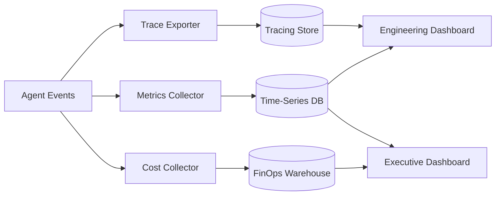

# Measuring Performance & ROI of Multi-Agent Systems
_Proving value with metrics that bridge engineering rigor and business outcomes_
**Author:** Cyber Income Innovators Editorial  |  **Date:** 2025-10-17  |  **Reading time:** ~15–25 min  
**Tags:** multi-agent, orchestration, analytics, roi, observability, finance

## TL;DR
- Use the MAS Metrics Compass to align success, efficiency, reliability, and financial indicators across teams.
- Build latency and throughput baselines with statistically sound sampling, not anecdotal runs.
- Quantify ROI using a worked cost model covering agent runtime, human deflection, and failure drag.
- Instrument evaluation loops with control charts and counterfactual holdouts to maintain trust.
- Visualize metrics in unified dashboards blending technical SLOs and business KPIs for executive clarity.

## Introduction
Engineering leaders must prove that orchestration investments beat status quo manual processes. Multi-agent systems produce sprawling telemetry but few actionable insights without structure. This guide provides a reusable framework, numerical ROI example, and tooling recommendations to defend budgets and iterate on performance.

## MAS Metrics Compass Framework
The MAS Metrics Compass organizes metrics into four quadrants: Success, Efficiency, Reliability, and Financial Impact. Each quadrant contains representative indicators and data sources.

### Success Metrics
Track task success rate, quality scores from human review, and goal attainment lag. Capture automated rubric grading outputs and MCP evaluation hooks.

### Efficiency Metrics
Measure median and tail latency, throughput per agent cluster, and tool call retries. Use percentile histograms and queue depth analytics to spot back-pressure.

### Reliability Metrics
Monitor SLO attainment, error budgets, incident frequency, and replay volume. Connect observability platforms and pager data to quantify resilience debt.

### Financial Metrics
Combine unit economics, cost per successful task, and margin uplift. Include amortized platform spending, LLM token costs, and human assist rates.

## Worked Example: ROI and Payback Math
Assume a customer support workflow previously required 40 analysts handling 400 tickets daily. Each ticket cost $11 fully loaded. Deploying a multi-agent orchestrator reduces manual effort by 65%, leaving 14 analysts. Platform costs include $420 daily for GPU instances, $185 for LLM tokens, and $80 for observability tooling.

Daily baseline spend equals 400 × $11 = $4,400. Post-automation analyst spend equals 14 × $11 = $154. Platform costs total $685, so the new daily operating cost is $154 + $685 = $839. Net savings is $4,400 − $839 = $3,561 per day. Implementation cost of $220,000 yields a payback time of $220,000 ÷ $3,561 ≈ 61.8 days.

## Instrumentation Pipeline
Set up data collectors at every orchestration hop. Emit structured events from agents, queues, and tool adapters. Route metrics to Prometheus, logs to Elastic or Loki, and traces to Jaeger. Normalize identifiers to support cross-system joins.

## Evaluation Loops and Sampling
Adopt stratified sampling for human evaluation with at least 5% of daily load. Alternate evaluation cohorts between production and shadow agents to preserve baselines. Use sequential testing or Bayesian A/B approaches to detect regression quickly.

## Dashboards and Reporting
Build role-based dashboards. Engineering views focus on latency, retries, and CPU saturation. Operations see ticket deflection, customer satisfaction, and escalation rates. Executives get ROI charts and trend lines with forecasts for budget planning.

## Trade-Offs and Risks
Chasing too many metrics dilutes focus. Over-sampling inflates review costs. Aggressive optimization for cost per task may degrade customer experience. Avoid vanity metrics disconnected from decision-making authority.

## Metrics Data Architecture
Design a data architecture that unifies streaming and batch analytics. Stream metrics into Kafka or Kinesis for near-real-time dashboards while persisting daily aggregates in a warehouse such as Snowflake or BigQuery. Define a canonical schema including task identifiers, agent roles, tool names, and cost fields so analysts can cross-filter without bespoke pipelines.

### Data Quality Safeguards
Implement freshness alerts that trigger when metrics lag by more than 10 minutes. Validate schema integrity with automated tests. Store reference data for exchange rates or cost factors in versioned tables to keep ROI math consistent over time.

## Benchmarking Playbook
Create internal benchmarking suites that replay synthetic workloads and measure throughput across orchestrator releases. Incorporate stress scenarios like bursty traffic or degraded dependencies. Compare results against industry benchmarks such as the HELM or BIG-Bench tasks if relevant to domain workflows. Document methodology to ensure repeatability.

### Latency Budget Allocation
Break down end-to-end latency budgets into intake, reasoning, tool execution, and post-processing slices. Allocate budgets based on critical path analysis. If agents exceed their slice, trigger adaptive responses such as lighter prompts or alternative tools to stay within SLA.

## Stakeholder Alignment
Hold monthly metric reviews with engineering, operations, finance, and compliance. Present trending charts, highlight deviations, and propose mitigation experiments. Translate technical findings into business language so stakeholders understand implications for customer experience and regulatory commitments.

## Automation of Alerts and Actions
Use event-driven automation to respond to metric anomalies. When the error budget burn rate exceeds thresholds, automatically throttle non-critical agents or route tasks to human specialists. Integrate alert bots with collaboration tools to provide context, links to dashboards, and recommended remediation steps.

## Continuous Improvement Loop
Tie metrics to retrospectives and roadmap planning. Prioritize feature work that increases success rates or reduces costs based on metric insights. Maintain a backlog of measurement gaps and close them each quarter. Share wins across the organization to reinforce data-driven culture.

## Advanced ROI Scenario Modeling
Apply sensitivity analysis to test ROI robustness. Vary deflection rates, token prices, and failure reductions to see how savings change. Use Monte Carlo simulations when variables are uncertain, such as demand volatility or regulatory impacts. Present outcomes as probability distributions so executives understand downside risks.

### Total Cost of Ownership Factors
Include indirect costs like security hardening, compliance audits, and change management. Amortize capitalized development over depreciation schedules. Align accounting treatment with finance policies to avoid disputes about savings attribution.

## Worked Example: Latency SLA Impact
Suppose agents handle trade reconciliation with a 5-minute SLA. Baseline latency averages 7 minutes, causing penalty fees of $25 per breach. With orchestration optimization, p95 latency drops to 4.2 minutes, reducing breaches from 320 per month to 40. Monthly penalty savings equal (320 − 40) × $25 = $7,000. Additional compute spend is $1,100 monthly, netting $5,900 in profit. Convert improvements into annualized ROI to justify further latency investments.

## Building a Metrics Catalog
Document each metric with definition, owner, data source, update frequency, and decision trigger. Include thresholds for green, yellow, and red status. Provide example queries or dashboard views so teams can self-serve.

## Tooling Governance
Evaluate observability vendors against requirements like cardinality, retention, and security. Create runbooks for adding new metrics to avoid dashboard sprawl. Regularly retire unused charts to keep focus sharp.

## Skills and Culture
Upskill analysts on SQL, Python, or visualization tools. Offer lunch-and-learn sessions on experimental design and statistical significance. Encourage teams to publish measurement postmortems describing metric failures and lessons learned.

## Data Privacy and Ethics Considerations
When measuring agents that process sensitive data, ensure dashboards aggregate or anonymize personally identifiable information. Apply differential privacy or role-based access to prevent inappropriate exposure. Collaborate with legal teams to approve metric sharing policies, especially for cross-border reporting.

## Comparison Table
| Metric Category | Example KPIs | Primary Tools | Risks |
| --- | --- | --- | --- |
| Success | Task completion %, rubric scores | MCP evaluator, human QA portal | Subjective scoring drift |
| Efficiency | p95 latency, throughput per node | Prometheus, Grafana | Sampling bias, noisy baselines |
| Reliability | Error budget burn, incident MTTR | PagerDuty, SLO dashboards | Alert fatigue, noisy signals |
| Financial | Cost per resolved task, net savings | FinOps platform, custom BI | Hidden overhead, misallocated costs |
| Strategic | Time-to-market, feature adoption | PMO trackers, OKR tools | Lagging indicators, confounding factors |

## Diagram (Mermaid)

## Checklist / SOP
1. Define the MAS Metrics Compass quadrant targets and owners.
2. Instrument agents, queues, and tools with consistent correlation IDs.
3. Configure time-series storage with retention policies for at least 13 months.
4. Establish baseline runs and capture control cohorts before optimization.
5. Launch dashboards aligned to engineering, operations, and executive stakeholders.
6. Review metrics weekly, triggering experiments or playbook updates when thresholds breach.
7. Recalculate ROI quarterly incorporating updated costs and benefits.
8. Present findings to leadership with action items tied to budget decisions.

## Benchmarks
> Time to implement: [Estimate] 6–8 weeks for full metrics pipeline and dashboards
> Expected outcome: [Estimate] 40% faster regression detection and 2× increase in validated automation savings
> Common pitfalls: Inconsistent IDs, manual ROI spreadsheets, ignoring sampling error
> Rollback plan: Maintain archived baseline dashboards and disable new collectors while reverting to prior alert rules

## Sources
* Google SRE Book — https://sre.google/sre-book/service-level-objectives/
* Datadog APM Guides — https://docs.datadoghq.com/tracing/
* AWS CloudWatch Metrics Insights — https://docs.aws.amazon.com/AmazonCloudWatch/latest/monitoring/metrics-insights.html
* Grafana Observability Playbook — https://grafana.com/docs/grafana/latest/getting-started/observability/
* FinOps Foundation — https://www.finops.org/resources/cloud-unit-economics/
* Bain & Company Automation ROI Study — https://www.bain.com/insights/how-to-measure-automation-roi/
* OpenAI Eval Guide — https://platform.openai.com/docs/guides/evals
* PagerDuty Incident Response — https://response.pagerduty.com/
* Monte Carlo Data Reliability — https://www.montecarlodata.com/blog/data-observability-metrics/

