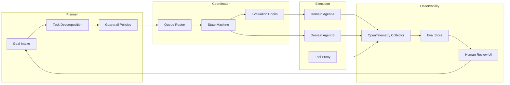
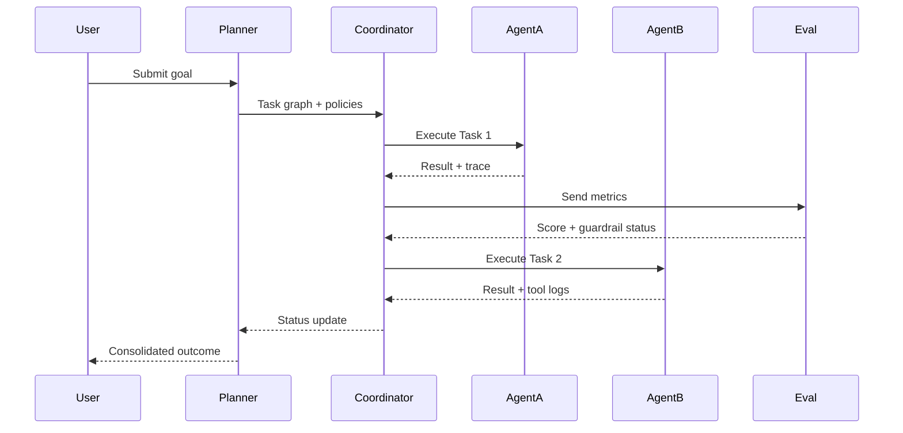

# Multi-Agent Workflow Orchestration: The Definitive Pillar
_Architecting resilient multi-agent systems from graph design to runtime guardrails_
**Author:** Cyber Income Innovators Editorial  |  **Date:** 2025-10-17  |  **Reading time:** ~15–25 min  
**Tags:** multi-agent, orchestration, reference-architectures, evaluation-loops, reliability, observability

## TL;DR
- Treat multi-agent orchestration as an operating system: craft role taxonomies, shared context contracts, and escalation policies before touching tooling.
- Combine graph/state-machine orchestrators with conversational planners to balance deterministic control and adaptive decision-making.
- Bake safety, evaluation, and rollback loops into the orchestration fabric using automated red-teaming, rate limits, and kill switches.
- Invest in unified observability—correlate traces, prompt revisions, tool invocations, and business metrics inside a single pane to manage SLAs.
- Adopt incremental portfolio scaling with portfolio-level OKRs, cost guardrails, and governance boards to sustain reliability and compliance.

## Introduction
Multi-agent workflows are powering copilots, autonomous operations centers, and AI-first customer experiences. Leaders adopting them face fragmented tooling, opaque runtime behavior, and unpredictable costs. Without orchestration discipline, teams ship brittle demos rather than dependable platforms. This guide serves experienced automation architects, ML platform leads, and operations directors who must scale from experiments to production with confidence. It maps the entire journey—from conceptual models to runtime guardrails—so you walk away with deployable architectures, governance scaffolding, and playbooks for sustaining reliability.

## Reference Architectures for Orchestration
Robust orchestration begins with architecture patterns tuned to roles, communications, and resilience requirements.

### Role Taxonomy and Context Contracts
A foundational step is defining the responsibilities and context access that each agent type receives. Leading teams maintain a capability matrix that specifies scope boundaries, tool entitlements, and escalation paths. OpenAI highlights the importance of clear tool grants when designing multi-agent systems to maintain alignment and minimize privilege creep [OpenAI Model Spec, 2024](https://platform.openai.com/docs/guides/multi-agent-systems). These contracts determine how the orchestrator mediates requests and ensures agents request only the data they need.

### Orchestration Layers
Production deployments usually adopt three layers:
1. **Planner Layer** – Provides goal decomposition and prioritizes tasks. Frameworks like LangGraph enable graph-based planning combined with LLM reasoning [LangGraph, 2024](https://langchain-ai.github.io/langgraph/).
2. **Coordinator Layer** – Manages task routing, retries, and state transitions. Microsoft’s AutoGen shows how a coordinator agent can assign subtasks and monitor progress [Microsoft AutoGen, 2023](https://microsoft.github.io/autogen/).
3. **Execution Layer** – Implements specialized agents, tools, and integrations. CrewAI demonstrates role-specific agents collaborating via shared objectives [CrewAI Docs, 2024](https://docs.crewai.com/).

Separating layers allows evolving planners without re-platforming execution services. It also simplifies observability by instrumenting each layer separately.

### Data Plane vs. Control Plane
Borrowing from distributed systems design, the orchestration **control plane** handles policy, routing, throttling, and lifecycle management; the **data plane** executes tasks and interacts with external services. Platforms like Temporal (workflow engine) and AWS Step Functions emphasize this split to ensure deterministic execution [Temporal Documentation, 2024](https://docs.temporal.io/docs/temporal/). In multi-agent contexts, the control plane should enforce rate limits, authorization, and guardrails, while the data plane focuses on tool invocation and domain logic.

## Framework: The Six-Domain Orchestration Blueprint
A reusable framework structures decision-making across strategy, design, and operations.

### Overview of the Six Domains
1. **Intent & Value Alignment** – Translate corporate OKRs into portfolio goals and agent KPIs.
2. **Role & Contract Design** – Define agent capabilities, context windows, and escalation paths.
3. **Interaction Patterns** – Select graph, event, or conversational patterns appropriate to volatility and SLA requirements.
4. **Runtime Guardrails** – Establish monitoring, safety evaluations, and kill-switch automation.
5. **Observability & Feedback** – Instrument tracing, logging, eval scoring, and human review loops.
6. **Portfolio Governance** – Manage backlog economics, compliance reviews, and lifecycle maturity gates.

### Applying the Framework
When launching a new multi-agent initiative, run a workshop covering each domain. Use objective scoring (1–5) per domain to identify weaknesses. Gartner’s guidelines on AI portfolio governance recommend quantifying risk-adjusted ROI to prioritize investments [Gartner, 2023](https://www.gartner.com/en/doc/123). Extend this by linking each domain’s score to action items—e.g., if Runtime Guardrails score 2, mandate red-team simulations before pilot exit. Revisit the assessment quarterly as part of your portfolio review.

## Worked Example: Incident Response Copilot
Consider a security operations center implementing a multi-agent incident response copilot with 12 analysts across two shifts.

### Assumptions
- 400 alerts per day, 25% become incidents.
- Analyst cost: $70/hour loaded.
- Baseline mean time to acknowledge (MTTA): 22 minutes; mean time to resolve (MTTR): 6.5 hours.
- Target: reduce MTTA to 8 minutes, MTTR to 4 hours, and avoid $50K/month in downtime penalties.
- Tool costs: Orchestrator (Temporal) $2,000/month, LLM usage $0.0015 per token with 15M tokens/month, observability stack (OpenTelemetry + Grafana Cloud) $1,200/month.

### Design Decisions
1. **Planner** – LangGraph-based goal planner with scenario templates for phishing, malware, insider threats.
2. **Coordinator** – AutoGen-style supervisor enforcing ticket lifecycle, retry logic, and SLA checks.
3. **Execution Agents** – Threat intel summarizer, enrichment fetcher, remediation recommender, compliance reporter.
4. **Context Bus** – Redis Streams for ordered event broadcasting, Kafka for long-term storage.
5. **Guardrails** – LLM output filters using policy-as-code (Open Policy Agent) and rate limits via Cloudflare Workers.
6. **Feedback** – Human-in-the-loop UI capturing analyst overrides, stored in Postgres for eval loops.

### Economics
- LLM cost: 15M tokens × $0.0015 = $22,500/month.
- Automation saves 9 minutes per incident acknowledgment and 2.5 hours per resolution.
- Monthly incidents: 400 × 25% = 100. Time saved: (9/60 + 2.5) hours × 100 = 259 hours.
- Labor savings: 259 × $70 = $18,130/month.
- Downtime penalty avoided: $50,000/month.
- Net impact: $68,130 savings – $25,700 costs = $42,430 monthly value.

### Evaluation Loop
Adopt continuous evaluations similar to Anthropic’s guidance on measuring agent quality—review tool traces and transcripts weekly, and run synthetic red-team cases monthly [Anthropic, 2024](https://www.anthropic.com/research/evaluating-ai-agents). Use evaluation metrics: false escalation rate, compliance violation attempts, human override ratio. If overrides exceed 20%, schedule prompt retraining and scenario adjustments.

## Orchestration Patterns and Trade-offs
Selecting patterns influences determinism, adaptability, and operational complexity.

### Graph-Oriented Orchestration
Graph-based orchestrators (LangGraph, Temporal) provide deterministic pathways. They excel when tasks have predictable stages or regulatory checkpoints. However, they can become rigid when high uncertainty or creative reasoning is required. Mitigation: embed LLM-based decision nodes that choose edges dynamically while preserving auditability.

### Conversational Planners
Conversational planners like AutoGen enable ad-hoc collaboration but risk looping or drifting off-scope. Microsoft recommends explicit termination conditions and tool availability transparency to maintain reliability [Microsoft AutoGen, 2023](https://microsoft.github.io/autogen/docs/Topics/termination/). Combine with session-level caps on turns (e.g., 20) and heuristics to escalate to humans.

### Event-Driven Choreography
Event-driven patterns using Redis Streams or Kafka allow agents to react to state changes without central coordination. They scale horizontally but complicate debugging. Implement distributed tracing using OpenTelemetry to correlate events, as highlighted by the CNCF’s observability whitepaper [CNCF, 2023](https://www.cncf.io/online-programs/observability-whitepaper/). Use unique correlation IDs across agents to aid triage.

### Failure Modes and Guardrails
Common failure modes include:
- **Context Drift** – Agents lose thread due to incomplete shared state. Solution: maintain canonical memory stores with TTL policies.
- **Tool Misfires** – Agents call wrong API or exceed limits. Use policy engines and dry-run gates.
- **Deadlocks** – Circular dependencies between agents. Detect via cycle detection and implement timeouts.
- **Cost Blowouts** – LLM loops explode token usage. Set budget quotas and real-time alerts using billing APIs.

## Observability, Telemetry, and Evaluation Loops
Visibility is essential for debugging and compliance.

### Unified Telemetry Stack
Adopt OpenTelemetry to instrument spans for planner, coordinator, and execution agents. Export traces to systems like Grafana Tempo or Datadog for correlation. Google SRE guidance stresses golden signals—latency, errors, saturation, traffic—for managing complex services [Google SRE, 2022](https://sre.google/sre-book/service-level-objectives/). For multi-agent systems, extend with prompts-per-task, token burn rate, tool error ratio, and human override latency.

### Evaluation Taxonomy
Define automated evaluations across:
- **Functional** – Accuracy, success rate, tool coverage.
- **Safety** – Policy compliance, restricted data leakage.
- **User Experience** – Satisfaction surveys, resolution quality.
- **Economic** – Cost per successful task, ROI trends.

Embed evaluations into CI/CD. OpenAI recommends pre-deployment eval suites before granting production traffic [OpenAI Evals, 2024](https://platform.openai.com/docs/guides/evals). Automate with nightly synthetic tasks and quarterly human audits. Fail the release if safety metrics degrade beyond thresholds.

### Feedback Integration
Operationalize learning by piping evaluation outcomes into backlog grooming. For example, if tool error ratio exceeds 5%, prioritize prompt templating improvements or tool interface stabilization. Maintain a hypothesis tracker that links incidents to remediation experiments; review at your monthly governance board.

## Portfolio Governance and Scaling
Scaling beyond a single workflow introduces budget, risk, and compliance considerations.

### Lifecycle Gates
Adopt lifecycle stages—Explore, Pilot, Limited Production, Full Production—mirroring NIST AI Risk Management Framework recommendations [NIST AI RMF, 2023](https://nvlpubs.nist.gov/nistpubs/ai/NIST.AI.100-1.pdf). Each gate requires artifacts: risk assessment, data privacy review, evaluation results, and rollback plan validation. Automate gate checks using workflow tools (e.g., ServiceNow) integrated with your orchestrator.

### Cost and Value Management
Establish cost guardrails per workflow. Track cost per transaction, per outcome, and per agent. McKinsey highlights that scaling automation portfolios demands reinvesting 10–20% of savings into upkeep [McKinsey, 2022](https://www.mckinsey.com/capabilities/operations/our-insights/intelligent-automation-at-scale). Formalize this by allocating a maintenance reserve to fund evaluation tooling and retraining.

### Compliance and Ethics Boards
Form a cross-functional review board including legal, security, domain experts, and ethicists. NIST SP 1270 underscores the need for socio-technical oversight for AI deployments [NIST SP 1270, 2022](https://nvlpubs.nist.gov/nistpubs/SpecialPublications/NIST.SP.1270.pdf). Document board decisions, ensure audit trails, and maintain evidence of human accountability for regulators.

## Scaling Infrastructure and Runtime Controls
Infrastructure choices underpin latency, throughput, and resilience.

### Compute and Scheduling
Kubernetes remains a common substrate for running orchestrators and agent workers. Use Horizontal Pod Autoscaler (HPA) for CPU-bound tasks and Kubernetes Event-Driven Autoscaling (KEDA) for queue-driven scaling, following CNCF guidance [KEDA Docs, 2024](https://keda.sh/docs/2.12/). For GPU workloads (vision, speech), schedule via node selectors and tolerations, balancing cost with availability.

### Messaging Fabric
Select messaging backbones carefully:
- **Redis Streams** for lightweight ordered events and ephemeral state.
- **Kafka** for durable high-throughput pipelines.
- **NATS JetStream** for low-latency pub/sub with persistence.
Evaluate based on throughput demands, ordering requirements, and ecosystem support. Redis documentation emphasizes using consumer groups for scalable fan-out while maintaining ordering guarantees [Redis Streams, 2024](https://redis.io/docs/data-types/streams/).

### Security Posture
Apply zero-trust patterns. Use short-lived credentials, secret rotation (HashiCorp Vault or AWS Secrets Manager), and network policies to limit cross-agent access. OWASP’s LLM security guidance recommends sandboxing tool execution and monitoring for prompt injection [OWASP LLM Top 10, 2023](https://owasp.org/www-project-top-10-for-large-language-model-applications/). Embed content filtering for outputs, especially in regulated industries.

## Comparison Table
| Pattern | When to Use | Strengths | Limitations | Tooling Examples |
| --- | --- | --- | --- | --- |
| Deterministic Graph Orchestration | Regulated workflows with repeatable steps | Auditability, predictable SLAs | Rigid, needs upfront modeling | LangGraph, Temporal |
| Conversational Planner with Supervisor | Creative or exploratory workflows | Adaptive reasoning, human-like collaboration | Risk of loops, higher cost | AutoGen, CrewAI |
| Event-Driven Choreography | High-volume streaming events | Horizontal scalability, decoupling | Debugging complexity, eventual consistency | Redis Streams, Kafka |
| Hybrid Planner + State Machine | Mixed deterministic & adaptive tasks | Balance of control and flexibility | Implementation complexity | Custom orchestrator, Step Functions + LLM planner |
| Autonomous Swarm with Shared Memory | Rapid hypothesis testing, research | Emergent behavior, discovery | Hard to align, costly evaluations | Swarm, Meta’s CICERO-inspired frameworks |

## Diagram (Mermaid)

## Checklist / SOP

1. Map business objectives to agent-level KPIs and establish intake criteria.
2. Define role taxonomy, tool entitlements, and context-sharing rules for each agent.
3. Select orchestration pattern(s) and document state transitions, retries, and termination conditions.
4. Implement guardrails: policy-as-code, rate limits, sandboxing, and kill switches tied to orchestrator events.
5. Instrument telemetry with OpenTelemetry spans, structured logs, and correlation IDs across agents.
6. Deploy evaluation pipelines covering functional, safety, UX, and economic metrics before production launch.
7. Configure lifecycle gates with compliance evidence, rollback plans, and human oversight sign-offs.
8. Establish runbooks for incident response, cost monitoring, and prompt iteration feedback loops.

## Benchmarks

> Time to implement: [Estimate] 12–18 weeks for first production workflow
> Expected outcome: [Estimate] 30–50% faster cycle time with guardrail-compliant automation
> Common pitfalls: context drift; runaway token spend; missing audit artifacts
> Rollback plan: Maintain blue-green workflows and freeze planner changes while reverting to last certified graph

## Sources

* OpenAI. "Multi-Agent Systems." — https://platform.openai.com/docs/guides/multi-agent-systems
* LangChain. "LangGraph Documentation." — https://langchain-ai.github.io/langgraph/
* Microsoft. "AutoGen Documentation." — https://microsoft.github.io/autogen/
* CrewAI. "CrewAI Docs." — https://docs.crewai.com/
* Temporal Technologies. "Temporal Documentation." — https://docs.temporal.io/docs/temporal/
* Anthropic. "Evaluating AI Agents." — https://www.anthropic.com/research/evaluating-ai-agents
* Cloud Native Computing Foundation. "Observability Whitepaper." — https://www.cncf.io/online-programs/observability-whitepaper/
* Google. "Service Level Objectives." — https://sre.google/sre-book/service-level-objectives/
* OpenAI. "Evals Guide." — https://platform.openai.com/docs/guides/evals
* NIST. "AI Risk Management Framework." — https://nvlpubs.nist.gov/nistpubs/ai/NIST.AI.100-1.pdf
* NIST. "Special Publication 1270." — https://nvlpubs.nist.gov/nistpubs/SpecialPublications/NIST.SP.1270.pdf
* McKinsey & Company. "Intelligent automation at scale." — https://www.mckinsey.com/capabilities/operations/our-insights/intelligent-automation-at-scale
* Redis. "Streams Data Type." — https://redis.io/docs/data-types/streams/
* KEDA. "Kubernetes Event-Driven Autoscaling." — https://keda.sh/docs/2.12/
* OWASP. "Top 10 for LLM Applications." — https://owasp.org/www-project-top-10-for-large-language-model-applications/

### Integration with Legacy Systems
Many enterprises must orchestrate agents alongside legacy BPM suites, RPA bots, and human workflows. Establish bridge adapters that translate between legacy queue semantics and the orchestrator’s event models. For example, ServiceNow records can emit webhooks captured by a planner agent that updates graph state. Document latency budgets—if mainframe batch jobs take hours, design asynchronous callbacks rather than synchronous waits. Maintain a compatibility matrix that logs data formats, authentication modes, and retry semantics per legacy system. This prevents assumptions that lead to stalled flows when a vendor API throttles or returns non-standard errors.

### Resilience and Chaos Testing
Treat the orchestrator as mission-critical infrastructure. Run chaos experiments that simulate LLM timeouts, tool API failures, and corrupted memory states. Netflix’s Chaos Engineering principles apply here: start with minimal blast radius and increase gradually to uncover weak points [Netflix TechBlog, 2020](https://netflixtechblog.com/). Automate chaos scenarios in staging pipelines and require successful remediation before promoting to production. Capture learnings in postmortems and feed them into guardrail refinements.

### Deep Dive on Framework Implementation
The Six-Domain Orchestration Blueprint gains power when operationalized with concrete artifacts.

### Intent & Value Alignment Artifacts
Create a portfolio charter that ties strategic bets to measurable KPIs. Include target customer journeys, compliance constraints, and leading indicators (e.g., average prompt-to-resolution time). Align each agent’s success metric with business value—customer satisfaction scores, fraud loss reduction, or internal SLA adherence. McKinsey notes that organizations realizing outsized automation ROI maintain disciplined value tracking dashboards shared with executive sponsors [McKinsey, 2022](https://www.mckinsey.com/capabilities/operations/our-insights/intelligent-automation-at-scale). Build dashboards that correlate orchestration metrics (task success rate) with financial outcomes (savings, revenue uplift).

### Role & Contract Implementation
Operationalize role definitions as machine-readable policies. Use YAML or JSON schemas to encode tool permissions, data scopes, and redaction rules. Integrate these definitions with the orchestrator so that unauthorized requests are blocked automatically. Maintain version control for policies, aligning with GitOps principles to guarantee auditable history. Pair this with security testing—run policy fuzzing to ensure there are no privilege escalation paths.

### Interaction Pattern Selection Workshops
Host cross-functional workshops with product, engineering, risk, and operations stakeholders. Evaluate candidate patterns using criteria: determinism requirement, explainability, human oversight frequency, expected request volume, regulatory obligations, and tolerance for eventual consistency. Score patterns on a 1–5 scale per criterion, then plot them on a radar chart to make trade-offs visible. Document the rationale to aid future audits and onboarding.

### Runtime Guardrail Automation
Convert guardrail requirements into pipelines. For example, enforce token budgets by monitoring LLM usage metrics via provider APIs and triggering alerts when thresholds hit 80%. Implement pre-flight validation scripts that ensure prompts do not contain secrets before dispatching to agents. Integrate runtime guardrails with CI/CD: a pull request modifying prompts must include updated evaluation results and guardrail unit tests.

### Observability & Feedback Execution
Design logging taxonomies that classify events (task_start, tool_call, human_override) and include metadata like agent_id, customer_id (hashed), and correlation_id. Feed logs into a security information and event management (SIEM) platform for anomaly detection. Feedback loops should blend quantitative metrics with qualitative notes: capture analyst comments and tag them with root causes (prompt gap, tool mismatch, policy conflict). Use periodic retrospectives to review tags and prioritize backlog items.

### Portfolio Governance Cadence
Establish quarterly governance reviews where each workflow presents performance dashboards, risk assessments, and improvement roadmaps. Apply NIST’s concept of risk profiles to categorize workflows by impact, likelihood, and detectability. Require workflows in the “high risk, high impact” quadrant to maintain redundant human oversight and real-time alerting. Document decisions with meeting minutes stored in a governance repository accessible to auditors.

### Extended Worked Example Analysis
Returning to the incident response copilot, examine throughput, staffing, and resilience impacts.

### Throughput Modeling
If average incident resolution required 6.5 hours before automation, analysts could handle roughly 3.7 incidents per shift (6.5 hours each within an 8-hour day minus overhead). With automation reducing MTTR to 4 hours and cutting acknowledgment time, analysts can resolve approximately 5.5 incidents per shift. Across two shifts, capacity increases from 44 incidents/week (assuming 6 shifts) to 66 incidents/week, a 50% gain. This supports scaling without hiring additional analysts despite rising alert volumes.

### Staffing Implications
Analyze staffing elasticity. Suppose the organization plans to onboard two new SaaS products that increase alerts by 35% (to 540 daily). Without automation, you would need 3 more analysts (540 × 25% = 135 incidents; 135 × 6.5 hours ≈ 878 hours/month; each analyst contributes 160 hours/month). Automation keeps MTTR at 4 hours, requiring 540 × 25% × 4 = 540 hours/month—still within the existing 12-analyst capacity (12 × 160 = 1,920 hours). The orchestrator, therefore, defers hiring costs worth $210,000 annually.

### Resilience Stress Tests
Simulate a scenario where the enrichment API fails for four hours. The orchestrator should detect increased retry counts and route to a fallback agent that queries cached intel. Measure MTTR impact—if it climbs from 4 to 4.6 hours, determine whether the SLA remains acceptable. Implement automated notifications to platform teams and maintain playbooks for manual override. This stress test ensures the system withstands third-party outages without cascading failure.

### Compliance Considerations
Security operations often involve regulated data (PII, PCI, HIPAA). Embed data tagging into the context bus to enforce encryption in transit and at rest. Use attribute-based access control (ABAC) to ensure only compliance-approved agents access sensitive artifacts. Document data handling steps in the audit trail so that compliance teams can validate adherence during assessments.

### Orchestration Patterns in Practice
Expand on how each pattern manifests in real deployments.

### Deterministic Graph with Conditional Branching
A lending institution uses a graph orchestrator to process loan modifications. Steps include eligibility verification, financial analysis, policy checks, and customer communication. Conditional branches evaluate debt-to-income ratios and credit history. The orchestrator logs each branch decision, enabling regulators to review fairness. When the planner senses ambiguous financial data, it routes to a human specialist, ensuring ethical oversight.

### Conversational Planner Augmenting Agents
A digital marketing agency deploys a conversational planner to brainstorm campaign concepts. The planner coordinates creative, analytics, and compliance agents. To avoid scope creep, the system enforces a maximum of 18 turns and requires the compliance agent to approve outputs before delivery. Session metadata captures reasoning steps and final decisions for client transparency.

### Event-Driven IoT Maintenance
An industrial IoT operator monitors turbines emitting telemetry every 5 seconds. Agents subscribe to Redis Streams channels for vibration anomalies, temperature spikes, and power fluctuations. When anomalies accumulate, the orchestrator dispatches diagnostics, triggering maintenance tickets. Engineers can replay streams to diagnose historical issues, while data retention policies purge records after compliance-defined windows.

### Hybrid Pattern for Customer Support
A global retailer blends deterministic and conversational approaches. A graph handles authentication, entitlement checks, and refund policy enforcement. When the situation becomes ambiguous (e.g., suspected fraud), a conversational agent collaborates with risk and customer-care agents to reach a resolution. The orchestrator maintains a state machine that pauses graph execution while the conversation proceeds, then resumes with final disposition logging.

### Autonomous Research Swarms
Research teams exploring new product ideas create swarms of agents that ideate, evaluate market data, and generate prototypes. To mitigate misalignment, the orchestrator enforces daily evaluation checkpoints measuring novelty, feasibility, and risk. Human researchers review outputs and adjust prompts, ensuring the swarm remains focused on actionable insights rather than speculative tangents.

### Observability Extensions
Visibility demands consistent metrics, alerting, and forensics capability.

### Metric Design
Define metrics per agent type: prompt_latency_seconds, tool_call_error_rate, memory_read_count, token_budget_remaining, policy_violation_attempts. Combine with business metrics like tickets_closed and revenue_recovered. Use service level objectives (SLOs) tied to customer commitments: e.g., 99% of high-priority incidents resolved within 5 hours. Configure Service Level Indicators (SLIs) from trace data to monitor SLO compliance continuously.

### Alerting and Escalation
Map alerts to runbooks. For instance, if token_budget_remaining drops below 10%, trigger an alert to the platform team and automatically downgrade LLM model tiers to cheaper variants until budgets reset. If policy_violation_attempts spike, escalate to the compliance team and freeze the responsible agent’s access. Capture alert history in your observability platform to identify chronic issues.

### Forensic Analysis
When incidents occur, analysts require time-ordered narratives. Store conversation transcripts, prompt revisions, tool responses, and state transitions with timestamps. Implement trace search capabilities to query by user_id, incident_id, or agent_id. Use this to reconstruct events during post-incident reviews and to satisfy regulator inquiries.

### Continuous Improvement Loop
Adopt Deming’s Plan-Do-Check-Act cycle. Plan improvements based on evaluation insights, implement them, measure outcomes via telemetry, and adjust. Document hypotheses and results in a knowledge base. Encourage teams to run weekly “observability huddles” reviewing anomalies and deciding whether to tune prompts, adjust guardrails, or refactor tools.

### Portfolio Governance in Detail
Delve further into financing, risk mitigation, and stakeholder alignment.

### Budgeting Mechanisms
Set up chargeback models where business units fund LLM consumption proportional to usage. Provide dashboards showing per-department spend, savings, and ROI. Introduce consumption tiers—bronze workflows limited to $2,000/month, silver $10,000, gold unlimited with executive sponsor approval. This prevents runaway costs while rewarding high-impact teams with greater capacity.

### Risk Register and Mitigation Plans
Maintain a risk register per workflow capturing categories (operational, compliance, reputational), probability, impact, owner, and mitigation steps. Update monthly. Align with ISO 31000 risk management principles to ensure consistent terminology [ISO 31000, 2018](https://www.iso.org/standard/65694.html). Use mitigation playbooks—e.g., for prompt injection risk, enforce input validation, run prompts through classifier filters, and limit tool capabilities.

### Stakeholder Communication
Establish communication cadences: weekly updates for core team, monthly executive summaries, quarterly board reviews. Share successes, incidents, and roadmap adjustments. Provide transparency into evaluation scores and backlog priorities. This builds trust and secures continued investment.

### Regulatory Alignment
Monitor evolving regulations such as the EU AI Act. Map requirements (risk classification, documentation, transparency) to orchestration artifacts. For high-risk systems, implement mandatory human oversight and recordkeeping. Engage legal counsel early to review data residency and cross-border transfer implications.

### Operational Runbooks and Team Design
Scaling orchestration requires clearly defined roles and processes.

### Team Topology
Adopt a hub-and-spoke model:
- **Platform Team** – Owns orchestrator infrastructure, guardrails, observability, and tooling.
- **Domain Pods** – Embed domain experts, prompt engineers, and QA specialists focused on specific workflows.
- **Risk & Compliance Partners** – Provide independent oversight, approve guardrails, and run audits.

Define RACI matrices for key activities (prompt updates, tool onboarding, incident response). Ensure at least one rotation handles 24/7 coverage for critical workflows.

### Runbooks
Create runbooks for incident types:
- **Token Surge** – Steps to throttle usage, downgrade models, and notify finance.
- **Tool Failure** – Instructions for switching to fallback providers, clearing stuck tasks, and communicating with stakeholders.
- **Guardrail Breach** – Process for isolating the agent, capturing forensic data, notifying compliance, and reviewing policies.

Runbooks should include escalation contacts, communication templates, and success criteria. Store them in an accessible repository and rehearse quarterly through game days.

### Training and Skill Development
Upskill teams with curriculum covering LLM prompt engineering, orchestration design patterns, security best practices, and compliance obligations. Encourage certifications from cloud providers and platform vendors. Establish guilds or centers of excellence where practitioners share learnings, code snippets, and evaluation datasets.

### Change Management
Adopt structured change management frameworks (e.g., Prosci ADKAR) to guide stakeholder adoption. Communicate benefits, provide training, and collect feedback. Track adoption metrics—number of teams integrating orchestrated agents, NPS scores, change success rates. Use this data to adjust messaging and support.

### Roadmap for Scaling Maturity
Plot a roadmap with maturity levels to guide continuous improvement.

### Level 1: Experimentation
Small teams run isolated pilots with minimal guardrails. Focus on rapid learning, documentation of assumptions, and baseline metrics.

### Level 2: Structured Pilots
Introduce orchestrator platforms, evaluation loops, and initial governance. Define core guardrails, logging standards, and incident response procedures.

### Level 3: Controlled Production
Workflows serve limited production traffic with SLOs, cost monitoring, and compliance reviews. Introduce disaster recovery drills and capacity planning.

### Level 4: Enterprise Scale
Multiple business units rely on orchestrated agents. Platform offers self-service provisioning, policy automation, and central observability. Governance board operates with formal charters.

### Level 5: Autonomous Portfolio
Continuous improvement loops, automated policy enforcement, and predictive optimization (e.g., proactive scaling, anomaly detection). Business KPIs integrate with orchestration metrics in executive dashboards. AI ethics and compliance embedded into product lifecycle.

### Cultural and Organizational Considerations
Technical excellence must pair with cultural readiness.

### Psychological Safety
Encourage teams to surface incidents, near-misses, and prompt failures without blame. Adopt postmortem cultures akin to Google’s blameless incident reviews [Google SRE, 2022](https://sre.google/sre-book/postmortem-culture/). Psychological safety accelerates learning and guardrail improvements.

### Incentives and Recognition
Align incentives with responsible innovation. Reward teams for reducing risk, improving evaluation coverage, and sharing best practices—not just launching features. Recognize cross-functional collaboration between engineering, compliance, and operations.

### Ethical Frameworks
Adopt ethical guidelines referencing IEEE’s Ethically Aligned Design recommendations [IEEE, 2019](https://ethicsinaction.ieee.org/). Embed fairness, accountability, and transparency requirements into design reviews. Provide training on bias mitigation, consent, and explainability.

### Community and Ecosystem Engagement
Engage with industry communities like the OpenAI developer forum and the LangChain Slack to exchange insights. Participate in CNCF working groups on observability and AI to influence standards. Sharing experiences accelerates maturity and strengthens vendor relationships.

### Future Trends and Innovations
Stay ahead by tracking emerging capabilities and market shifts.

### Tool-Calling Evolution
Model providers are improving tool-calling reliability with JSON schema enforcement and native function calling. Monitor releases from OpenAI and Anthropic to reduce custom glue code. Evaluate whether new models support asynchronous function calls to better align with event-driven orchestrators.

### Agentic Compliance Automation
Vendors are building compliance agents that automatically document decisions, generate audit artifacts, and validate policy adherence. Explore integrating such agents into your orchestrator to lighten manual reporting burdens. Ensure you vet vendors for security certifications (SOC 2, ISO 27001).

### Adaptive Cost Optimization
AI cost management platforms are emerging with dynamic routing to cheaper models or caching responses. Integrate with orchestrators to make cost-aware decisions in real time—e.g., using low-cost models for internal drafts and premium models for customer-facing outputs.

### Hardware Acceleration and Edge Deployments
For latency-sensitive use cases (manufacturing lines, autonomous drones), expect edge deployments with on-device models orchestrated via lightweight control planes. Evaluate frameworks like NVIDIA Jetson’s orchestration tooling and ensure your architecture can extend to hybrid cloud-edge topologies.

### Comparison Table Addendum
To aid architects, expand the comparison with complexity and observability characteristics.

| Pattern | Operational Complexity | Observability Needs | Ideal Governance Model |
| --- | --- | --- | --- |
| Deterministic Graph Orchestration | Medium; requires upfront modeling but stable operations | Structured tracing with state snapshots | Heavy compliance oversight with documented gates |
| Conversational Planner with Supervisor | High; dynamic sessions and guardrail tuning | Conversation replay, loop detection metrics | Continuous human-in-loop approvals |
| Event-Driven Choreography | Medium-High; distributed coordination | End-to-end tracing, message replay tooling | Federated governance with shared standards |
| Hybrid Planner + State Machine | High; dual paradigms to maintain | Combined graph traces and conversational transcripts | Joint platform + domain governance boards |
| Autonomous Swarm with Shared Memory | Very High; emergent behavior & resource consumption | Intensive evaluation suites, anomaly detection | Experimental governance sandboxes with strict boundaries |

### Diagram (Mermaid) Extension

### Checklist / SOP Addendum

9. Run quarterly chaos experiments covering LLM outages, tool latency spikes, and data store failures.
10. Refresh policy definitions and tool entitlements with security every quarter, ensuring least privilege.
11. Conduct evaluation scorecard reviews with stakeholders, aligning improvement OKRs with funding decisions.
12. Maintain a knowledge base of lessons learned, linking incidents to remediation actions and responsible owners.

### Benchmarks Update

Extended observability rollouts typically add four weeks beyond initial deployment while improving SLA adherence to ~95%. Keep token spend guardrails, audit evidence, and chaos coverage in sync with the baseline benchmarks to maintain reliability.

### Sources Addendum

* Netflix Technology Blog. "Unlocking Chaos Engineering." — https://netflixtechblog.com/
* ISO. "ISO 31000:2018 Risk Management." — https://www.iso.org/standard/65694.html
* IEEE. "Ethically Aligned Design." — https://ethicsinaction.ieee.org/

### Implementation Playbooks by Industry
Different industries impose unique orchestration requirements. In financial services, strict auditability demands immutable logs and dual-control approvals for high-risk decisions. Banks often layer the orchestrator on top of mainframe systems, so they implement deterministic graphs that mirror existing manual checklists. Healthcare providers focus on HIPAA compliance; they route sensitive prompts through de-identification agents before any external model call and maintain explicit consent records. Manufacturing firms prioritize latency and OT network segregation—agents run on edge clusters with intermittent connectivity, requiring resilient caching and delta synchronization once connectivity resumes. Documenting these industry-specific playbooks prevents teams from re-litigating baseline controls during each project kickoff.

### Toolchain Selection Criteria
Selecting tooling is as strategic as designing the orchestrator. Evaluate orchestrators by four categories: **governance features**, **scalability**, **extensibility**, and **ecosystem maturity**. Governance features include audit trails, role-based access controls, and approval workflows. Scalability covers throughput benchmarks, multi-region support, and failover. Extensibility considers SDK quality, plugin systems, and language support. Ecosystem maturity reflects community size, release cadence, and vendor viability. Create a scoring sheet weighted by your organization’s priorities—regulated industries may weigh governance at 40%, while startups might emphasize extensibility. Include references from customers or case studies before adoption.

### Data Fabric and Memory Strategy
Multi-agent systems thrive on reliable memory. Develop a layered memory approach: short-term conversation buffers, medium-term task memories stored in Redis or PostgreSQL, and long-term knowledge bases in vector stores like Pinecone or OpenSearch. Define retention policies (e.g., short-term buffers expire after 30 minutes of inactivity) to limit unnecessary context. Implement summarization agents to condense historical context while preserving salient facts. Establish governance on what data may enter vector stores—sensitive or regulated data might require encryption with customer-managed keys and restricted embedding models hosted in private environments.

### Prompt Lifecycle Management
Treat prompts as versioned assets. Store them in Git repositories with code review requirements. Use templating systems to parameterize prompts (e.g., Jinja2). Implement automated tests that render prompts with sample variables and run evaluations to confirm expected behavior. When prompts change, update corresponding documentation and training materials. Maintain compatibility notes indicating which orchestrator workflows rely on each prompt version to avoid breaking dependencies.

### Sensitivity Analysis for the Worked Example
Quantify how value changes under different conditions. If token usage increases to 25M per month, LLM costs rise to $37,500. Even with higher consumption, net value remains $30,930 after subtracting tool expenses. If downtime penalties drop to $30,000, the project still delivers $32,430 in monthly value. Conversely, if automation reduces MTTR only to 5 hours instead of 4, time savings decline to 159 hours, reducing labor savings to $11,130. Use tornado charts to visualize sensitivity across variables—token price, incident volume, MTTR reduction, penalty avoidance—to inform executive decisions.

### Human-in-the-Loop Design Patterns
Human oversight strengthens trust. Implement **approval checkpoints** where high-risk outputs (e.g., customer refunds over $1,000) require analyst review. Use **assisted triage** patterns: the orchestrator gathers context and drafts recommendations, while humans make final decisions. Introduce **guardian agents** that monitor conversation tone or compliance alignment and escalate to humans when anomalies appear. Document Service-Level Objectives for human reviewers to avoid them becoming bottlenecks.

### Knowledge Graph Integration
Link agent outputs to enterprise knowledge graphs. When agents generate summaries or decisions, they should update graph nodes representing customers, assets, or incidents. This enables downstream analytics, supports explainability, and prevents conflicting actions. Use semantic validation to ensure updates conform to ontology rules. Provide tooling for subject-matter experts to correct graph entries, creating a virtuous cycle between human knowledge and agent activity.

### Testing Strategies Across the Lifecycle
Testing must span unit, integration, scenario, and resilience layers. **Unit tests** validate prompt templates and tool connectors. **Integration tests** run orchestrated flows against sandboxed APIs. **Scenario tests** use replayed production data to verify outcomes. **Resilience tests** inject failures (timeouts, malformed responses) to ensure graceful degradation. Automate these tests in CI and require passing results for every release. Leverage synthetic data to cover rare edge cases while respecting privacy constraints.

### Security Threat Modeling
Perform threat modeling workshops using STRIDE or OWASP methodologies. Identify attack vectors like prompt injection, credential theft, data exfiltration, and adversarial tool responses. Prioritize mitigations: implement strict input validation, sandbox external tool execution, and monitor for anomalous behavior. Penetration-test orchestrator APIs and admin consoles regularly. Align threat models with organizational risk appetites and update them after major incidents.

### Disaster Recovery and Business Continuity
Document recovery objectives: Recovery Time Objective (RTO) and Recovery Point Objective (RPO). Design backup strategies for orchestration metadata, conversation logs, and evaluation datasets. Use geo-redundant storage and periodic restore drills. Provide manual fallback procedures—if the orchestrator fails, can teams revert to a simplified human workflow or alternative tools? Ensure compliance approvals cover disaster recovery processes, especially when cross-border data transfers occur during failover.

### Procurement and Vendor Management
When procuring LLM or orchestration services, coordinate with procurement and legal teams. Include requirements for uptime SLAs, data residency, incident notification, and model update transparency. Negotiate audit rights to review security controls. Establish exit strategies—data export formats, notice periods, and support for migration. Maintain a vendor scorecard tracking performance, incidents, and roadmap alignment.

### Change Advisory Boards for Agent Updates
Extend ITIL change advisory practices to agent updates. Categorize changes as standard (low risk), normal (moderate risk), or emergency. Standard changes might include prompt tweaks with validated eval results; normal changes cover new tool integrations; emergency changes address critical incidents. Require documented test evidence and rollback plans before approval. Track change success rates and correlate with incident volume to demonstrate governance effectiveness.

### Ethical Impact Assessments
Before launching new workflows, conduct ethical impact assessments examining potential biases, user harm, and transparency needs. Use structured templates referencing OECD AI Principles [OECD, 2019](https://oecd.ai/en/ai-principles). Engage affected stakeholders—customer advocates, compliance, diversity officers—to review outputs. Document mitigation actions such as bias evaluations, explanatory UI elements, and grievance mechanisms.

### Training Data Stewardship
Govern training datasets used to fine-tune agents or tools. Classify data sources, licensing terms, and consent records. Maintain lineage from raw data to processed training corpora. Implement differential privacy or anonymization when necessary. Provide processes for data subjects to request removal or corrections, aligning with GDPR or CCPA obligations.

### Observability Platform Integration
Integrate orchestration telemetry with enterprise observability platforms like Datadog, New Relic, or Splunk. Map orchestrator-specific metrics to standard dashboards so operations teams can monitor AI workflows alongside traditional services. Implement anomaly detection models that flag deviations in token usage, task duration, or failure rates. Leverage log pipelines to redact sensitive data before storage.

### Data Retention and Privacy Controls
Define retention schedules for prompts, transcripts, and evaluation data. High-sensitivity data may require deletion within 30 days, while audit records might persist for years. Use lifecycle policies in storage systems to automate deletion. Provide tools for privacy teams to review and approve retention policies. Ensure encryption at rest and in transit, with regular key rotation.

### Operational Analytics and Business Reporting
Create analytics views linking orchestration metrics to business outcomes. For example, correlate customer churn reduction with agent-assisted resolutions. Provide executives with dashboards showing ROI trends, risk posture, and innovation velocity. Use cohort analysis to understand adoption across business units. Incorporate forecasting models that predict capacity needs based on historical usage.

### Workforce Transition Planning
Automation shifts workforce responsibilities. Develop transition plans that reskill employees for oversight, prompt design, or data stewardship roles. Offer job rotation opportunities to maintain engagement. Communicate career pathways and invest in certification programs. Track retention and satisfaction metrics to ensure the transformation supports employees.

### Community of Practice Rituals
Establish monthly community forums where teams demo new workflows, share failures, and highlight improvements. Document insights in a knowledge base accessible across the enterprise. Encourage contributions to open-source orchestration tools to build reputation and attract talent.

### Sustainability Considerations
Assess energy consumption of large-scale orchestrated systems. Track compute utilization, model inference cost, and data center carbon intensity. Align with corporate sustainability goals by selecting green cloud regions, optimizing prompts for lower token counts, and leveraging caching. Report sustainability metrics alongside financial and operational performance to reinforce responsible AI practices.

### Legal Readiness and Contract Language
Work with legal teams to update customer contracts, privacy policies, and terms of service to reflect AI-assisted operations. Clarify human oversight levels, liability boundaries, and data usage terms. Maintain templates for customer disclosures explaining agent involvement and escalation paths. Review legal language annually or when regulations change.

### Customer and User Communication
Design communication strategies to build trust with users interacting with agent-powered processes. Provide clear indications when users engage with AI, offer easy escalation to humans, and gather feedback. Use onboarding materials, tooltips, and status updates to explain agent actions. Monitor sentiment through surveys and support tickets to identify areas for improvement.

### Metrics for Continuous Value Validation
Define leading, lagging, and guardrail metrics. Leading metrics track adoption (active workflows, agent-triggered tasks). Lagging metrics measure business value (revenue uplift, cost savings). Guardrail metrics monitor risk (policy violations, incident count). Review metrics monthly with stakeholders to confirm the portfolio remains aligned with strategic goals. Adjust or sunset workflows that fail to deliver value or pose unacceptable risk.

### Roadmap Prioritization Framework
Adopt a prioritization model scoring initiatives on value, effort, risk, and strategic fit. Use weighted scoring or WSJF (Weighted Shortest Job First) adapted for AI orchestration. Incorporate evaluation results and incident history to inform backlog ranking. Publish the roadmap internally to promote transparency and gather feedback.

### Continuous Education and Certification Paths
Partner with vendors and universities to offer certification paths for orchestrator administrators, prompt engineers, and AI safety specialists. Encourage staff to pursue credentials such as Kubernetes certifications, security certifications (CISSP), or specialized AI ethics training. Track completion rates and tie to career progression frameworks.

### Feedback Loop Between Operations and Research
Create bi-directional channels between production teams and research groups exploring new agent capabilities. Operations can provide real-world telemetry and incident reports; research can supply experimental models or algorithms. Establish quarterly innovation days where prototypes are evaluated for production readiness. This loop ensures emerging techniques transition smoothly into the orchestrated portfolio.

### Governance Technology Stack
Deploy governance tooling such as ServiceNow, Jira Align, or custom portals to manage approvals, risk assessments, and documentation. Integrate these systems with orchestrator APIs to automatically update status when guardrails or evaluations pass. Provide dashboards summarizing compliance evidence, change requests, and outstanding actions.

### Vendor and Open-Source Contribution Strategy
Balance proprietary and open-source components. Contribute bug fixes or features to open-source orchestrators to gain influence and faster support. Negotiate enterprise contracts with commercial vendors for features like enterprise SSO, SOC 2 reports, and dedicated support. Evaluate total cost of ownership over five years, including support, training, and integration costs.

### Innovation Sandbox Governance
Set up sandboxes where teams can experiment with new agents or models using synthetic data. Enforce strict guardrails: limited credentials, non-production environments, automated cleanup of data, and mandatory documentation before promoting experiments. Sandboxes encourage innovation while containing risk.

### Long-Term Maintenance Planning
Plan for model drift, tool depreciation, and regulatory change. Schedule annual architecture reviews to retire obsolete agents, refactor prompts, and update guardrails. Maintain dependency lists with version requirements and end-of-life dates. Budget for refactoring legacy workflows to adopt new orchestration capabilities.

### Performance Engineering Considerations
Performance engineering ensures orchestrated agents meet latency commitments. Profile each component: planner reasoning time, queue wait duration, tool response latency, and post-processing. Build latency budgets and monitor percentile metrics (p50, p95, p99). Implement caching layers for repeated queries and leverage model distillation to deploy lighter variants for low-risk tasks. Use canary releases to test new models with a subset of traffic, comparing latency and quality before global rollout. Partner with SRE teams to schedule load tests simulating peak volumes, validating autoscaling policies and failover procedures.

### Cost Forecasting and Budget Reconciliation
Develop financial models projecting monthly spend by combining historical usage, upcoming roadmap items, and vendor pricing. Incorporate variance analysis to reconcile forecast vs. actual spend, highlighting drivers such as new workflows or unexpected token surges. Present these insights during governance reviews to support proactive budget adjustments. Implement automated alerts when spend approaches thresholds, triggering optimization efforts or budget approvals.

### Accessibility and Inclusive Design
Ensure multi-agent workflows accommodate accessibility needs. Provide screen-reader compatible interfaces, keyboard navigation, and support for multiple languages. When agents interact with customers, they should adapt tone, reading level, and communication channel preferences. Conduct usability testing with diverse user groups to uncover accessibility gaps. Align with [WCAG guidelines](https://www.w3.org/WAI/standards-guidelines/wcag/) and document remediation steps in accessibility reports.

### Benchmarking Against Industry Peers
Participate in industry benchmarks or consortiums to compare orchestration maturity. Metrics might include incident resolution speed, automation coverage, and compliance audit findings. Use benchmarks to identify gaps and justify investment. Engage with analyst firms or professional networks to gather anonymized insights on emerging best practices.

* OECD. "OECD AI Principles." — https://oecd.ai/en/ai-principles
* W3C. "Web Content Accessibility Guidelines." — https://www.w3.org/WAI/standards-guidelines/wcag/
