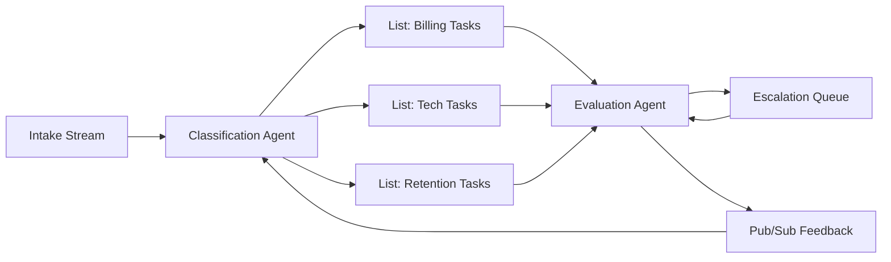

# Coordinating Agents with Redis & Messaging Queues
_Architect reliable Redis-based coordination patterns for multi-agent systems_
**Author:** Cyber Income Innovators Editorial  |  **Date:** 2025-10-17  |  **Reading time:** ~15–25 min  
**Tags:** multi-agent, orchestration, redis, queues, reliability, backpressure

## TL;DR
- Choose Redis queue types—Lists, Streams, Pub/Sub—based on ordering, durability, and consumer group needs.
- Design idempotency keys, deduplication policies, and visibility timeouts to avoid duplicate agent actions.
- Implement dead-letter queues, backoff strategies, and monitoring to manage failure modes gracefully.
- Tune throughput and latency using pipelining, Lua scripts, and autoscaling guided by telemetry.
- Govern queue usage with access controls, schema docs, and cost models to sustain compliance and ROI.

## Introduction
Redis offers low-latency messaging primitives that make it a natural backbone for coordinating multi-agent workflows. However, naive implementations create race conditions, message loss, or runaway costs. This article guides platform engineers, SREs, and automation architects through designing resilient agent coordination using Redis. We present a reusable framework, a worked contact-center example, trade-offs between data structures, and actionable operational practices.

## Coordination Framework
A five-pillar framework ensures Redis queues support reliable orchestration.

### Pillar 1: Workload Characterization
Classify workflows by throughput, latency, ordering strictness, and durability requirements. Redis Streams support ordered delivery with consumer groups, while Lists suit simple FIFO tasks [Redis Streams Docs, 2024](https://redis.io/docs/data-types/streams/). Document metrics (tasks/sec, payload size) to size infrastructure.

### Pillar 2: Queue Schema and Contracts
Define message schemas (JSON objects with task ID, agent type, context pointer, TTL). Include idempotency keys and priority fields. Store schema definitions in Git with version history. Validate messages using lightweight schema checks within agents.

### Pillar 3: Reliability Mechanisms
Implement visibility timeouts so stuck tasks reappear. Use `XCLAIM` for Streams or re-push messages to Lists if acknowledgments fail. Create dead-letter queues for messages exceeding retry thresholds. Track retry counts in message metadata.

### Pillar 4: Observability & Cost Management
Collect metrics: queue depth, processing latency, retry counts, and consumer lag. Export to Prometheus using Redis exporters. Map costs by tracking memory usage, cloud spend, and compute consumption for consumers. Align monitoring with Google SRE golden signals [Google SRE, 2022](https://sre.google/sre-book/service-level-objectives/).

### Pillar 5: Governance & Security
Restrict access via Redis ACLs; segregate queues per environment. Audit queue usage by logging producer/consumer IDs. Use TLS and AUTH tokens to protect data in transit. Align retention policies with compliance guidelines.

## Worked Example: Contact Center Copilot
A contact center deploys agents handling customer inquiries, with Redis coordinating workloads.

### Baseline Metrics
- 4,800 interactions per day.
- Average handling time: 12 minutes; target: 7 minutes.
- 40 agents per shift; cost $45/hour.
- 65% of interactions can be automated with AI agents; remaining require human oversight.

### Architecture
1. **Intake Queue (Redis Stream)** – Ingests conversations from telephony system. Partitioned by region.
2. **Classification Agent** – Consumes from Streams, categorizes intents, and pushes tasks to specialized queues.
3. **Specialist Queues (Redis Lists)** – Billing, technical support, retention. Each consumed by dedicated agents.
4. **Human Escalation Queue** – Messages requiring humans go to a priority List with SLA timeouts.
5. **Feedback Queue (Pub/Sub)** – Broadcasts evaluation outcomes and prompts adjustments.

### Economics
- Baseline labor cost: 4,800 × 12 min = 57,600 minutes ≈ 960 hours/day; 960 × $45 = $43,200/day.
- With automation, AI handles 65% (3,120 interactions) at 2 minutes each (104 hours). Humans handle 1,680 at 7 minutes (196 hours). Total time = 300 hours/day; cost = 300 × $45 = $13,500/day.
- Redis Enterprise + compute costs: $8,000/month (~$266/day). Observability + support: $1,200/month (~$40/day). LLM usage: $0.001 per token, 1.5M tokens/day ≈ $1,500/day.
- Net daily savings ≈ $43,200 – ($13,500 + $266 + $40 + $1,500) = $27,894; annualized ≈ $10.2M.

### SLA Metrics
- Queue depth < 500 per queue.
- 99% of messages processed < 30 seconds.
- Retry rate < 2%.
- Human escalation queue latency < 2 minutes.

## Redis Data Structure Trade-offs
Selecting the right structure determines reliability and scalability.

### Redis Lists
Best for simple FIFO with limited durability needs. Use `BLPOP` for blocking consumption. Pros: minimal overhead, easy to implement. Cons: no built-in consumer groups; manual retry management.

### Redis Streams
Support ordered, durable delivery with consumer groups and pending entries. Use `XREADGROUP` for consumption, `XACK` for acknowledgment. Streams retain history, enabling replay. Watch memory growth; set trimming policies (`XTRIM`) to control retention.

### Pub/Sub
Ideal for broadcast events like status updates. No persistence; consumers must be online. Use for telemetry and low-risk notifications.

### Redis Gears or Functions
For advanced routing, embed logic inside Redis using Lua scripts or Redis Functions. Useful for transforming messages or enforcing guardrails before enqueuing. Ensure scripts are idempotent and monitored for latency.

### Hybrid Approaches
Combine Streams for primary workflows and Lists for fallback queues. Use Pub/Sub to notify services about queue backlogs or scaling events. Document data flow diagrams to communicate interactions across structures.

## Reliability Patterns
Prevent and recover from failures systematically.

### Idempotency Keys
Assign unique keys per task; store processed keys in Redis Sets with TTL. Before processing, check set membership to prevent duplicates. For Streams, leverage message IDs as part of idempotency logic.

### Visibility Timeouts
Implement custom visibility windows by tracking `processing_started_at`. If an agent fails to ack within the window, re-queue. For Streams, use `XPENDING` to inspect stuck messages and `XCLAIM` to transfer ownership.

### Dead-Letter Queues
Create `queue:dlq` lists capturing messages after max retries. Monitor DLQ metrics and trigger alerts. Provide tooling for engineers to inspect payloads and replay after fixes.

### Backoff Strategies
Adopt exponential backoff with jitter to avoid thundering herds. Store retry metadata in message headers. Use Redis sorted sets to schedule future retries, with background workers scanning due messages.

### Circuit Breakers
Integrate circuit breakers that pause consumption when downstream services fail. Use distributed locks (Redlock) to coordinate pausing/resuming across workers. Notify incident channels via Slack or PagerDuty integrations.

### Sensitivity Analysis
Stress-test queue performance. If daily interactions climb to 7,200, Streams may require additional shards; measure consumer lag and adjust partitioning. Evaluate costs: Redis memory usage grows 50%, increasing monthly spend to ~$12,000. If automation coverage drops to 50%, human labor rises by 84 hours/day, reducing savings to ~$20,000/day. Use scenario modeling dashboards to inform scaling decisions.

### Testing Strategy
Implement automated tests covering enqueue/dequeue logic, schema validation, and failure recovery. Use integration tests that spin up ephemeral Redis instances with docker-compose. Replay sanitized production data to observe backlog behavior. Chaos tests should simulate node failures, network partitions, and corrupted messages—align with CNCF chaos principles to uncover systemic weaknesses [CNCF Chaos, 2023](https://www.cncf.io/online-programs/chaos-engineering-principles/).

### Operational Runbooks
Document runbooks for common incidents: queue backlog, DLQ overflow, Redis cluster failover. Include diagnostic commands (`XINFO`, `XRANGE`, `MONITOR`), mitigation steps, and communication templates. Schedule quarterly drills to rehearse failover and restoration from snapshots. Capture lessons learned and update runbooks promptly.

### Training and Enablement
Provide workshops for engineering and operations teams on Redis internals, consumer group management, and security configuration. Offer sandbox environments where practitioners can explore queue behaviors without risking production. Maintain knowledge base articles detailing queue schemas, retention policies, and troubleshooting tips.

### Compliance Alignment
Map queue operations to regulatory requirements such as PCI DSS (for payment data) or HIPAA (for health data). Ensure encryption, access logging, and retention policies meet standards. Maintain audit evidence—change requests, review notes, and retention approvals—in governance tools. Coordinate with legal teams to review data residency implications when deploying multi-region clusters.

### Stakeholder Communication
Establish monthly reviews with customer support leaders, finance, and compliance. Share metrics (handle time, automation rate, queue health) and upcoming changes. Solicit feedback on pain points to prioritize backlog items. Transparent communication sustains sponsorship for infrastructure investments.

### Continuous Improvement Loop
Set quarterly objectives for queue reliability—e.g., reduce DLQ entries by 30% or cut latency variance by half. Track progress through dashboards and retrospectives. Integrate evaluation feedback from agents (accuracy, sentiment) to refine routing logic or queue priorities. Iterate on guardrails as new failure modes emerge.

## Observability and Performance
Visibility enables tuning and proactive interventions.

### Metrics and Dashboards
Collect metrics using Redis Exporter (Prometheus) or Datadog integration. Track queue depth, processing latency, consumer lag, error rates, and memory usage. Build dashboards correlating queue health with business KPIs (customer satisfaction, handle time).

### Tracing and Logging
Propagate correlation IDs from intake to downstream agents. Store logs with message IDs, agent IDs, and processing durations. Use OpenTelemetry to trace cross-service interactions, ensuring instrumentation covers Redis operations [OpenTelemetry Redis, 2024](https://opentelemetry.io/docs/instrumentation/python/libraries/redis/).

### Capacity Planning
Run load tests to estimate required Redis cluster size. Monitor CPU, memory fragmentation, and network usage. Use Redis Enterprise or AWS ElastiCache autoscaling policies to add shards as throughput grows. Document capacity thresholds and upgrade plans.

### Cost Management
Estimate memory costs: 1 KB payload × 4,800/day × 7-day retention ≈ 33 MB. Account for replication overhead. Monitor egress charges when agents span regions. Evaluate caching vs. persistent storage trade-offs to control spend.

## Governance, Security, and Compliance
Ensure queue usage meets enterprise controls.

### Access Control
Use Redis ACLs to define allowed commands per role. Separate credentials for producers, consumers, and admins. Rotate passwords regularly or integrate with cloud IAM where supported.

### Encryption and Network Policies
Enable TLS in transit and, if using Redis Enterprise, encryption at rest. Restrict network access to specific subnets via security groups. Inspect firewall rules to prevent unauthorized agent access.

### Auditability
Log command usage via Redis slowlog and keyspace notifications. Export logs to SIEM systems. Maintain evidence for compliance audits demonstrating who accessed which queues and when.

### Data Retention
Set retention policies based on regulation. For Streams, configure `MAXLEN` trimming; for Lists, build cleanup jobs removing stale entries. Document retention schedules and approvals.

### Change Management
Version queue schemas, TTLs, and retry policies in Git. Require peer review for configuration changes. Test updates in staging before production rollout. Maintain runbooks for rolling upgrades and failovers.

## Comparison Table
| Redis Structure | Best Use Case | Strengths | Limitations | Key Commands |
| --- | --- | --- | --- | --- |
| Lists | Simple FIFO task distribution | Low latency, easy implementation | No consumer groups, manual retries | LPUSH, BRPOP |
| Streams | Ordered, durable workflows with multiple consumers | Consumer groups, replay, persistence | Higher memory usage, need trimming | XADD, XREADGROUP, XACK |
| Pub/Sub | Broadcast notifications | Real-time fan-out | No persistence, prone to message loss | PUBLISH, SUBSCRIBE |
| Sorted Sets | Scheduled retries/backoff | Natural ordering by score | Requires polling | ZADD, ZPOPMIN |
| Redis Functions | Inline validation/transforms | Reduced network hops | Operational complexity | FCALL, FUNCTION LOAD |

## Diagram (Mermaid)

## Checklist / SOP

1. Inventory workflows and classify ordering, durability, and latency needs.
2. Select Redis structures (Streams, Lists, Pub/Sub) aligned with requirements.
3. Define message schemas with idempotency keys, priority, and retry metadata.
4. Implement visibility timeouts, retries, and dead-letter queues.
5. Configure metrics, logging, and tracing for queue depth, latency, and errors.
6. Enforce ACLs, TLS, and audit logging; document retention policies.
7. Run load tests and chaos drills; adjust capacity and backoff settings.
8. Review performance, cost, and compliance metrics monthly to refine design.

## Benchmarks

> Time to implement: [Estimate] 5–7 weeks for production-grade Redis coordination layer
> Expected outcome: [Estimate] 35–45% reduction in handling time with resilient failover coverage
> Common pitfalls: missing idempotency; unchecked DLQ growth; inadequate observability
> Rollback plan: Switch consumers to standby queue provider while flushing Redis queues to last consistent snapshot

## Sources

* Redis. "Streams Data Type." — https://redis.io/docs/data-types/streams/
* Google. "Service Level Objectives." — https://sre.google/sre-book/service-level-objectives/
* OpenTelemetry. "Redis Instrumentation." — https://opentelemetry.io/docs/instrumentation/python/libraries/redis/
* Redis Labs. "Redis Security Guide." — https://redis.io/docs/management/security/
* AWS. "ElastiCache for Redis Best Practices." — https://docs.aws.amazon.com/AmazonElastiCache/latest/red-ug/BestPractices.html
* PagerDuty. "Incident Response Runbook." — https://www.pagerduty.com/resources/learn/incident-response-runbook/
* HashiCorp. "Consul Connect for Service Mesh." — https://developer.hashicorp.com/consul/docs/connect
* CNCF. "Chaos Engineering Principles." — https://www.cncf.io/online-programs/chaos-engineering-principles/

