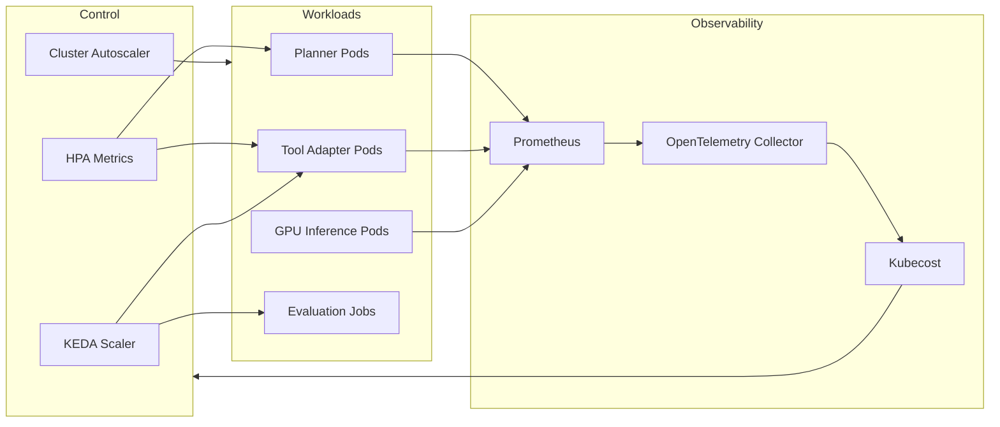

# Scaling Multi-Agent Workflows on Kubernetes
_Design autoscaling, observability, and governance for agent platforms on Kubernetes_
**Author:** Cyber Income Innovators Editorial  |  **Date:** 2025-10-17  |  **Reading time:** ~15–25 min  
**Tags:** multi-agent, orchestration, kubernetes, autoscaling, reliability, security

## TL;DR
- Use layered autoscaling (HPA, KEDA, custom controllers) to match agent demand while honoring SLAs and cost guardrails.
- Engineer GPU and CPU scheduling policies with taints, tolerations, and resource quotas to prevent contention.
- Embed observability via OpenTelemetry, Prometheus, and tracing to correlate agent behavior with infrastructure health.
- Implement security guardrails—network policies, service mesh, secret rotation—to protect agent communications.
- Govern rollout/rollback with progressive delivery, policy gates, and compliance documentation.

## Introduction
Kubernetes offers flexibility for running multi-agent orchestration, but scaling requires more than turning on Horizontal Pod Autoscaler. Multi-agent workflows mix CPU-heavy planning, GPU inference, and latency-sensitive coordination. This guide equips platform engineers, SREs, and AI operations leaders to build scalable, compliant clusters. You’ll learn a reusable framework, a worked customer support example, trade-offs between autoscaling tactics, and guardrails for production reliability.

## Kubernetes Scaling Framework
A six-layer framework organizes scaling decisions.

### Layer 1: Workload Profiling
Inventory workloads: planner services, tool adapters, evaluation jobs, GPUs. Capture CPU/GPU usage, memory pressure, latency targets, and burst patterns. Use Kubernetes metrics server and profiling tools to gather baselines. Document service-level objectives (SLOs) aligned with Google SRE guidance [Google SRE, 2022](https://sre.google/sre-book/service-level-objectives/).

### Layer 2: Autoscaling Strategy
Combine Kubernetes HPA for CPU/Memory, KEDA for event-driven scaling (queues, Kafka), and Vertical Pod Autoscaler (VPA) for rightsizing. Configure custom metrics (request rate, token usage) via Prometheus Adapter. Ensure scale-to-zero for idle agents using KEDA [KEDA Docs, 2024](https://keda.sh/docs/2.12/).

### Layer 3: Scheduling & Placement
Define node pools for CPU, GPU, and burst workloads. Use taints/tolerations, node selectors, and affinity rules to place pods appropriately. For GPU workloads, leverage NVIDIA device plugin. Configure resource quotas and limit ranges per namespace to prevent noisy neighbors.

### Layer 4: Resilience & Rollouts
Adopt progressive delivery with Argo Rollouts or Flagger. Implement pod disruption budgets (PDBs), readiness probes, and liveness checks. Use chaos experiments to validate resilience before scaling widely [CNCF Chaos, 2023](https://www.cncf.io/online-programs/chaos-engineering-principles/).

### Layer 5: Observability & Cost
Instrument services with OpenTelemetry for traces, Prometheus for metrics, and Grafana for dashboards. Track cost drivers via Kubecost or OpenCost. Tie infrastructure metrics to business outcomes (response time, task success) for cost-aware scaling.

### Layer 6: Governance & Security
Implement network policies, service mesh (Istio/Linkerd), and secret management (Vault/Secrets Manager). Align with NIST AI RMF for monitoring and accountability [NIST AI RMF, 2023](https://nvlpubs.nist.gov/nistpubs/ai/NIST.AI.100-1.pdf). Document change controls, evaluations, and rollback plans.

## Worked Example: Customer Support Copilot Platform
A SaaS company runs a multi-agent support platform with 10M monthly requests.

### Baseline
- Planner service (LLM-based) handles 1,200 RPS peak, CPU-intensive.
- Tool adapter services call CRM, billing, and knowledge bases.
- GPU inference pods handle summarization and speech-to-text.
- Evaluation service replays cases nightly, requiring batch capacity.

### Architecture Decisions
1. **Cluster Layout** – Three node pools: general CPU (m5.xlarge), GPU (g5.xlarge), and spot/preemptible nodes for batch.
2. **Autoscaling** – HPA for planner (target 70% CPU), KEDA scaling tool adapters based on Redis queue depth, VPA for evaluation jobs.
3. **Scheduling** – GPU pods tolerate `gpu=true` taint; planner pods prefer zones near Redis caches via topologySpreadConstraints.
4. **Resilience** – Argo Rollouts for canaries; PDB ensures at least two planner pods available; Istio for circuit breaking.
5. **Observability** – Prometheus collects qps, latency, token usage; OpenTelemetry traces connect planner to adapters; Kubecost monitors spend.
6. **Security** – Network policies restrict namespace egress; Vault Agent injects secrets; Kyverno enforces resource limits.

### Economic Impact
- Pre-optimization: 450 nodes average, $220K/month.
- Post-optimization: autoscaling reduces to 320 nodes average, $156K/month.
- Kubecost identifies 10% of workloads idle; rightsizing saves additional $15K/month.
- Improved latency (p95 from 3.1s to 1.8s) boosts customer satisfaction, reducing churn by 0.5% (worth ~$600K ARR).

### Performance Metrics
- Planner CPU utilization <75%.
- Queue backlog < 5 minutes.
- GPU utilization >60% during peak.
- Error budget: 99.5% successful responses monthly.

## Autoscaling Patterns and Trade-offs
Choosing autoscaling tactics affects performance and cost.

### Horizontal Pod Autoscaler (HPA)
HPA scales based on CPU/memory or custom metrics. Pros: native, well-supported. Cons: reactive; may lag with spiky traffic. Mitigate with predictive scaling using external metrics (e.g., queue length) and minimum pod counts.

### Kubernetes Event-Driven Autoscaling (KEDA)
KEDA scales deployments based on external scalers (Redis, Kafka, Prometheus). Pros: handles bursty workloads, supports scale-to-zero. Cons: additional component to manage. Ensure scaler configuration includes cool-down periods to avoid oscillation.

### Vertical Pod Autoscaler (VPA)
VPA adjusts resource requests/limits based on observed usage. Useful for batch/evaluation jobs. Avoid pairing with HPA on same metric; set update modes (Auto vs. Recreate) carefully to prevent disruptions.

### Cluster Autoscaler
Automatically adjusts node count. Pros: reduces manual capacity planning. Cons: slower than pod-level scaling; requires headroom for surge. Combine with bin-packing strategies (resource requests, topologySpread) to optimize usage.

### Custom Controllers
For complex scenarios, build custom controllers reacting to business metrics (e.g., conversation backlog). Ensure controllers respect Kubernetes API limits and include fail-safe conditions (max pods, budget caps).

## Scheduling and Resource Management
Prevent resource contention and ensure fairness.

### Node Pools and Affinity
Group workloads by resource needs. Use affinity rules to co-locate dependent services (planner + cache). Use anti-affinity to spread replicas across zones. For GPUs, isolate workloads to dedicated pools to avoid CPU workloads occupying GPU nodes.

### Resource Quotas and LimitRanges
Set quotas per namespace to prevent runaway deployments. Use LimitRanges to enforce minimum/maximum CPU and memory. Monitor via `kubectl describe quota` and integrate alerts when quotas near exhaustion.

### GPU Scheduling
Leverage NVIDIA GPU Operator for driver management. Configure pod priority classes so critical inference pods preempt less important jobs. Use MIG (Multi-Instance GPU) for partitioning when supported. Track utilization with DCGM exporter.

### Storage and Data Locality
Use PersistentVolumeClaims for shared context stores. For high-speed caching, deploy Redis or Memcached with local SSDs. Ensure stateful components use StatefulSets with PodDisruptionBudgets.

## Observability and Incident Response
Visibility ensures scaling decisions are informed.

### Metrics and Dashboards
Instrument metrics: request rate, token burn, queue backlog, autoscaler actions, node costs. Use Grafana dashboards with overlays showing deployment rollouts. Monitor Kubernetes events for scaling failures.

### Tracing and Logging
Implement OpenTelemetry tracing across planner, agent workers, and external services. Export to Jaeger or Tempo. Include correlation IDs so support teams can map infrastructure events to customer impact. Centralize logs with Loki or Elastic.

### Alerting and SLOs
Define alerts for CPU saturation, failed rollouts, autoscaler errors, and cost anomalies. Tie alerts to runbooks stored in Opsgenie/PagerDuty. Track SLO compliance; when error budgets burn fast, trigger release freezes.

### Incident Runbooks
Maintain runbooks for cluster scaling failures, GPU shortages, and rollout rollback. Include commands (`kubectl top`, `kubectl describe hpa`, `argo rollouts abort`). Practice game days to validate response time.

### Sensitivity Analysis
Model scaling scenarios to avoid surprises. If peak RPS surges 40%, planner pods may require 2× CPU requests, triggering node scale-ups. Estimate incremental cost: +120 nodes for two hours daily adds ~$18K/month. If GPU workloads spike due to new voice features, evaluate MIG partitioning and spot GPU capacity to balance performance and cost. Run what-if simulations using Kubecost and Prometheus data to forecast budget impact and capacity needs.

### Testing and Validation
Automate scaling tests with tools like k6, Locust, or Vegeta. Simulate bursty traffic and long-lived conversations to test autoscaler responsiveness. Use LitmusChaos or Chaos Mesh to inject node failures, network delays, and pod crashes, validating resilience. Include regression tests for manifests—`kubectl diff`, `kubeval`, and policy-as-code checks—to catch misconfigurations before deployment.

### Operational Runbooks and Training
Maintain detailed runbooks for autoscaler issues, GPU exhaustion, and network policy violations. Include dashboards, command snippets, and escalation contacts. Provide enablement sessions for platform and app teams covering Kubernetes primitives, autoscaler tuning, and observability tooling. Rotate engineers through on-call simulations to build muscle memory.

### Cost Governance
Establish budget guardrails with Kubecost alerts. Tag namespaces by business unit to allocate spend. Set approval workflows for deploying GPU-intensive workloads. Review spend in monthly governance meetings; compare actual vs. forecast. Implement spot/ondemand mix strategies and reserved instances where predictable.

### Compliance and Audit Readiness
Capture evidence for compliance: autoscaler configs, policy definitions, security scans, and deployment approvals. Store artifacts in a governance repository. Provide auditors with topology diagrams, runbooks, and incident postmortems demonstrating control effectiveness. Align documentation cadence with internal audit cycles.

### Continuous Improvement Loop
Track improvement OKRs—reduce p95 latency by 15%, cut cost per request by 10%, or increase automation coverage. Review metrics quarterly, decide on experiments (e.g., new scaler algorithms), and document outcomes. Share learnings across platform guilds to propagate best practices, and publish postmortems highlighting successful experiments and cautionary tales.

## Security, Compliance, and Governance
Multi-agent platforms handle sensitive data; protect accordingly.

### Network Policies and Service Mesh
Apply namespace isolation with NetworkPolicies. Use service mesh to enforce mTLS, rate limits, and retries. Istio’s authorization policies help restrict which services can call others [Istio Docs, 2024](https://istio.io/latest/docs/concepts/security/).

### Secrets Management
Use Kubernetes Secrets with encryption at rest and integrate with Vault or AWS Secrets Manager for rotation. Sidecar agents refresh credentials without restarts. Audit secret access via Kubernetes audit logs.

### Policy Enforcement
Employ Kyverno or OPA Gatekeeper to enforce policies (resource limits, label requirements, forbidden images). Automate policy checks in CI/CD before manifests reach production.

### Compliance Documentation
Align deployment lifecycle with NIST AI RMF and ISO 27001 controls. Maintain evidence of approvals, evaluation results, and rollback plans in systems like ServiceNow or Jira. Provide auditors with runbook documentation and incident history.

## Comparison Table
| Scaling Component | Purpose | Strengths | Limitations | Tooling |
| --- | --- | --- | --- | --- |
| HPA | Pod-level scaling on metrics | Native, simple | Reactive to spikes, requires tuned metrics | Kubernetes HPA |
| KEDA | Event-driven scaling | Handles queues, scale-to-zero | Additional controller | KEDA Scalers |
| VPA | Adjust resource requests | Optimizes utilization | Restarts pods, limited for stateless online | Kubernetes VPA |
| Cluster Autoscaler | Node-level scaling | Reduces manual capacity work | Slower reactions, requires buffer | Cluster Autoscaler |
| Argo Rollouts | Progressive delivery | Automated canaries/blue-green | Adds complexity, needs observability | Argo Rollouts |

## Diagram (Mermaid)

## Checklist / SOP

1. Profile workloads and define SLOs for planner, adapters, and evaluators.
2. Configure HPA/KEDA/VPA with appropriate metrics and cool-down periods.
3. Set up node pools, taints, tolerations, and quotas to isolate workloads.
4. Implement progressive delivery (Argo Rollouts) with health checks and PDBs.
5. Instrument metrics, traces, and cost analytics; build dashboards and alerts.
6. Enforce network policies, secret rotation, and policy-as-code in CI/CD.
7. Run load, chaos, and failover drills; review autoscaler logs and adjust thresholds.
8. Document changes, approvals, and rollback steps; review governance metrics monthly.

## Benchmarks

> Time to implement: [Estimate] 7–9 weeks to productionize Kubernetes scaling stack
> Expected outcome: [Estimate] 25–40% infrastructure cost reduction with tighter SLA adherence
> Common pitfalls: mis-tuned autoscalers; GPU contention; missing network policies
> Rollback plan: Pause autoscalers, revert manifests via GitOps, and redirect traffic to previous stable rollout

## Sources

* Google. "Service Level Objectives." — https://sre.google/sre-book/service-level-objectives/
* KEDA. "Kubernetes Event-Driven Autoscaling." — https://keda.sh/docs/2.12/
* CNCF. "Chaos Engineering Principles." — https://www.cncf.io/online-programs/chaos-engineering-principles/
* NIST. "AI Risk Management Framework." — https://nvlpubs.nist.gov/nistpubs/ai/NIST.AI.100-1.pdf
* Kubecost. "Kubernetes Cost Optimization." — https://www.kubecost.com/kubernetes-cost-optimization/
* Istio. "Security Concepts." — https://istio.io/latest/docs/concepts/security/
* NVIDIA. "GPU Operator Documentation." — https://docs.nvidia.com/datacenter/cloud-native/gpu-operator/overview.html
* Argo Project. "Argo Rollouts Documentation." — https://argo-rollouts.readthedocs.io/
* LitmusChaos. "LitmusChaos Documentation." — https://docs.litmuschaos.io/
* Chaos Mesh. "Chaos Mesh Documentation." — https://chaos-mesh.org/docs/

