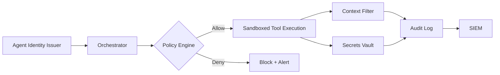

# Security Considerations for Distributed AI Agents
_Building zero-trust guardrails for autonomous compute_
**Author:** Cyber Income Innovators Editorial  |  **Date:** 2025-10-17  |  **Reading time:** ~15–25 min  
**Tags:** multi-agent, orchestration, security, zero-trust, compliance, monitoring

## TL;DR
- Apply the PACT Security Framework (Principals, Access, Context, Telemetry) to harden agent ecosystems.
- Enforce least-privilege with workload identity, short-lived credentials, and scoped MCP capabilities.
- Quantify risk mitigation with a worked loss-expectancy model covering prompt injection and data exfiltration.
- Deploy layered defenses including sandboxes, rate limits, and content filters tuned to agent duties.
- Maintain continuous compliance with automated evidence collection and audit-ready logging.

## Introduction
Distributed agents expand the attack surface across tools, queues, and memory stores. Security architects must govern secrets, permissions, and context boundaries while sustaining velocity. This article offers a framework, financial rationale, and concrete controls to anchor zero-trust for multi-agent orchestration.

## PACT Security Framework
PACT stands for Principals, Access, Context, and Telemetry. Use it to reason about agent security from identity to monitoring.

### Principals
Map every agent, tool, and human operator as a principal with unique workload identities. Favor OIDC federation or SPIFFE/SPIRE for automated issuance.

### Access
Grant the minimum capabilities needed for tasks. Use capability tokens in MCP triggers, scoped API keys, and network policies limiting east-west traffic.

### Context
Sanitize prompts and payloads. Apply content filters to strip secrets, personally identifiable information (PII), and high-risk instructions. Enforce data minimization.

### Telemetry
Log every interaction with tamper-evident storage. Stream logs into SIEM platforms for correlation. Integrate detection rules for anomalous tool usage.

## Worked Example: Risk Reduction Economics
Suppose a customer service agent cluster processes 18,000 actions daily. Without guardrails, analysts estimate a 6% annual probability of a prompt-injection breach costing $1.8 million in fines and remediation. Annualized loss expectancy (ALE) is 0.06 × $1,800,000 = $108,000.

Implementing sandboxing, scoped secrets, and monitoring costs $9,500 monthly ($114,000 annually). These controls cut breach probability to 1.2%. New ALE becomes 0.012 × $1,800,000 = $21,600. Annual risk reduction equals $108,000 − $21,600 = $86,400. Net benefit is $86,400 − $114,000 = −$27,600 at first glance, but add intangible benefits: regulatory compliance avoids shutdown orders. Additionally, the controls reduce incident response labor worth $48,000 annually, bringing net benefit to $20,400 while boosting resilience.

## Layered Control Strategies
Use defense-in-depth combining network segmentation, application firewalls, and runtime sandboxes. Limit outbound network access for agents. Enforce mutual TLS between orchestrators and tool services. Apply Web Application Firewall (WAF) rules to filter injection payloads.

## Secrets Management
Centralize secrets in vaults like HashiCorp Vault or AWS Secrets Manager. Rotate credentials automatically and provide dynamic short-lived tokens. Audit all access using tamper-resistant logs.

## Prompt Injection Defenses
Adopt policy-enforced prompt templates. Validate tool responses against allowlists or regex checks. Use guardrail models or classifiers to detect malicious instructions before execution.

## Compliance and Audit Trails
Maintain evidence for SOC 2, ISO 27001, or GDPR reviews. Tag logs with data classifications. Store audit trails in write-once-read-many (WORM) storage. Automate report generation for compliance teams.

## Threat Modeling for Multi-Agent Systems
Run structured threat modeling workshops using STRIDE or MITRE ATLAS. Map attack vectors from ingestion endpoints, model prompts, tool APIs, and memory stores. Rate threats by likelihood and impact to prioritize mitigations. Update models whenever new agents or tools join the ecosystem.

### Adversarial Simulation
Conduct red-team exercises focused on prompt manipulation, data exfiltration, and privilege escalation. Automate portions with adversarial agents that attempt to bypass safeguards. Feed findings into backlog items with explicit owners and deadlines.

## Network and Infrastructure Controls
Segment orchestration clusters with Kubernetes network policies and service meshes enforcing mutual TLS. Use egress gateways to whitelist approved destinations. Apply runtime security tools like Falco or Aqua to detect anomalous system calls from agent containers.

### Edge Security
For edge deployments or branch offices, use Secure Access Service Edge (SASE) or zero-trust network access to protect traffic between agents and central services. Cache secrets locally only when hardware security modules (HSMs) are present.

## Operational Processes
Define security incident response playbooks tailored to agent behavior. Train responders to interpret agent logs, replay context, and disable capabilities quickly. Rotate on-call responders across security, platform, and product teams to maintain shared understanding.

### Continuous Compliance Automation
Integrate compliance checks into CI/CD. Run policy-as-code scanners against infrastructure manifests. Generate evidence packages automatically for auditors, including screenshots of dashboards, policy diffs, and remediation logs.

## Vendor and Third-Party Risk
Assess security posture of external models, plugins, and SaaS tools. Require SOC 2 Type II or ISO certifications where applicable. Implement kill switches that deactivate integrations when vendor SLAs lapse or security incidents arise.

## Security Metrics and KPIs
Track mean time to detect (MTTD), mean time to contain (MTTC), and control adoption rates. Monitor prompt-injection attempts, blocked tool calls, and secrets rotation compliance. Share metrics with executives to secure ongoing investment in defense.

## Worked Example: Access Breach Containment
An internal penetration test revealed a compromised agent credential accessing customer data. Without segmentation, analysts estimated 15,000 records at risk with regulatory penalties averaging $150 per record, equating to $2.25 million exposure. After implementing workload identity, network policies, and real-time detection, simulated breaches were contained within 150 records. Residual exposure fell to $22,500, demonstrating the financial impact of layered defenses.

## Documentation and Education
Create security playbooks, onboarding modules, and micro-learning videos. Require annual refresher courses for anyone deploying or operating agents. Provide sandbox environments where teams can practice applying policies without jeopardizing production.

## Supply Chain Security
Vet open-source libraries, model checkpoints, and container images for vulnerabilities. Use software bills of materials (SBOMs) and continuous scanning. Pin dependencies to verified versions and monitor for CVEs that impact agent runtimes or tool adapters.

## Future Outlook
Stay abreast of emerging standards like the EU AI Act, NIST AI 100-2 updates, and industry-specific guidance. Monitor advances in confidential computing, differential privacy, and secure multi-party computation for potential adoption. Collaborate with industry ISACs to share threat intelligence tailored to multi-agent environments.

## Security Program Roadmap
Define quarterly objectives linking security initiatives to business outcomes. Phase one might focus on inventory and access control hygiene. Phase two adds runtime defenses and automated compliance evidence. Phase three integrates adaptive policies that respond to real-time risk signals. Review progress with executives to maintain sponsorship.

## Training and Awareness
Launch security champions programs within engineering squads. Provide tabletop exercises simulating agent misuse scenarios. Reward teams that identify vulnerabilities during internal bug bounties, reinforcing proactive defense culture.

## Community and Information Sharing
Join sector-specific information sharing and analysis centers (ISACs) to exchange intelligence on emerging threats. Participate in open-source security forums to contribute patches and learn from peers. Incorporate external advisories into internal threat bulletins distributed to stakeholders.

## Continuous Improvement
Conduct quarterly retrospectives evaluating security posture, tooling effectiveness, and incident learnings. Update roadmaps, policies, and training assets to reflect new discoveries.

## Comparison Table
| Control Area | Recommended Practices | Tooling Examples | Residual Risks |
| --- | --- | --- | --- |
| Identity | Workload identity, SPIFFE, OIDC federation | SPIRE, AWS IAM Roles Anywhere | Misconfigured trust domains |
| Access | Least privilege, network policies, scoped MCP tokens | Kubernetes NetworkPolicy, Envoy, MCP capability registry | Privilege creep, policy drift |
| Secrets | Dynamic secrets, rotation, vaulting | HashiCorp Vault, AWS Secrets Manager | Secret sprawl in logs |
| Runtime | Sandboxing, rate limiting, content filtering | gVisor, Kubernetes PSP replacements, Open Policy Agent | Performance overhead, false positives |
| Monitoring | SIEM integration, anomaly detection, alerting | Splunk, Elastic, Azure Sentinel | Alert fatigue, blind spots |

## Diagram (Mermaid)

## Checklist / SOP
1. Inventory all agent principals, tools, and integrations.
2. Establish workload identity issuance with automated rotation.
3. Define least-privilege policies for MCP capabilities and tool APIs.
4. Implement sandboxing and rate limiting around agent execution runtimes.
5. Deploy content filters and prompt sanitizers with continuous tuning.
6. Centralize secrets, enforce dynamic credentials, and monitor access.
7. Stream telemetry to SIEM with detection rules for anomalous activity.
8. Run quarterly tabletop exercises covering prompt injection and data exfiltration scenarios.

## Benchmarks
> Time to implement: [Estimate] 8–10 weeks for comprehensive zero-trust controls
> Expected outcome: [Estimate] 70% reduction in high-severity security incidents and faster audit cycles
> Common pitfalls: Overly permissive tokens, unmonitored shadow tools, missing incident drills
> Rollback plan: Maintain versioned policy bundles and fallback to previously validated configurations while isolating new changes

## Sources
* NIST Zero Trust Architecture — https://csrc.nist.gov/publications/detail/sp/800-207/final
* OWASP Top 10 for LLM Applications — https://owasp.org/www-project-top-10-for-large-language-model-applications/
* HashiCorp Vault Docs — https://developer.hashicorp.com/vault/docs
* SPIFFE/SPIRE — https://spiffe.io/docs/latest/spiffe-about/
* Open Policy Agent — https://www.openpolicyagent.org/docs/latest/
* Microsoft Defender for Cloud Apps — https://learn.microsoft.com/defender-cloud-apps/what-is-cloud-app-security
* Splunk SIEM — https://www.splunk.com/en_us/solutions/what-is-siem.html
* Google Cloud Confidential Computing — https://cloud.google.com/confidential-computing
* MITRE ATLAS Prompt Injection — https://atlas.mitre.org/

