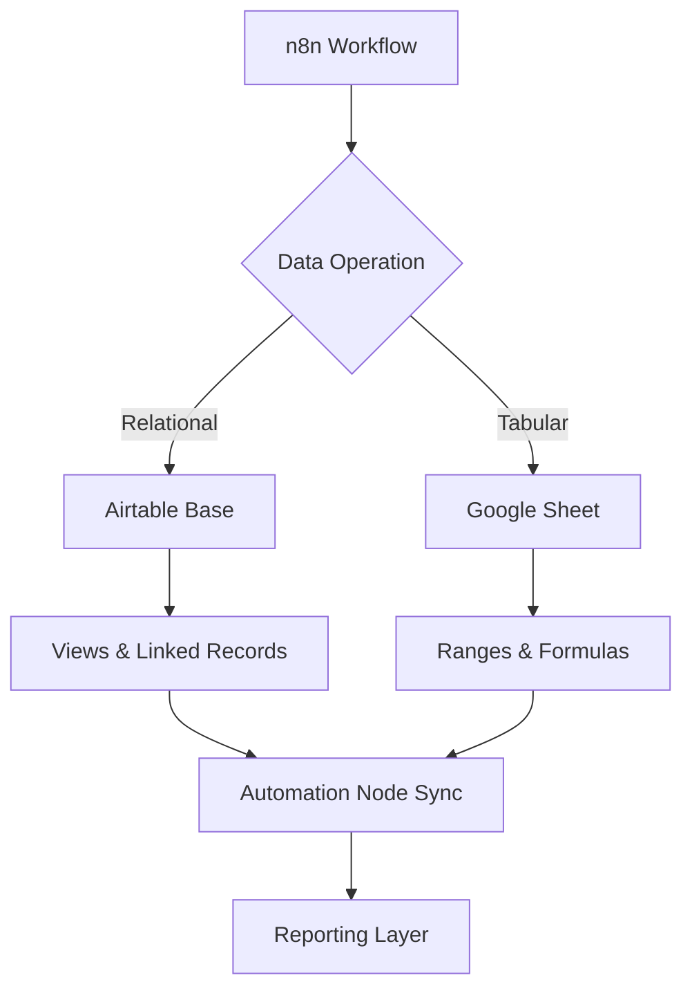

TL;DR
- Airtable handles relational-like schemas and permissioning, while Google Sheets shines for lightweight tabular data with ubiquitous access.
- Rate limits differ significantly: Airtable's base and API quotas can bottleneck large automations, whereas Sheets' batch updates mitigate API churn when tuned correctly.
- Choose based on collaboration requirements, automation complexity, and governance—not just comfort with spreadsheets.

## Understand Schema and Structure Differences
Airtable gives you typed fields, linked records, and views that act like pre-filtered datasets. This structure makes it easier to model multi-table relationships without writing SQL. Google Sheets is flat but flexible; you can mimic relations with `IMPORTRANGE` or lookup formulas, yet maintenance becomes painful as automations grow. In n8n, Airtable nodes support linking records directly, while Sheets nodes rely on row-based operations and require you to manage ranges carefully.

### Limits and Throughput
Airtable bases cap out at 50,000 records on standard plans, with attachment size limits and daily API quotas. API calls are limited to five requests per second per base. Google Sheets technically supports up to 10 million cells per spreadsheet and enforces read/write quotas per minute per user. However, Sheets' batch update endpoint allows you to modify many cells with fewer API calls, which n8n can leverage via HTTP Request nodes.

## Collaboration and Permissions
Airtable offers granular roles, field-level limits via Interface Designer, and automation audit logs. This is ideal when multiple teams edit the same dataset but need guardrails. Google Sheets permissions piggyback on Google Workspace; while sharing is easy, it's harder to restrict edits to specific ranges without complex Protected Ranges setups. Evaluate compliance needs—if you need audit trails and revision locking, Airtable may win.

### Automation Patterns in n8n
For Airtable, use the List and Update nodes combined with pagination to sync data incrementally. Create views to pre-filter records so n8n processes only what's necessary. For Sheets, rely on Append or Batch Update operations and store a cursor (like the last updated row) to prevent duplicates. Implement exponential backoff when hitting Sheets' `RESOURCE_EXHAUSTED` errors.

## Migration Tips
If you start in Sheets and outgrow it, export CSV snapshots and import into Airtable, then use n8n to backfill linked records. Build connectors that translate column headers to Airtable field IDs. Conversely, if cost pushes you toward Sheets, flatten Airtable linkages into normalized tabs and rely on VLOOKUP or n8n's Merge nodes to reconstruct relationships.

## Comparison Table
| Dimension | Airtable | Google Sheets |
| --- | --- | --- |
| Record/Cell Limits | 50k records per base (plan dependent) | 10 million cells per spreadsheet |
| API Rate Limits | 5 requests/sec per base | 60 read & 60 write requests/min per project (baseline) |
| Data Modeling | Linked records, rollups, lookup fields | Flat sheets, formulas, scripts |
| Permissions | Granular roles, interfaces, audit trails | Workspace sharing, protected ranges |
| Pricing | Per seat with advanced features on higher tiers | Included with Google Workspace |

## Diagram

## Checklist
- [ ] Audit record volume, collaborator count, and permission needs.
- [ ] Map automation steps that rely on relational joins versus flat tabular updates.
- [ ] Stress test API quotas with representative loads in staging.
- [ ] Define migration plan should you need to switch platforms.
- [ ] Document governance (sharing, audit trails) for whichever datastore you adopt.

> **Benchmarks**
> - Time to implement: 3–4 hours to run proofs of concept on both platforms with n8n. [Estimate]
> - Expected outcome: Select a datastore that sustains 12 months of automation growth without hitting quota ceilings. [Estimate]

## Internal Links
- [Tie your datastore decision back to the automation blueprint's governance steps.](../ai-automation-foundations/practical-blueprint-first-win.mdx)
- [Review the webhook foundations article to understand input volume before choosing storage.](../n8n-workflows-integrations/n8n-triggers-webhooks-foundation.mdx)

## Sources
- [Airtable feature and limit breakdown](https://support.airtable.com/docs/understanding-airtable-limits)
- [Google Sheets API usage limits](https://developers.google.com/sheets/api/limits)
