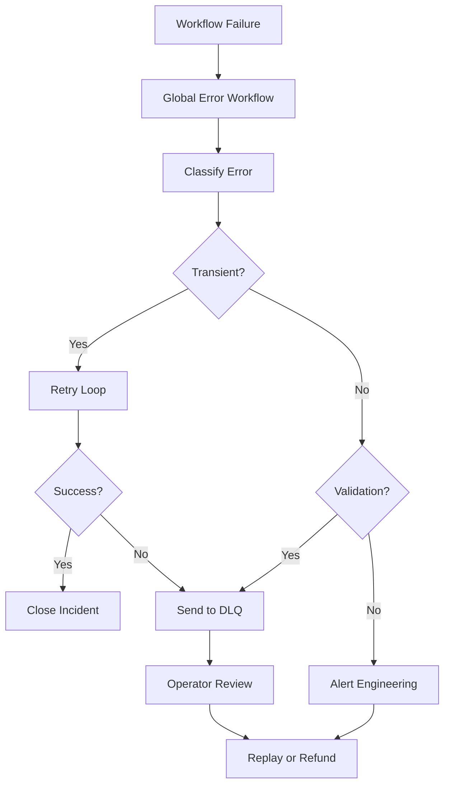

TL;DR
- Use global error workflows to capture failures, classify severity, and enrich context for responders.
- Send unrecoverable payloads to a dedicated dead-letter queue with metadata so you can reprocess or refund quickly.
- Automate retries, alerting, and dashboarding to keep stakeholders informed without manual log diving.

## Build the Global Error Workflow
Enable n8n's error workflow feature and create a global handler triggered by failures. Ingest metadata such as workflow ID, execution data, error message, and timestamp. Append contextual information like customer ID or order value when available. Store events in a structured datastore (Postgres, BigQuery) for analytics.

### Classify Errors
Use a Switch node to categorize errors: transient (network, provider downtime), validation (bad payload), or system (node misconfiguration). Each category should route to different handling logic—retries for transient errors, DLQ for validation, escalation for system issues. Document classification criteria in a runbook.

## Implement Dead-Letter Queues
For payloads that cannot be processed automatically, push them into a DLQ. Use Redis lists, Amazon SQS, or a database table with columns for payload, error type, attempt count, and timestamps. Provide a manual review interface (Notion, Airtable, internal tool) where operators triage entries and decide whether to replay, refund, or discard.

### Automated Retry Logic
Set up a loop that retries transient errors with exponential backoff capped at a safe threshold. After max attempts, move the payload to DLQ and alert the on-call engineer. Track retry success rate to tune thresholds and identify nodes that require optimization.

## Observability and Alerting
Push metrics from the error workflow to your monitoring stack. Key signals include error rate per workflow, average time to resolution, DLQ backlog size, and top failure nodes. Build dashboards and alerts that trigger when error rates exceed baselines or backlog grows beyond SLA.

### Runbook Integration
Link each error category to a runbook stored in your knowledge base. Include steps for replaying jobs, issuing refunds, or contacting partners. Review runbooks quarterly to reflect new integrations or provider changes.

## Comparison Table
| Error Class | Typical Cause | Automated Response | Escalation Target | Example Control |
| --- | --- | --- | --- | --- |
| Transient | Network hiccup, provider outage | Retry with exponential backoff | On-call engineer | Rate limit playbook |
| Validation | Missing fields, schema mismatch | DLQ + manual review | Operations lead | Data readiness audit |
| System | Node misconfiguration, code bug | Immediate alert + rollback | Engineering lead | CI guardrails |

## Diagram

## Checklist
- [ ] Enable global error workflows and capture rich context for each failure.
- [ ] Classify errors into transient, validation, and system categories with routing logic.
- [ ] Implement DLQ storage with metadata for auditing and reprocessing.
- [ ] Automate retry loops with exponential backoff and alerting after max attempts.
- [ ] Maintain runbooks and dashboards that track resolution metrics.

> **Benchmarks**
> - Time to implement: 2–3 days to build the error workflow, DLQ storage, and dashboards. [Estimate]
> - Expected outcome: 70% reduction in manual incident triage time and faster recovery from provider outages. [Estimate]

## Internal Links
- [Leverage the Redis queue design to back the DLQ implementation.](../n8n-workflows-integrations/n8n-queues-with-redis-webhooks.mdx)
- [Align validation logic with the automation data readiness audit.](../ai-automation-foundations/automation-data-readiness-audit.mdx)
- [Coordinate alerting with the CI for content repos guide to standardize incident response.](../devops-for-creators/ci-for-content-repos.mdx)
- [Share retry strategies with the pagination and rate limit playbook for consistency.](../n8n-workflows-integrations/n8n-pagination-and-rate-limits-playbook.mdx)

## Sources
- [n8n error workflow documentation](https://docs.n8n.io/hosting/guides/error-workflows/)
- [Google Cloud resilient workflow best practices](https://cloud.google.com/architecture/best-practices-for-building-resilient-workflows)
