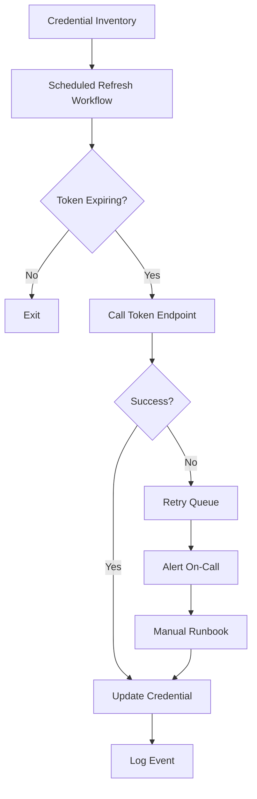

TL;DR
- Store OAuth tokens securely in n8n credentials, use short-lived access tokens, and automate refresh requests before expiry.
- Rotate client secrets on a predictable cadence and log refresh events to detect anomalies or abuse.
- Build runbooks that handle provider-specific quirks, throttling, and revocation to prevent outages during rotation.

## Understand OAuth in n8n
n8n uses credential nodes to store client IDs, client secrets, access tokens, and refresh tokens. When a node executes, n8n automatically refreshes tokens if the provider response indicates expiration. However, not every API follows the spec, so proactive refresh orchestration provides additional safety. Document provider endpoints, scopes, and grant types in your credential inventory.

### Secure Credential Storage
Ensure n8n runs with encrypted credential storage (via `N8N_ENCRYPTION_KEY`) and restrict environment variable access. For multi-tenant deployments, segregate credentials by environment and workspace. Pair with the DevOps secrets rotation guidance in your CI processes to avoid stale secrets lingering in git history or logs.

## Refresh Automation Strategy
Create a scheduled workflow that runs every few hours to check token expiry timestamps. Use the HTTP Request node to call the provider's token endpoint with `grant_type=refresh_token`. Store the new access token via the Set node and update the credential using the `n8n-nodes-base.credentials` operation. Log success or failure to a datastore such as Redis or PostgreSQL for auditing.

### Handling Provider Variations
Some providers like Google issue long-lived refresh tokens, while others such as Slack rotate refresh tokens on each use. Build branching logic that captures new refresh tokens and stores them atomically. For providers requiring PKCE or additional headers, maintain configuration files that the workflow reads to avoid hardcoding secrets.

## Rotation Cadence and Auditing
Implement a quarterly rotation for client secrets. Coordinate with security teams to generate new secrets, update them in n8n, and immediately run smoke tests. Maintain an audit log that records who triggered rotations, timestamp, affected workflows, and validation status. Feed logs into your SIEM to monitor unusual refresh rates that could indicate credential compromise.

### Incident Response
If refresh fails, queue a retry with exponential backoff. After three failed attempts, alert on-call engineers via Slack or PagerDuty with context: provider, workflow, last successful refresh. Provide a manual runbook that explains how to re-authenticate, revoke old tokens, and re-run impacted jobs.

## Comparison Table
| Scenario | Refresh Strategy | Rotation Cadence | Monitoring Signal | Notes |
| --- | --- | --- | --- | --- |
| Standard OAuth2 | Scheduled pre-expiry refresh | Quarterly | Refresh success rate | Works for Google, Microsoft |
| Single-Use Refresh Tokens | Capture new refresh token each call | Quarterly | Token mismatch alerts | Slack, HubSpot |
| Provider Throttling | Retry with exponential backoff | Quarterly | HTTP 429 counts | Use rate limit playbook |
| Manual OAuth Apps | Human-triggered refresh | Monthly | Credential age | Document manual steps |

## Diagram

## Checklist
- [ ] Enable encrypted credential storage and restrict environment variable exposure.
- [ ] Document provider-specific OAuth endpoints, scopes, and refresh behaviors.
- [ ] Schedule automated refresh workflows with logging and retries.
- [ ] Rotate client secrets quarterly and validate downstream workflows immediately.
- [ ] Maintain incident runbooks and SIEM alerts for failed refresh attempts.

> **Benchmarks**
> - Time to implement: 1–2 days to build automated refresh workflows for three key providers. [Estimate]
> - Expected outcome: 90% reduction in auth-related workflow failures and faster incident recovery. [Estimate]

## Internal Links
- [Connect refresh automation to the Redis-backed queue design for resilient retries.](../n8n-workflows-integrations/n8n-queues-with-redis-webhooks.mdx)
- [Reference the webhook security guide to protect OAuth callback endpoints.](../n8n-workflows-integrations/n8n-webhook-security-zero-trust.mdx)
- [Coordinate client secret rotation with the CI guardrails for content repos.](../devops-for-creators/ci-for-content-repos.mdx)
- [Align automation governance approvals before rotating sensitive credentials.](../ai-automation-foundations/automation-governance-operating-models.mdx)

## Sources
- [n8n OAuth2 credential documentation](https://docs.n8n.io/integrations/builtin/credentials/oauth2/)
- [RFC 6749: The OAuth 2.0 Authorization Framework](https://datatracker.ietf.org/doc/html/rfc6749)
