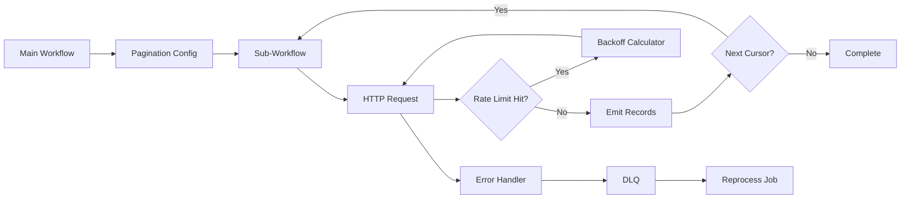

TL;DR
- Detect API pagination styles—page-number, cursor, time-based—and encapsulate them in reusable n8n sub-workflows.
- Respect rate limits by implementing throttling, adaptive backoff, and dead-letter queues for persistent failures.
- Monitor throughput, remaining quota, and error rates to tune concurrency and prevent bans.

## Identify Pagination Modes
Catalog target APIs and note their pagination schemes. Page-number APIs require incrementing integers, while cursor-based APIs hand back tokens in response payloads. Time-based pagination pulls data by timestamp windows. Build a configuration table that your workflows reference to avoid hardcoding logic.

### Build Pagination Sub-Workflows
Use n8n's Sub-Workflow trigger to encapsulate pagination. Pass parameters like endpoint URL, query params, page size, and cursor value. Within the sub-workflow, use the HTTP Request node, parse response metadata, and emit data plus the next cursor. This pattern keeps main workflows clean and reusable.

## Rate Limit Strategies
Implement the built-in `Rate Limit` node or a Function node that calculates sleep durations based on headers like `X-RateLimit-Remaining`. Combine with the `Split In Batches` node to control concurrency. For APIs lacking explicit headers, estimate usage via request counters stored in Redis or Airtable.

### Adaptive Backoff and DLQ
When the API returns 429 or 503, apply exponential backoff with jitter. After three failed retries, send payloads to a dead-letter queue (Redis list or database table) for later reprocessing. Monitor DLQ size as a leading indicator of API instability.

## Observability
Log request counts, average latency, error codes, and remaining quota. Use the `n8n-nodes-base.got` response to push metrics into Prometheus or another monitoring stack. Visualize with Grafana dashboards highlighting success throughput and throttled events. Alert when remaining quota drops below thresholds or DLQ backlog exceeds limits.

### Collaboration with Upstream Teams
Share dashboards and runbooks with partner teams consuming the same APIs. Align on heavy-usage windows and coordinate bulk jobs to avoid collective rate limit breaches. Document emergency contacts for API providers in case you need temporary limit increases.

## Comparison Table
| Pagination Type | Detection Method | State Storage | Retry Considerations | Example APIs |
| --- | --- | --- | --- | --- |
| Page Number | Inspect query params (`page`, `offset`) | Workflow static data | Increment sequentially, reset on failure | Shopify, Zendesk |
| Cursor | Response includes `next_cursor` | Redis, database | Store cursor atomically, retry with last cursor | Slack, HubSpot |
| Time Window | Timestamp fields | Config table | Adjust window size if rate-limited | Twitter, Salesforce |

## Diagram

## Checklist
- [ ] Catalog API pagination modes and document required parameters.
- [ ] Build reusable pagination sub-workflows with cursor handling.
- [ ] Configure rate limit nodes and adaptive backoff logic for throttled responses.
- [ ] Set up dead-letter queues and monitoring dashboards for retries.
- [ ] Coordinate heavy-usage windows with partner teams and providers.

> **Benchmarks**
> - Time to implement: 3–4 days to templatize pagination and rate limit handling for core APIs. [Estimate]
> - Expected outcome: Sustain 99% successful syncs with zero provider bans despite growth in volume. [Estimate]

## Internal Links
- [Pair this with the Redis queue tutorial to process retries without losing data.](../n8n-workflows-integrations/n8n-queues-with-redis-webhooks.mdx)
- [Reference the pagination-ready datastore selection guide when persisting cursors.](../n8n-workflows-integrations/airtable-vs-sheets-as-n8n-datastore.mdx)
- [Connect rate limit alerts to the automation pilot-to-scale playbook for rollout governance.](../ai-automation-foundations/automation-pilot-to-scale-playbook.mdx)
- [Coordinate with the sibling worker scaling blueprint for concurrency planning.](../n8n-workflows-integrations/n8n-worker-scaling-blueprint.mdx)

## Sources
- [n8n Function/Code node documentation](https://docs.n8n.io/workflows/components/nodes/core-nodes/Code/)
- [GitHub REST API best practices for integrators](https://docs.github.com/rest/using-the-rest-api/best-practices-for-integrators)
