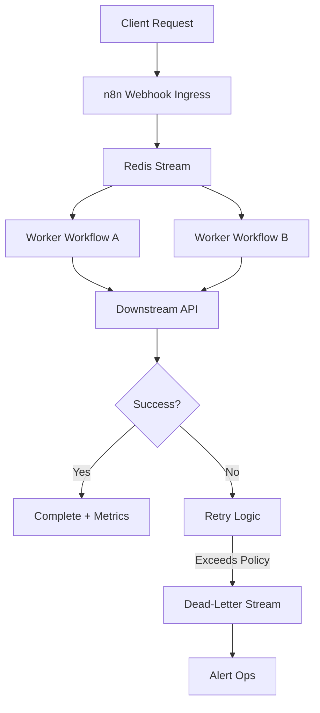

TL;DR
- Use Redis Streams or lists to buffer webhook bursts before jobs hit the n8n main worker.
- Separate lightweight ingestion from heavy processing by running dedicated consumer workflows with concurrency limits.
- Instrument retries, DLQs, and metrics so you can trace each event from webhook receipt through completion.

## When Queues Become Necessary
N8n webhooks work well until unpredictable bursts or slow downstream APIs create back-pressure. A queue decouples inbound requests from processors, giving you elasticity. Before adding Redis, document throughput requirements and failure modes: what happens if the downstream API takes 30 seconds? How many retries are acceptable? Understanding these thresholds shapes your queue retention policies and worker concurrency.

### Redis Setup
Provision a managed Redis instance or deploy Redis Stack with persistence enabled. Create a namespace for automation queues and set eviction policies to `noeviction` so production jobs are never discarded. Use Redis ACLs to restrict webhook-only credentials from consumer credentials. Configure TLS and rotate passwords with your secrets manager.

## Wiring the Webhook Ingress
Create an n8n workflow dedicated to ingestion. The webhook node validates incoming payloads (signature verification, schema checks) and then pushes the JSON into a Redis Stream with `XADD`. Store metadata such as tenant, timestamp, and idempotency key. Return a 202 Accepted response with a request ID so clients can poll status later. Keep the ingestion workflow lightweight—no branching business logic.

### Designing the Worker
Spin up a second workflow (or multiple) that uses the Redis node or a custom function to `XREADGROUP` from the stream. Acknowledge items only after downstream processing succeeds. Apply concurrency limits in n8n execution settings so a spike does not starve other workflows. If a job fails after your retry policy, move it to a dedicated dead-letter stream and alert the ops channel. Persist retry counts and last error message for triage.

## Observability and Metrics
Add instrumentation with n8n's built-in execution logging and external dashboards like Grafana. Track lag (`XINFO`), throughput per tenant, and failure reasons. Configure DLQ notifications via Slack or email. Consider storing successful job metrics in a lightweight warehouse so you can analyze success rates and processing time trends.

## Comparison Table
| Component | Purpose | Key Settings | Failure Signal | Recovery Action |
| --- | --- | --- | --- | --- |
| Webhook Ingress Workflow | Validate & enqueue | Signature validation, 202 response | 4xx surge, slow responses | Autoscale ingestion pods |
| Redis Stream | Buffer jobs | Maxlen, retention, ACLs | Lag rising, memory alerts | Scale Redis, shard streams |
| Worker Workflow | Process jobs | Concurrency, retries | High retry count | Pause consumer, inspect DLQ |
| Dead-Letter Stream | Hold failed jobs | TTL, alerting | Queue growth | Investigate root cause, replay |
| Metrics Dashboard | Visibility | Lag, throughput panels | Missing metrics | Check exporters, restart agent |

## Diagram

## Checklist
- [ ] Deploy Redis with persistence, TLS, and dedicated credentials for ingress vs consumers.
- [ ] Build a lightweight n8n webhook workflow that enqueues validated payloads.
- [ ] Create consumer workflows with concurrency caps and explicit acknowledgement.
- [ ] Configure DLQ handling and alerting for failed jobs.
- [ ] Monitor lag, throughput, and retries via dashboards and logs.

> **Benchmarks**
> - Time to implement: 1–2 days for experienced automation engineers to wire Redis Streams with n8n. [Estimate]
> - Expected outcome: Handle 5–10× traffic spikes without dropping webhook requests while keeping failure rate under 1%. [Estimate]

## Internal Links
- [Revisit webhook basics before layering queues.](../n8n-workflows-integrations/n8n-triggers-webhooks-foundation.mdx)
- [Coordinate with the Vercel deployment guide to ensure preview environments include Redis secrets.](../devops-for-creators/vercel-content-sites-previews-edge-caching.mdx)

## Sources
- [n8n production guide for Redis-backed scaling](https://docs.n8n.io/hosting/production/running-n8n-with-redis/)
- [Redis Streams consumer group documentation](https://redis.io/docs/interact/programmability/streams/)
