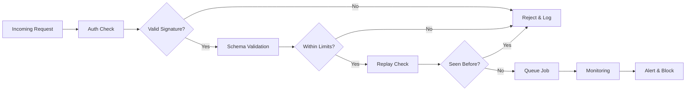

TL;DR
- Authenticate every webhook with signatures, mutual TLS, or token headers—never accept anonymous traffic in production.
- Validate payload size, schema, and replay attempts before enqueuing work to prevent abuse and injection.
- Monitor telemetry and implement automated blocking with WAF rules or rate limits when anomalies spike.

## Enforce Strong Authentication
Use shared-secret HMAC signatures or OAuth-signed requests where providers support them. In n8n, verify signatures using a Function node before any downstream processing. For internal systems, require mutual TLS with client certificates so only approved services can connect. Rotate secrets regularly and store them in encrypted credentials.

### Token-Based Access
When third-party providers lack signature support, issue unique bearer tokens per partner. Validate tokens and IP ranges, and revoke access if suspicious behavior occurs. Log all authentication attempts for forensic analysis.

## Payload Validation and Sanitization
Check `Content-Type`, payload size, and schema before writing to queues. Use JSON schema validation to enforce required fields and formats. Reject requests exceeding size limits to prevent memory exhaustion. For text fields, sanitize to remove scripts or SQL injection payloads even if they will be processed by downstream AI agents.

### Replay Protection
Store request IDs or signature timestamps in Redis to detect replays. Reject requests older than a configured window (e.g., 5 minutes) and log the attempts. Align with your automation risk matrix to escalate repeated replay attempts.

## Observability and Blocking
Integrate webhooks with your API gateway or WAF. Configure rate limits, geo-blocking, and anomaly detection. Feed logs into monitoring to visualize request volume, auth failures, and blocked attacks. Create alert thresholds for sudden spikes or unusual payload characteristics.

### Incident Response
Document runbooks for compromised secrets: rotate credentials, invalidate existing tokens, and inspect logs for data exfiltration. Use the error handling DLQ patterns to capture suspicious payloads for forensic review. Communicate with partners when you rotate keys so integrations resume quickly.

## Comparison Table
| Control | Purpose | n8n Implementation | Companion Tooling | Notes |
| --- | --- | --- | --- | --- |
| HMAC Signatures | Validate authenticity | Function node verifying hash | API gateway, serverless functions | Use per-partner secrets |
| Mutual TLS | Restrict internal access | Reverse proxy enforcing certificates | Nginx, Cloudflare | Rotate certificates quarterly |
| Schema Validation | Prevent malformed payloads | JSON schema check in Function node | Ajv library | Reject oversize payloads |
| Rate Limiting | Block abuse | Rate Limit node or gateway | Cloudflare, Fastly | Monitor 429 spikes |

## Diagram

## Checklist
- [ ] Require signatures, tokens, or mutual TLS for every production webhook.
- [ ] Validate payload schema, size, and content before processing.
- [ ] Implement replay detection with short-lived nonce storage.
- [ ] Monitor webhook metrics and integrate with WAF or gateway rules.
- [ ] Maintain incident runbooks for compromised secrets and abuse patterns.

> **Benchmarks**
> - Time to implement: 2 days to add authentication, validation, and monitoring controls to critical webhooks. [Estimate]
> - Expected outcome: Eliminate anonymous traffic and cut malicious payloads by 90%. [Estimate]

## Internal Links
- [Reuse the webhook foundation article for baseline setup before adding zero-trust layers.](../n8n-workflows-integrations/n8n-triggers-webhooks-foundation.mdx)
- [Queue validated requests using the Redis-based workflow for resilience.](../n8n-workflows-integrations/n8n-queues-with-redis-webhooks.mdx)
- [Coordinate key rotation and governance through the automation risk matrix.](../ai-automation-foundations/automation-risk-matrix-small-teams.mdx)
- [Share incident telemetry with the offer testing framework to protect monetized campaigns.](../monetization-analytics/offer-testing-framework.mdx)

## Sources
- [n8n security best practices](https://docs.n8n.io/workflows/best-practices/security/)
- [OWASP API Security Top 10](https://owasp.org/www-project-api-security/)
