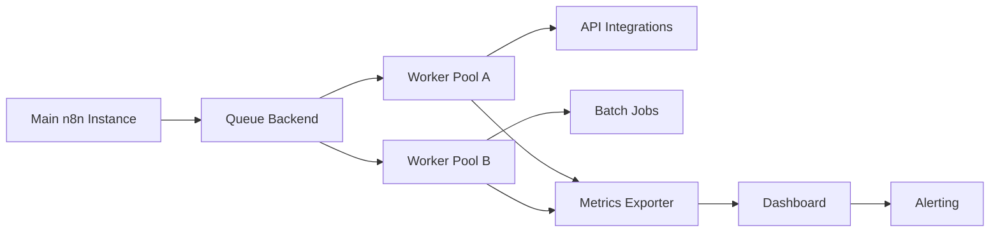

TL;DR
- Separate n8n execution from the editor by deploying worker instances connected via queue mode.
- Control concurrency with queues, rate limits, and workload sharding to protect downstream APIs and databases.
- Instrument workers with metrics and tracing to detect bottlenecks before customers feel them.

## Architecture Overview
In queue mode, n8n's main instance handles the UI and scheduling while workers pick up jobs from Redis or RabbitMQ. This design supports horizontal scaling by adding more worker pods without exposing the editor to heavy load. Decide on queue technology based on your latency and durability requirements.

### Provisioning Workers
Use infrastructure-as-code (Terraform, Helm) to define worker instances with consistent environment variables and credentials. Configure autoscaling policies—CPU, memory, or custom metrics—so the cluster expands during high-volume periods like campaign launches.

## Workload Segmentation
Group workflows by sensitivity or resource profile. Critical customer-facing flows may require dedicated worker pools with stricter SLAs. Batch jobs can run on separate pools with higher concurrency but lower priority. Store assignment rules in environment variables or use `queueModeId` to pin workflows to specific workers.

### Concurrency Controls
Combine worker-level concurrency limits with n8n's per-node throttling. For API-heavy workflows, integrate the pagination and rate limit playbook to avoid bans. Implement circuit breakers inspired by the production guardrails so runaway jobs cannot saturate infrastructure.

## Observability and Alerting
Emit metrics like jobs in queue, execution duration, success/failure counts, and resource usage. Use Prometheus exporters or the n8n built-in event bus. Visualize metrics alongside queue health to spot imbalances. Configure alerts for backlog thresholds, worker restarts, or error spikes.

### Disaster Recovery
Plan for worker node failures by enabling job retries and ensuring idempotency. Regularly test failover by draining queues and simulating worker crashes. Maintain infrastructure runbooks covering scaling events, redeployments, and queue maintenance.

## Comparison Table
| Component | Purpose | Key Settings | Scaling Signal | Tooling |
| --- | --- | --- | --- | --- |
| Main Instance | UI, scheduling | `QUEUE_BULL_REDIS` config | Editor latency | Kubernetes deployment |
| Worker Pool | Execute jobs | `EXECUTIONS_PROCESS`, `CONCURRENCY` | Jobs waiting, CPU | Horizontal Pod Autoscaler |
| Queue Backend | Dispatch jobs | Redis streams, RabbitMQ | Pending jobs, ack latency | Managed Redis/Rabbit |
| Observability | Detect issues | Prometheus, Grafana | Error rate, backlog | Loki, OpenTelemetry |

## Diagram

## Checklist
- [ ] Deploy n8n in queue mode with separate worker instances.
- [ ] Configure worker pools and assignment rules based on workflow criticality.
- [ ] Set concurrency limits and integrate rate limiting for API-heavy jobs.
- [ ] Instrument metrics, logs, and tracing for workers and queues.
- [ ] Document failover and autoscaling runbooks with regular game days.

> **Benchmarks**
> - Time to implement: 1 week to move from single instance to worker-based scaling with monitoring. [Estimate]
> - Expected outcome: Handle 3x workload spikes with stable SLA and <5% failure rate. [Estimate]

## Internal Links
- [Start with the webhook foundation tutorial to ensure entry points can handle scale.](../n8n-workflows-integrations/n8n-triggers-webhooks-foundation.mdx)
- [Adopt the Redis queue recipe for durable job storage and DLQ integration.](../n8n-workflows-integrations/n8n-queues-with-redis-webhooks.mdx)
- [Coordinate deployment governance using the automation pilot-to-scale playbook.](../ai-automation-foundations/automation-pilot-to-scale-playbook.mdx)
- [Align observability with the Core Web Vitals tuning guide to create shared dashboards.](../devops-for-creators/cwv-tuning-for-mdx-sites.mdx)

## Sources
- [n8n scaling documentation](https://docs.n8n.io/hosting/advanced/scaling/)
- [Redis streams overview](https://redis.io/docs/interact/pubsub/streams/)
