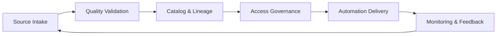

# Data Readiness for Reliable Automation: Quality, Lineage, Access
_Practical playbooks to make automation data trustworthy, compliant, and usable._
**Author:** Cyber Income Innovators Editorial  |  **Date:** 2025-10-16  |  **Reading time:** ~15–18 min
**Tags:** ai automation, foundations, data quality, lineage, pii protection, validation, access control

## TL;DR
- Treat data readiness as a product: define service-level objectives for quality, availability, lineage, and access aligned with automation requirements.
- Apply the Data Readiness Maturity Framework to assess gaps across ingestion, curation, governance, and monitoring.
- Use a worked example showing how a logistics company quantifies data quality improvements to unlock automation ROI.
- Balance trade-offs between centralized data platforms and domain data products, strict access control vs. agility, and manual vs. automated validation.
- Operationalize checklists for PII protection, approvals, and ongoing validation to keep automation reliable in production.

## Introduction
Automation initiatives fail when data is incomplete, stale, or untrusted. Intelligent document processing, AI copilots, and decisioning workflows demand high-quality, well-governed data. Yet many organizations treat data readiness as an afterthought, leading to brittle automations and compliance exposure. This article guides data leaders, automation architects, and product owners through the foundations of data readiness. You will gain a reusable maturity framework, metrics, worked calculations, trade-off analysis, and concrete SOPs to build trustworthy data pipelines.

## Why Data Readiness Matters for Automation ROI
Automation value depends on consistent, accurate, and timely data.

### Quality and Reliability
Poor data quality amplifies errors. Gartner estimates that organizations lose an average of \$12.9 million annually from poor data quality, highlighting the financial stakes.[^gartnerdq] Automations ingesting noisy data propagate mistakes faster than manual processes.

### Lineage and Transparency
Knowing where data originated and how it transformed builds trust. The DAMA-DMBOK advocates lineage tracking to support auditability and impact analysis.[^dama]

### Access and Security
Automation often requires cross-domain data sharing. Without proper access controls and approvals, teams risk violating regulations like GDPR or HIPAA. AWS recommends granular access policies and data lake governance to balance agility and compliance.[^aws]

## Data Readiness Maturity Framework
Use a four-level framework to evaluate readiness across key domains.

### Level 1: Ad Hoc
- Data sources ingested manually, minimal documentation.
- Quality issues discovered reactively; no standard metrics.
- Access managed via ad hoc requests.

### Level 2: Managed
- Standardized ingestion pipelines with basic metadata.
- Data quality rules defined for critical fields; manual monitoring.
- Access approvals require manager sign-off; limited automation.

### Level 3: Systematized
- Automated ingestion with schema validation and change detection.
- Data quality metrics tracked via dashboards (completeness, accuracy, timeliness, consistency).
- Data catalog integrates lineage, business glossary, and access workflows; approvals delegated via role-based access control.

### Level 4: Productized
- Data treated as products with owners, SLAs, and roadmaps.
- Continuous data observability with anomaly detection and alerting.
- Fine-grained access (attribute-based), privacy-preserving techniques (tokenization, differential privacy) embedded.
- Automated lineage captures end-to-end data flows; impact analysis triggers notifications on schema changes.

## Worked Example: Logistics Automation Data Improvement
A logistics company wants to automate delivery exception handling using AI. Baseline data issues: incomplete status codes, delayed telemetry, and inconsistent warehouse identifiers.

### Baseline Metrics
- On-time telemetry arrival: 68% within 5 minutes.
- Status code completeness: 72% of records.
- Warehouse identifier accuracy: 81% (verified against master data).
- Manual exception resolution cost: \$7.50 per incident; 120k incidents annually.

### Improvement Plan
1. **Telemetry Streaming Upgrade:** Implement IoT ingestion with buffering and retry policies, target ≥95% timely arrival.
2. **Reference Data Synchronization:** Create master data service with nightly reconciliation, target ≥98% warehouse identifier accuracy.
3. **Status Code Validation:** Deploy rule-based validation and human review queue, target ≥92% completeness.

### Economic Impact Calculation
Assume automation reduces manual handling from \$7.50 to \$3.10 per incident once data targets met. Expected savings = (7.50 - 3.10) × 120,000 = \$528,000 annually. Apply risk adjustment for data goals not fully met: 0.8 multiplier ⇒ \$422,400. Improvement costs: streaming upgrade \$180k, master data \$120k, validation \$90k (total \$390k). Payback ≈ 0.92 years. Without data upgrades, automation accuracy only 55%, yielding net loss due to rework. This example shows data readiness as prerequisite for ROI.

## Building Data Quality Metrics and SLAs
Define metrics aligned with automation needs.

### Core Metrics
- **Completeness:** percentage of required fields populated.
- **Accuracy:** match rate against trusted references.
- **Timeliness:** latency between event occurrence and availability.
- **Consistency:** number of conflicting values across systems.
- **Validity:** adherence to format and business rules.

### Service-Level Objectives (SLOs)
Set SLOs per data product. Example: "Delivery Telemetry" data product guarantees 95% timeliness (<5 minutes), 98% accuracy, and 97% completeness. Publish metrics on dashboards and integrate with automation monitoring. Google Cloud advises aligning data governance with SLOs to support analytics and AI workloads.[^google]

### Observability Tooling
Implement data observability platforms or build custom monitors capturing metric breaches, anomalies, and drift. IBM recommends applying AI-infused observability to detect quality issues before they impact downstream automations.[^ibm]

## Data Lineage and Cataloging
Lineage enables transparency and impact assessment.

### Metadata Strategy
- Maintain business glossaries, technical metadata, and ownership assignments in a catalog.
- Capture lineage at table, column, and model level using automated scanners or ETL-native lineage.
- Provide self-service search so automation teams can discover data products quickly.

### Impact Analysis
When schema changes occur, notify dependent automations and require regression tests. Snowflake recommends using lineage graphs to assess downstream impacts and manage change approvals.[^snowflake]

### Regulatory Compliance
Maintain lineage evidence to support audits (GDPR Article 30 records). Document data processing purposes, retention periods, and deletion procedures. Microsoft Purview guidance highlights linking lineage with data classification to support compliance.[^microsoft]

## Access Control and PII Protection
Automations must respect privacy and confidentiality.

### Access Governance Workflow
- Use role-based access control (RBAC) for standard roles and attribute-based access control (ABAC) for sensitive data.
- Implement approval workflows with data owners and compliance sign-off.
- Log all access grants and reviews; conduct quarterly recertification.

### Privacy Techniques
- Tokenize or encrypt PII before sharing with automation systems.
- Apply differential privacy or k-anonymity for analytical automations where exact identifiers are unnecessary.
- Use synthetic data for development environments; Google Cloud recommends synthetic data to protect privacy during testing.[^google]

### Data Localization and Residency
Track where data resides; ensure cross-border transfers comply with regulations (e.g., EU Standard Contractual Clauses). Document approvals in the data catalog.

## Validation and Testing
Treat data validation like software testing.

### Pre-Production Validation
- Unit tests for data transformations (schema, null checks).
- Regression suites comparing historical distributions.
- User acceptance testing with subject matter experts verifying business rules.

### Production Monitoring
- Automated checks for SLO breaches.
- Sentinel records or control totals to detect missing data.
- Incident response runbooks for data quality failures.

### Continuous Improvement
Run quarterly data retrospectives with automation stakeholders to review incidents, adjust rules, and prioritize remediation. AWS suggests embedding data governance in agile cadences for continuous improvement.[^aws]

## Trade-Offs and Architectural Decisions
Design choices influence flexibility and control.

### Centralized Data Lake vs. Domain Data Products
Centralized lakes simplify control but risk bottlenecks. Domain-oriented data products (Data Mesh) empower teams but demand strong federated governance. Evaluate culture, skills, and compliance needs before choosing.

### Strict Access Control vs. Agility
Tighter controls reduce risk but slow delivery. Implement "progressive disclosure"—grant minimal access for exploration, expand upon justification. Automate approvals to balance speed and safety.

### Manual vs. Automated Quality Checks
Manual reviews catch nuanced issues but don’t scale. Automated checks scale but may miss contextual anomalies. Combine both: automation for baseline validation, human review for high-risk datasets.

### When Not to Automate
Defer automation when data is heavily unstructured with no labeling strategy, when lineage is opaque, or when privacy obligations prohibit necessary data sharing. Focus on data remediation first.

## Comparison Table
| Approach | Strengths | Weaknesses | Best Fit | Key Considerations |
|----------|-----------|------------|----------|--------------------|
| Centralized Data Platform | Unified governance, simplified security, economies of scale | Slower to deliver domain-specific changes, potential backlog | Regulated industries needing tight control | Requires strong platform team and clear intake process |
| Data Mesh (Domain Data Products) | Domain ownership, faster iteration, contextual knowledge | Higher coordination overhead, requires mature governance | Large enterprises with decentralized business units | Need federated governance council and shared tooling |
| Hybrid Hub-and-Spoke | Balances central standards with domain autonomy | Complexity in roles and responsibilities | Organizations transitioning from centralized to federated | Define clear RACI and shared services |
| Automation-specific Data Mart | Tailored datasets for automation, faster performance | Risk of data drift, duplication, siloing | High-volume automations with strict latency | Keep sync with source-of-truth and monitor drift |

## Diagram (Mermaid)

## Checklist / SOP
1. Inventory automation-critical datasets; assign data product owners and document SLAs for quality, timeliness, and access.
2. Implement data quality rules and observability dashboards covering completeness, accuracy, timeliness, consistency, and validity.
3. Set up metadata cataloging with lineage capture; require impact analysis for schema changes before deployment.
4. Establish access governance workflows with RBAC/ABAC, privacy-preserving techniques, and quarterly recertification.
5. Integrate data validation into CI/CD pipelines and production monitoring; maintain incident response playbooks for data issues.
6. Conduct quarterly data readiness reviews with automation stakeholders to update roadmaps and remediation priorities.

## Benchmarks
> Time to implement: 12–16 weeks to achieve Level 3 data readiness for priority automations
> Expected outcome: 20–35% increase in automation accuracy and 30% reduction in data-related incidents
> Common pitfalls: Incomplete ownership, manual access approvals, lack of observability
> Rollback plan: Suspend automation deployments relying on impacted data, launch data remediation sprints, and retest before reactivation

## Sources
1. Gartner, "How to Improve Data Quality." https://www.gartner.com/en/documents/4000499/how-to-improve-data-quality
2. DAMA International, "DAMA-DMBOK: Data Management Body of Knowledge." https://www.dama.org/cpages/body-of-knowledge
3. Amazon Web Services, "Building Data Lakes: Data Governance Considerations." https://docs.aws.amazon.com/whitepapers/latest/building-data-lakes/understanding-data-lakes-and-data-governance.html
4. Google Cloud, "Data Governance and Security for Analytics and AI." https://cloud.google.com/architecture/data-governance-and-security
5. IBM, "Data Observability for Data Fabric." https://www.ibm.com/products/data-fabric/data-observability
6. Snowflake, "Data Lineage in Snowflake." https://www.snowflake.com/guides/what-is-data-lineage/
7. Microsoft, "Microsoft Purview Data Governance Overview." https://learn.microsoft.com/en-us/purview/purview
8. NIST, "Privacy Framework: A Tool for Improving Privacy through Enterprise Risk Management." https://www.nist.gov/privacy-framework/privacy-framework
9. Gartner, "Market Guide for Data Quality Solutions." https://www.gartner.com/en/documents/4009943/market-guide-for-data-quality-solutions

## FAQ

### How often should data SLAs be reviewed?
Review SLAs quarterly or whenever automation requirements change. Track actual performance against SLOs and adjust thresholds as capabilities mature.

### What tools support automated data quality monitoring?
Commercial tools include Monte Carlo, Soda, Bigeye, and IBM’s data observability solutions. Open-source options like Great Expectations and dbt tests provide flexible alternatives. Choose tools that integrate with your pipelines and support alerting.

### How do we handle third-party data feeds?
Treat third-party feeds as data products: evaluate quality, negotiate SLA clauses, and monitor delivery. Implement quarantine zones to validate feeds before exposing them to production automations.

**Call to action:** Want automation-ready data pipelines? Partner with us to design your data readiness roadmap.

[^gartnerdq]: Gartner, "How to Improve Data Quality."
[^dama]: DAMA International, "DAMA-DMBOK: Data Management Body of Knowledge."
[^aws]: Amazon Web Services, "Building Data Lakes: Data Governance Considerations."
[^google]: Google Cloud, "Data Governance and Security for Analytics and AI."
[^ibm]: IBM, "Data Observability for Data Fabric."
[^snowflake]: Snowflake, "Data Lineage in Snowflake."
[^microsoft]: Microsoft, "Microsoft Purview Data Governance Overview."
[^nistprivacy]: NIST, "Privacy Framework: A Tool for Improving Privacy through Enterprise Risk Management."
[^gartnertooling]: Gartner, "Market Guide for Data Quality Solutions."

## Data Governance Operating Model
A resilient operating model ensures data readiness scales across teams.

### Roles and Responsibilities
Assign clear roles: chief data officer (policy owner), data product owners (quality and access), data stewards (day-to-day remediation), automation leads (consumer requirements), and security/privacy officers (compliance). Document RACI matrices and escalation paths. NIST’s Privacy Framework recommends identifying responsible parties for data processing activities to support accountability.[^nistprivacy]

### Governance Forums
Establish data councils and domain working groups that meet monthly to review quality metrics, approve schema changes, and prioritize remediation. Include automation representatives so requirements influence data roadmap decisions.

### Policy Lifecycle
Publish policies for data classification, retention, access, and quality. Review annually or when regulations change. Track policy adherence through audits and metric dashboards.

## Tooling Landscape and Selection Criteria
Selecting the right tooling accelerates data readiness.

### Data Quality Platforms
Evaluate platforms (e.g., Monte Carlo, Informatica Data Quality, Great Expectations) based on rule management, anomaly detection, observability, and integration with orchestration tools. Gartner’s market guides recommend assessing scalability, multi-cloud support, and governance integrations before purchase.[^gartnertooling]

### Metadata and Catalog Solutions
Assess catalog capabilities: automated discovery, lineage visualization, business glossary, policy tagging, and workflow integration. Microsoft Purview and Collibra are examples offering RBAC and policy enforcement.

### Access Governance Tools
Implement identity governance tools to automate provisioning, approval workflows, and recertification. Integrate with ticketing systems and security information and event management (SIEM) platforms for end-to-end traceability.

## Advanced Data Validation Techniques
Beyond basic rules, use advanced methods to protect automation reliability.

### Statistical Process Control
Apply control charts to detect shifts in data distributions. For example, monitor mean and variance of order amounts; alerts trigger when metrics breach control limits.

### Machine Learning-Based Anomaly Detection
Use unsupervised models (e.g., isolation forests) to detect unusual patterns in streaming data. Validate anomalies with human reviewers before blocking automation flows.

### Synthetic Data Validation
When using synthetic data for testing, compare statistical properties with original datasets to ensure representativeness. AWS advises validating synthetic data to avoid biased test outcomes.[^aws]

## Expanded Worked Example: Data Remediation Roadmap
Continuing the logistics scenario, the company builds a 12-week remediation roadmap.

| Week | Focus | Key Activities | Owner |
|------|-------|----------------|-------|
| 1–2 | Telemetry assessment | Instrument IoT devices, baseline latency metrics | Data engineering |
| 3–4 | Quality rule design | Define validation rules, configure observability alerts | Data stewards |
| 5–6 | Master data sync | Build reconciliation jobs, set up golden record workflows | Master data team |
| 7–8 | Access governance | Implement RBAC, approve automation service accounts | Security & privacy |
| 9–10 | Pilot validation | Run dry runs with synthetic data, conduct UAT | Automation product |
| 11–12 | Production readiness | Finalize SLAs, update playbooks, train support teams | Data operations |

Progress is tracked in a shared dashboard with burndown charts for remediation tasks and SLO attainment. Weekly steering meetings resolve blockers and adjust priorities.

## Data Risk Management and Compliance
Link data readiness to broader risk management.

### Privacy Impact Assessments
Conduct privacy impact assessments (PIAs) for automations processing PII. Document lawful bases, consent mechanisms, data minimization strategies, and retention schedules. NIST’s Privacy Framework provides templates for assessing privacy risk.[^nistprivacy]

### Security Controls
Implement encryption at rest/in transit, key management, and data masking. Align with CIS Controls or NIST SP 800-53 to ensure security baselines.

### Audit Trails and Evidence
Capture evidence of data quality checks, access approvals, and remediation actions. Store in immutable repositories to support audits.

## Data Product Lifecycle Management
Treat data assets like products with continuous improvement.

### Roadmapping
Develop quarterly roadmaps for each data product including enhancements, new metrics, and automation enablement features. Align with automation portfolio timelines.

### User Feedback
Collect feedback from automation teams, analysts, and downstream users. Incorporate into backlog grooming. Establish service request SLAs for new data features or fixes.

### Retirement Planning
Plan for data product retirement when sources change or automations no longer require them. Communicate timelines and provide migration guidance.

## Collaboration with Automation Teams
Data and automation teams must work hand in hand.

### Embedded Data Leads
Embed data stewards within automation squads during discovery and build phases. They ensure data requirements are feasible and capture metadata updates.

### Co-Design Workshops
Run co-design sessions to map process flows, data touchpoints, and validation checkpoints. Document dependencies and assign owners.

### Shared OKRs
Set joint OKRs linking data readiness and automation outcomes, such as "Achieve 97% data completeness enabling 25% cycle-time reduction." Shared metrics foster collaboration.

## Sustainability and Cost Optimization
Data readiness should also consider cost and environmental impact.

### Storage Lifecycle Policies
Implement tiered storage (hot, warm, cold) to manage costs while meeting access requirements. Automate archival and deletion policies aligned with retention schedules.

### Efficient Processing
Optimize data pipelines for resource efficiency—batch windows, serverless architectures, and compression. Google’s data governance guidance highlights aligning cost and performance for analytics workloads.[^google]

### Green Data Practices
Track energy usage for data infrastructure; prioritize cloud regions with renewable energy commitments. Communicate sustainability metrics alongside data quality dashboards.

[^nistprivacy]: NIST, "Privacy Framework: A Tool for Improving Privacy through Enterprise Risk Management." https://www.nist.gov/privacy-framework/privacy-framework
[^gartnertooling]: Gartner, "Market Guide for Data Quality Solutions." https://www.gartner.com/en/documents/4009943/market-guide-for-data-quality-solutions

## Data Readiness KPIs and Reporting
Define dashboards showing:
- Percentage of automation-critical datasets meeting all SLAs.
- Number of open data quality incidents by severity and age.
- Time-to-approve access requests segmented by data classification.
- Percentage of datasets with documented lineage and ownership.
- Data remediation throughput (issues closed per sprint). 
Share reports with executives and automation governance councils monthly to maintain accountability.
