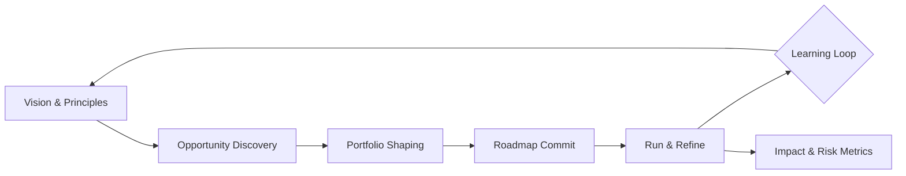

# Designing an AI Automation Strategy: From Vision to Roadmap
_Building an accountable portfolio that connects ambition, guardrails, and measurable outcomes._
**Author:** Cyber Income Innovators Editorial  |  **Date:** 2025-10-16  |  **Reading time:** ~15–18 min
**Tags:** ai automation, foundations, strategy, governance, okrs, portfolio management

## TL;DR
- Anchor AI automation strategy in quantified business value, prioritized bets, and explicit risk appetite before funding implementation.
- Translate aspirational OKRs into a "portfolio Kanban" that sequences discovery, pilots, and production releases with gated governance.
- Use a reusable Vision-to-Roadmap Framework that starts with intent, codifies design principles, stress-tests feasibility, and closes the loop with operating metrics.
- Apply a worked backlog economics model to justify investment, adjust for probability of success, and set decision thresholds for kill-or-scale moments.
- Recognize trade-offs between centralized and federated models, pace versus control, and innovation versus standardization—know when to slow down.

## Introduction
Teams launching AI automation initiatives often jump into tooling or vendor demos before aligning on the why, who, and how. Executives complain about "pilot purgatory," practitioners fight unclear guardrails, and operations leaders fear automation debt that undermines customer trust. A resilient strategy stitches vision to execution: the organization knows where automation generates leverage, how it will be governed, and which capabilities must mature over time. This article targets experienced automation leaders, heads of intelligent automation, and business owners who want a battle-tested playbook to scale AI automation with confidence. You will leave with a reusable framework, hard numbers to evaluate portfolio decisions, comparisons of operating models, and explicit warnings about when the approach fails.

## Clarifying Strategic Intent Before Tooling
The first question is not "Which AI model?" but "Which strategic narrative are we amplifying?" A coherent strategy links corporate objectives, value pools, and guardrails into an automation north star. Thoughtful leaders use OKRs to state directional ambition while reserving flexibility for discovery work.[^okr] They also factor in regulatory context, brand implications, and technical debt.

### Map Corporate Objectives to Automation Opportunities
Start with top-level strategic themes—customer experience, margin expansion, risk resilience. For each theme, identify measurable value pools such as call handle time reduction or straight-through processing. Link them to enabling capabilities like document understanding, workflow orchestration, or decision intelligence. This mapping surfaces alignment gaps: if the company aims to reduce churn but the automation backlog lacks customer retention journeys, recalibrate.

### Define Automation Design Principles
Design principles act as the constitution for automation decisions. Common principles include "human-in-the-loop for all high-risk decisions," "model observability before scale," or "reuse canonical APIs instead of point-to-point." Codifying principles early prevents whiplash from later compliance reviews. The NIST AI Risk Management Framework emphasizes aligning AI system characteristics—validity, reliability, accountability—with enterprise risk tolerance to maintain trust.[^nist]

### Quantify the Target Portfolio Ambition
Translate vision into numbers: what proportion of core processes should be automation-enabled in three years? How much opex reduction or revenue uplift is expected? McKinsey estimates that companies capturing AI at scale report 3–15% EBITDA uplift, but only when investments align with enterprise strategy and robust change management.[^mckinsey] Use that range as a sanity check and anchor your internal goals in historical performance and industry benchmarks.

## Vision-to-Roadmap Framework
A repeatable framework enables leaders to convert intent into an executable roadmap. The Vision-to-Roadmap Framework comprises five stages with feedback loops.

### Stage 1: Intent Framing
- Clarify the value thesis: specify target KPIs, stakeholders, and constraints.
- Capture risk appetite statements in language risk and audit teams endorse.
- Establish governance liaisons—legal, security, compliance—who sign off on principles.

### Stage 2: Opportunity Discovery
- Run cross-functional workshops to surface candidate processes; score them against value, feasibility, and risk.
- Use service design blueprints to expose upstream/downstream dependencies that automation must respect.
- Document data requirements, latency expectations, and human roles for each candidate.

### Stage 3: Portfolio Shaping
- Group opportunities into waves (e.g., 90-day increments) balancing quick wins and platform investments.
- Layer in enabling work—data pipelines, guardrail services, operating model training.
- Define success metrics for each wave, including adoption and quality signals.

### Stage 4: Roadmap Commit
- Convert waves into an adaptive roadmap with milestone OKRs, budgets, and staffing.
- Secure executive sponsorship for gating criteria and escalation paths.
- Integrate the roadmap into existing PMO or product operations cadences to avoid siloed execution.

### Stage 5: Run & Refine
- Track progress through dashboards that combine delivery status, business impact, and risk indicators.
- Operate continuous evaluation loops, aligning with recommendations in NIST SP 1270 on trustworthy AI lifecycle management.[^nist1270]
- Trigger retrospectives after each release wave to adjust principles, backlog, and resource mix.

## Worked Example: Backlog Economics and OKR Alignment
Consider a regional insurer targeting a 12% reduction in claims operating expense within 18 months. They identify six automation candidates, each with estimated annual benefit, cost, time-to-value, and probability of success based on technical complexity.

| Candidate | Annual Benefit (\$M) | One-Time Cost (\$M) | Time-to-Value (months) | Probability of Success |
|-----------|----------------------|----------------------|------------------------|------------------------|
| FNOL Triage Automation | 4.2 | 1.3 | 9 | 0.7 |
| Fraud Scoring Augmentation | 3.5 | 0.9 | 6 | 0.6 |
| Claims Document Extraction | 2.1 | 0.6 | 5 | 0.8 |
| Reserve Forecasting Model | 5.0 | 1.8 | 12 | 0.4 |
| Vendor Invoice Automation | 1.6 | 0.5 | 4 | 0.9 |
| Agent Knowledge Copilot | 2.8 | 0.7 | 7 | 0.65 |

They calculate expected annualized net value using \(\text{ENPV} = (Benefit \times Prob) - Cost/PaybackFactor\). Assume PaybackFactor approximates time-to-value/12 (i.e., proportion of year realized). For FNOL Triage: Benefit × Prob = 2.94M. Cost adjustment: 1.3 ÷ (9/12 ≈ 0.75) = 1.73M. ENPV ≈ 1.21M. Repeat for others to rank investments.

Ranking reveals Document Extraction (ENPV ≈ 1.08M) and Vendor Invoice (ENPV ≈ 1.38M) as high-confidence quick wins, while Reserve Forecasting yields negative ENPV because success probability is 0.4 and costs amortized over a year (1.8 ÷ 1 = 1.8M) exceed expected benefit (2.0M). The team sequences automation waves: Wave 1 tackles Vendor Invoice and Document Extraction to free cash flow; Wave 2 invests in FNOL and Fraud once data dependencies are unlocked. OKRs align accordingly: Objective "Cut claims handling cost by 12%" with Key Results such as "Automate 65% of invoice processing" and "Reduce FNOL touch time by 25%." This example shows how probabilistic economics guide the roadmap.

## Capability and Operating Model Enablers
Strategy evaporates without the muscles to sustain it. Leaders should inventory four capability layers—people, process, technology, and data—and assess maturity using a simple 1–5 scale. People maturity covers roles such as automation product managers, solution architects, prompt engineers, and risk champions. Process maturity examines how intake, design reviews, testing, and incident response flow. Technology maturity evaluates reuse of platforms, integration with orchestration, and observability tooling. Data maturity inspects cataloging, access controls, and lineage. Boston Consulting Group found that companies investing simultaneously in talent, operating model, and technology quadruple the odds of AI at-scale success compared to those focusing on tools alone.[^bcg]

### Skills Architecture and Workforce Strategy
Document required skills for the next 18 months, highlighting gaps between current staff and desired future state. Combine upskilling and external hiring. Use T-shaped profiles: depth in process engineering or ML engineering plus breadth in governance and change management. Encourage job rotation between business process owners and automation engineers to build empathy.

### Funding and Portfolio Governance Cadence
Standing governance forums keep the roadmap honest. Establish a quarterly investment review chaired by finance and product leaders to assess wave performance, release new funding, or sunset underperformers. The review should include an audit trail of decision rationale, consistent with regulator expectations for explainability.[^oecd] Use rolling-wave planning: commit to detail for the next 2 quarters while keeping later waves directional, allowing flexibility as insights emerge.

## Change Management and Adoption Mechanics
Automation strategy is worthless if frontline teams resist adoption. Change management must be part of the roadmap, not an afterthought.

### Stakeholder Mapping and Narrative Design
Identify impacted personas—operators, supervisors, compliance officers, customers. Build a narrative that articulates value for each persona, balancing efficiency with quality and safety. Harvard Business Review stresses that AI adoption accelerates when organizations treat change as a social process, combining technical delivery with human enablement.[^hbr]

### Training, Enablement, and Support
Create enablement packages tailored to personas. For operators, provide scenario-based training with sandbox environments. For supervisors, deliver dashboards and playbooks that explain exception management. For compliance, expose testing evidence and model cards. Tie training completion to production gating to ensure readiness.

### Reinforcement and Feedback Loops
Launch adoption metrics alongside technical KPIs: usage frequency, exception rate, satisfaction scores. Hold monthly voice-of-user sessions to capture issues and feed them into backlog grooming. Prosci’s ADKAR model reinforces the need for awareness, desire, knowledge, ability, and reinforcement to make change stick; integrate these checkpoints into the roadmap stages.[^prosci]

## Measurement, Analytics, and Decision Rights
Leaders need clarity on whether automation is delivering value and operating safely.

### Impact Measurement
Define a measurement architecture that spans business impact (e.g., cost per transaction, revenue per interaction), operational efficiency (cycle time, throughput), and quality (error rate, customer satisfaction). Use control groups or interrupted time series analysis to isolate automation contributions. Where possible, align with finance’s EBITDA modeling. Gartner recommends using "value realization offices" to connect digital investments to financial statements, a practice worth emulating for AI automation portfolios.[^gartnervalue]

### Risk and Ethics Monitoring
Implement automated monitoring for bias, drift, and performance degradation, particularly for models affecting customer outcomes. Use red-team exercises to stress-test guardrails. Align with OECD AI principles emphasizing transparency and accountability, documenting mitigation plans for each identified risk.[^oecd]

### Decision Rights Matrix
Create a RACI matrix that clarifies who can approve experiments, production releases, and model changes. For example, product owners recommend releases, risk officers provide compliance sign-off, and the automation steering committee grants final approval for high-impact automations. Document escalation paths for incidents and threshold breaches to avoid confusion under pressure.

## Scenario Planning and Stress Testing
Forecast uncertainty by building scenarios with varying demand, regulatory changes, or technology shifts.

### Scenario Construction
Develop at least three scenarios: Base Case (expected demand growth and stable regulation), Disruptive Upside (rapid customer adoption, new data partnerships), and Guarded Downside (regulatory tightening, supply chain disruption). Quantify each scenario’s impact on backlog prioritization, resource allocation, and risk posture. Use Monte Carlo simulations to estimate portfolio variance and inform contingency reserves.

### Stress Testing AI Guardrails
Simulate worst-case behaviors such as model hallucination, data breach, or process failure. Design drills similar to cyber incident tabletop exercises. Document lessons learned and integrate them into design principles, testing protocols, and playbooks. The Financial Stability Board encourages scenario analysis for operational resilience—automation programs should adopt comparable rigor.[^fsb]

### Contingency Triggers
Define leading indicators that signal when to shift scenarios: regulatory updates, unexpected customer churn, spikes in exception handling. Establish trigger-based actions, such as pausing deployments or accelerating alternative use cases. Ensure finance aligns contingency triggers with budgeting and capital allocation processes.

## Scaling Through Ecosystem Partnerships
No organization scales automation alone; partnerships with vendors, integrators, and academia extend capability.

### Vendor Ecosystem Strategy
Segment vendors into categories—platform providers, niche AI services, implementation partners, auditors. Evaluate each against strategic fit, security posture, compliance readiness, and roadmap alignment. Structure contracts with performance clauses tied to adoption and business outcomes, not just licenses. When integrating large language model providers, scrutinize data handling, retention policies, and fine-tuning options.

### External Innovation and Co-Development
Collaborate with universities or startup accelerators to explore advanced use cases, leveraging open innovation while protecting IP. Establish joint governance and data-sharing agreements. Monitor evolving standards for AI management systems to ensure partnerships align with emerging compliance expectations.

### Portfolio Scaling Playbook
Create playbooks for scaling: once a pilot succeeds, document deployment steps, integration requirements, and change stories to accelerate replication across business units. Maintain a knowledge base with architecture patterns, reusable components, and lessons learned.

## Trade-Offs and When Not to Use This Approach
Even disciplined frameworks have limits.

### Centralized vs. Federated Ownership
Centralized automation centers of excellence (CoEs) provide consistent guardrails, shared platforms, and consolidated reporting. However, they risk becoming bottlenecks and may lack domain depth. Federated models embed automation leads within business units, boosting relevance but often fragmenting governance. Gartner notes hyperautomation programs succeed when they blend centralized platform stewardship with federated innovation councils.[^gartner] Choose hybrid structures for large enterprises; avoid pure centralization if backlog diversity is high.

### Ambition versus Feasibility
Strategy frameworks can produce wish lists without delivery muscle. If data governance is immature or change management capacity is stretched, resist launching wide portfolios. Deloitte cautions CFOs that automation ROI craters when organizations underestimate process redesign and workforce transition costs.[^deloitte]

### Pace versus Control, Build versus Buy, Innovation versus Standardization
Aggressive timelines generate quick wins but increase change fatigue and risk of oversight gaps. Building custom automation delivers differentiation but demands deep engineering investment; buying platforms accelerates deployment yet risks vendor lock-in. Experimentation drives innovation but can fracture standards, while standardization provides scale at the risk of stifling creativity. Calibrate each dial to organizational risk tolerance and capability maturity.

### When Not to Use This Framework
Do not adopt the full Vision-to-Roadmap Framework if:
- The organization lacks executive sponsorship willing to enforce gating decisions.
- There is no baseline process measurement; without data you cannot quantify value or track progress.
- Regulatory uncertainty is extreme and evolving weekly, making long-term commitments brittle.
In such cases, focus on discovery pilots under a "learning agenda" rather than a multi-wave roadmap.

## Comparison Table
| Operating Model | Strengths | Weaknesses | Best Fit | Watchouts |
|-----------------|-----------|------------|----------|-----------|
| Centralized CoE | Standardized tooling, consolidated expertise, strong compliance oversight | Slower response to business needs, risk of shadow IT workarounds | Highly regulated industries needing tight control | Requires executive mandate to prevent backlog inflation |
| Federated Pods | Deep domain knowledge, faster experimentation, closer to customer pain | Inconsistent guardrails, duplicated investments, harder portfolio reporting | Diversified conglomerates with autonomous business units | Must maintain shared architecture forums |
| Hybrid Hub-and-Spoke | Combines shared services with domain ownership, balanced governance | Complexity of coordination, dual accountability | Enterprises scaling beyond 10+ automation products | Needs clear RACI for model monitoring and escalation |
| Product-aligned Automation Guilds | Focus on end-to-end outcomes, integrated with agile release trains | Requires mature product management culture, potential underinvestment in core platform | Digital-native firms pursuing continuous delivery | Guard against guilds reinventing risk controls |

## Diagram (Mermaid)

## Checklist / SOP
1. Convene a cross-functional steering committee and document automation design principles agreed upon by business, technology, risk, and change leaders.
2. Catalogue candidate processes across business units; score each using a standardized value-feasibility-risk rubric with numeric ranges.
3. Build a portfolio kanban: group candidates into waves, map enabling capabilities, and assign accountable owners.
4. For each wave, define OKRs, estimated costs, expected benefits, and success probability assumptions; socialize with finance and PMO.
5. Secure executive approval for gating criteria and escalation protocols; integrate checkpoints into existing governance cadences.
6. Launch delivery with continuous evaluation dashboards covering impact, quality, and compliance metrics; adjust roadmap based on telemetry.

## Benchmarks
> Time to implement: 12–18 weeks for initial roadmap baseline
> Expected outcome: 10–15% cost-to-serve reduction across targeted processes within 18 months
> Common pitfalls: Over-indexing on technology, skipping change management, ignoring data readiness
> Rollback plan: Pause wave launches, revalidate design principles with risk/compliance, and redeploy resources to foundational enablement

## Sources
1. NIST, "Artificial Intelligence Risk Management Framework (AI RMF 1.0)." https://nvlpubs.nist.gov/nistpubs/CSWP/NIST.AI.100-1.pdf
2. NIST, "Towards a Standard for Identifying and Managing Bias in Artificial Intelligence." https://nvlpubs.nist.gov/nistpubs/SpecialPublications/NIST.SP.1270.pdf
3. McKinsey & Company, "The State of AI in 2023: Generative AI’s Breakout Year." https://www.mckinsey.com/capabilities/quantumblack/our-insights/the-state-of-ai-in-2023-generative-ais-breakout-year
4. Deloitte, "Intelligent Automation for the CFO." https://www2.deloitte.com/us/en/insights/focus/cognitive-technologies/intelligent-automation-cfo.html
5. Gartner, "What Is Hyperautomation?" https://www.gartner.com/en/articles/what-is-hyperautomation
6. Google re:Work, "Set goals with OKRs." https://rework.withgoogle.com/guides/set-goals-with-okrs/steps/introduction/
7. Boston Consulting Group, "Achieving Individual and Organizational AI Maturity." https://www.bcg.com/publications/2023/achieving-individual-and-organizational-ai-maturity
8. OECD, "OECD AI Principles." https://oecd.ai/en/ai-principles
9. Harvard Business Review, "Building the AI-Powered Organization." https://hbr.org/2019/07/building-the-ai-powered-organization
10. Prosci, "What is the ADKAR Model?" https://www.prosci.com/resources/articles/adkar-change-management-model
11. Gartner, "Establish a Value Realization Office to Ensure Digital Investments Deliver Results." https://www.gartner.com/en/documents/4001803/establish-a-value-realization-office-to-ensure-digital
12. Financial Stability Board, "Enhancing Third-Party Risk Management and Oversight." https://www.fsb.org/2022/12/enhancing-third-party-risk-management-and-oversight/

## FAQ

### How do we reconcile automation OKRs with traditional KPIs?
Align OKRs with leading indicators (deployment velocity, adoption rate) and lagging indicators (financial impact). Use OKRs to drive behavior, while KPIs confirm outcomes. Revisit OKRs quarterly to ensure they remain ambitious yet realistic.

### What if the organization lacks reliable process data?
Invest in process mining, manual time studies, and data instrumentation before scaling automation. Without baseline data, value claims remain speculative and governance weak.

### How often should the automation strategy be refreshed?
Review quarterly for tactical adjustments and annually for structural changes. Major regulatory shifts or significant M&A events should trigger immediate reassessment.

**Call to action:** Ready to align your automation bets with board-level goals? Schedule a strategy working session this quarter.

[^okr]: Google re:Work, "Set goals with OKRs."
[^nist]: NIST, "Artificial Intelligence Risk Management Framework (AI RMF 1.0)."
[^mckinsey]: McKinsey & Company, "The State of AI in 2023: Generative AI’s Breakout Year."
[^nist1270]: NIST, "Towards a Standard for Identifying and Managing Bias in Artificial Intelligence."
[^bcg]: Boston Consulting Group, "Achieving Individual and Organizational AI Maturity."
[^oecd]: OECD, "OECD AI Principles."
[^hbr]: Harvard Business Review, "Building the AI-Powered Organization."
[^prosci]: Prosci, "What is the ADKAR Model?"
[^gartnervalue]: Gartner, "Establish a Value Realization Office to Ensure Digital Investments Deliver Results."
[^fsb]: Financial Stability Board, "Enhancing Third-Party Risk Management and Oversight."
[^gartner]: Gartner, "What Is Hyperautomation?"
[^deloitte]: Deloitte, "Intelligent Automation for the CFO."
